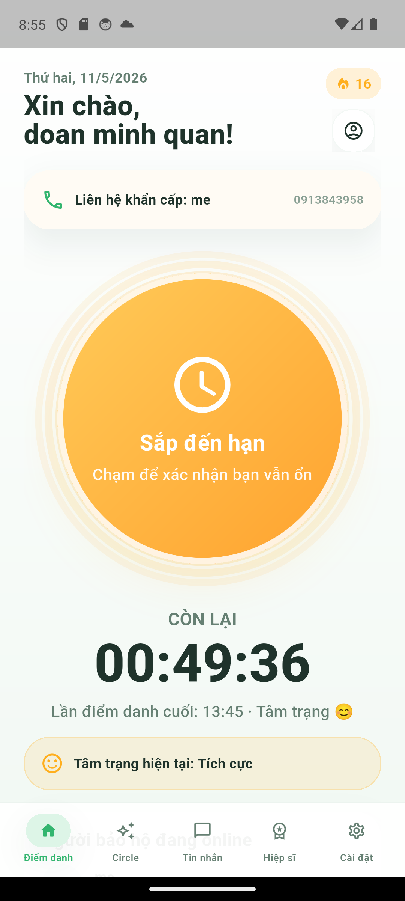
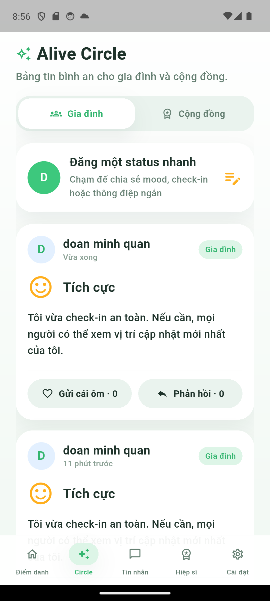
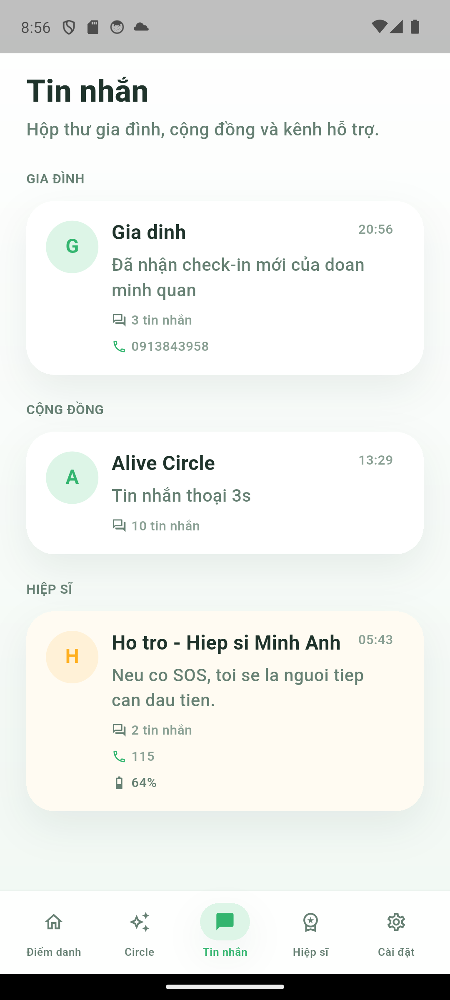
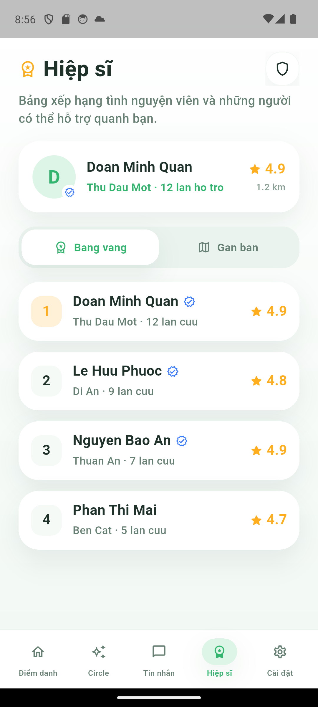
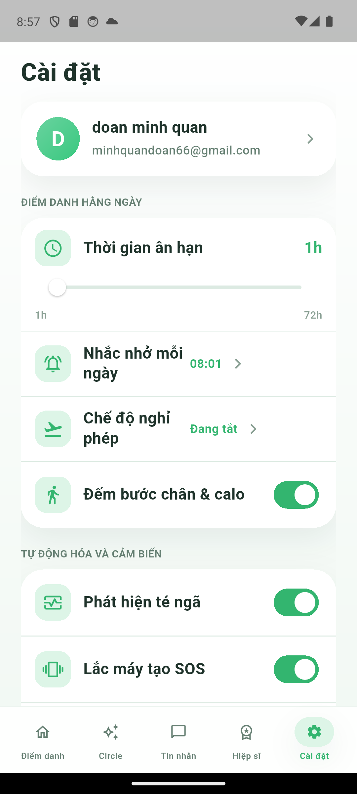
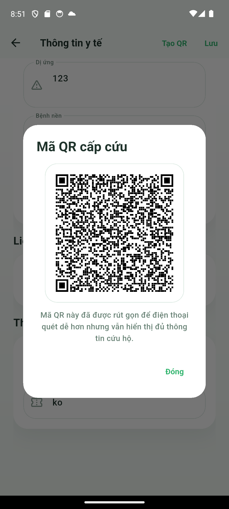

# SafeSolo

SafeSolo là nền tảng bảo vệ an toàn cá nhân theo mô hình `mobile app + backend + web-admin`.

Hệ thống được xây để hỗ trợ các tình huống:

- điểm danh định kỳ để xác nhận người dùng vẫn an toàn
- phát hiện mất liên lạc theo cơ chế `dead-man switch`
- kích hoạt SOS thủ công hoặc ngầm
- chia sẻ tín hiệu khẩn cấp cho người thân, cộng đồng và đội điều phối
- lưu trữ hồ sơ y tế, két sinh tử, chế độ ngụy trang và các thiết lập an toàn nâng cao

Repo này hiện là một mono-repo gồm:

- `Flutter app` cho người dùng cuối
- `Node.js + Express + MongoDB` backend
- `React + Vite` web-admin cho điều phối và giám sát

## 1. Thành phần chính

### Flutter app

Thư mục: `lib/`, `android/`, `windows/`, `web/`

Chức năng chính:

- Onboarding, đăng nhập, cấp quyền hệ thống
- Home check-in với vòng tròn trạng thái, đếm ngược, mood prompt
- Alive Circle cho status, gửi động viên, phản hồi
- Messenger cho chat gia đình, cộng đồng, hiệp sĩ, ghi âm thoại
- Heroes / Hiệp sĩ cho bảng xếp hạng tình nguyện viên
- Settings, Medical ID, Network, Vault, Security, Achievements, Stealth
- SOS Map và Community Radar
- Song ngữ `Tiếng Việt / English`
- MapTiler cho bản đồ hiển thị

### Backend

Thư mục: `backend/`

Chức năng chính:

- người dùng, đăng ký, hồ sơ, cài đặt an toàn
- check-in, interaction events, alert policies
- dead-man worker, alert timeline, SMS log
- guardians, medical profile, automation settings, security settings
- rescue incidents, volunteer response, radar broadcast
- chat rooms, messages, emergency memos
- KYC, vault, device signals
- API cho web-admin

### Web Admin

Thư mục: `web-admin/`

Chức năng chính:

- dashboard điều phối sự cố
- quản lý người dùng app
- timeline cảnh báo, sự cố đang xử lý
- KYC queue
- export Excel
- bản đồ điều phối dùng MapTiler

## 2. Cấu trúc repo

```text
SafeSolo/
├─ android/                 Flutter Android runner
├─ backend/                 API + workers + Mongo models
├─ docs/                    Tài liệu và ảnh minh họa
│  └─ screenshots/
├─ lib/                     Flutter source
├─ test/                    Flutter tests
├─ web/                     Flutter web runner
├─ web-admin/               React/Vite admin portal
├─ windows/                 Flutter Windows runner
├─ flutter.env.example.json Cấu hình mẫu cho Flutter
└─ README.md
```

## 3. Luồng ứng dụng

```text
Onboarding
→ Auth
→ Permissions
→ Main Shell
   ├─ Home
   ├─ Circle
   ├─ Messages
   ├─ Heroes
   └─ Settings
```

Các nhánh điều hướng quan trọng:

- `Home` → `Mood Prompt` → `Check-in`
- `Home` nhấn giữ → `SOS Map`
- `SOS Map` → broadcast → `Community Radar`
- `Settings` → `Medical`, `Network`, `Security`, `Vault`, `Achievements`
- `Stealth mode` bật → toàn app bị ghi đè bởi `StealthScreen`

## 4. Chức năng nổi bật

### 4.1 Home và check-in

- vòng tròn check-in lớn có hiệu ứng nhịp đập và halo nhiều lớp
- đổi trạng thái theo thời gian còn lại:
  - an toàn
  - sắp đến hạn
  - cần điểm danh
- chạm vào vòng tròn để điểm danh
- sau khi điểm danh, người dùng chọn cảm xúc:
  - Vui vẻ
  - Bình thường
  - Mệt / Ốm
- có hiển thị mood hiện tại, thời điểm check-in cuối và countdown
- hỗ trợ hiển thị bước chân và calo nếu người dùng bật trong `Cài đặt`

### 4.2 SOS và cứu hộ

- long press từ Home để mở SOS map
- hiển thị vị trí nạn nhân, vị trí người hỗ trợ, polyline, voice memo
- broadcast ẩn danh sang Community Radar
- volunteer có thể nhận ca cứu hộ và vào chat room cứu hộ
- web-admin nhận timeline cảnh báo và trạng thái xử lý

### 4.3 Alive Circle

- đăng status nhanh
- đồng bộ status check-in sang feed
- gửi động viên
- phản hồi bài đăng
- hỗ trợ ghi âm và hiển thị voice note

### 4.4 Tin nhắn

- hộp thư theo nhóm:
  - Gia đình
  - Cộng đồng
  - Hiệp sĩ
- nhắn tin văn bản
- ghi âm thật bằng file âm thanh
- gọi điện trực tiếp

### 4.5 Y tế, bảo mật và quyền riêng tư

- Medical ID có mã QR cấp cứu
- Vault / Két sinh tử
- Stealth mode dạng máy tính
- PIN thật và PIN giả
- auto-wipe
- theo dõi té ngã, lắc máy tạo SOS, geofence về nhà

## 5. Gallery giao diện

### Home



### Circle



### Tin nhắn



### Hiệp sĩ



### Cài đặt



### Mã QR y tế



## 6. Kiến trúc dữ liệu MongoDB

Backend hiện chạy trên MongoDB database mặc định:

```text
mongodb://127.0.0.1:27017/Safesolo
```

Các collection chính:

| Collection | Mục đích |
| --- | --- |
| `users` | Hồ sơ người dùng, check-in gần nhất, trạng thái cơ bản |
| `checkinhistories` | Nhật ký check-in |
| `alertevents` | Timeline cảnh báo theo cấp độ |
| `alertpolicies` | Rule engine cho thời gian nhắc, báo động, SOS |
| `interactionevents` | Nhật ký thao tác như check-in, mood, status |
| `medicalprofiles` | Nhóm máu, dị ứng, bệnh nền, thuốc, QR rescue |
| `automationsettings` | Nhắc hằng ngày, phát hiện té ngã, geofence, pill reminder |
| `securitysettings` | Stealth, encryption flag, auto wipe |
| `devicesignals` | Tín hiệu từ cảm biến và geofence |
| `guardianrelationships` | Guardians và trusted contacts |
| `rescueincidents` | Ca cứu hộ, trạng thái điều phối |
| `volunteerresponses` | Tình nguyện viên nhận ca cứu |
| `chatrooms` | Phòng chat gia đình, cộng đồng, cứu hộ |
| `messages` | Tin nhắn văn bản và voice note |
| `emergencylogs` | Sự kiện SOS và khẩn cấp |
| `emergencymemos` | Ghi chú và ghi âm khẩn cấp |
| `smsdispatchlogs` | Nhật ký gửi SMS |
| `systemlogs` | Audit log và event hệ thống |
| `kycdocuments` | Xác minh danh tính cho volunteer |
| `vaults` | Dữ liệu két sinh tử |
| `dailystatuses` | Bài đăng / trạng thái nhanh |
| `thankyounotes` | Lời cảm ơn gửi hiệp sĩ / cộng đồng |

## 7. Cài đặt môi trường

### 7.1 Flutter app

Tạo file local từ mẫu:

```powershell
Copy-Item flutter.env.example.json flutter.env.json
```

Ví dụ:

```json
{
  "API_BASE_URL": "http://127.0.0.1:4000/api",
  "MAPTILER_KEY": "your-key",
  "MAPTILER_STYLE": "streets-v2"
}
```

Chạy app:

```powershell
flutter pub get
flutter run --dart-define-from-file=flutter.env.json
```

Lưu ý:

- Android Emulator: có thể dùng `10.0.2.2`
- máy thật: phải dùng IP LAN, ví dụ `http://192.168.1.10:4000/api`

### 7.2 Backend

```powershell
cd backend
npm install
npm run dev
```

Biến môi trường gợi ý:

```env
PORT=4000
MONGODB_URI=mongodb://127.0.0.1:27017/Safesolo
MONGODB_DB_NAME=Safesolo
JWT_SECRET=change-me
MAPTILER_KEY=your-key
```

Health check:

```text
http://127.0.0.1:4000/api/health
```

### 7.3 Web Admin

Tạo file local:

```powershell
Copy-Item web-admin\\.env.local.example web-admin\\.env.local
```

Ví dụ:

```env
VITE_API_BASE_URL=http://127.0.0.1:4000/api
VITE_MAPTILER_KEY=your-key
VITE_MAPTILER_STYLE=streets-v2
```

Chạy:

```powershell
cd web-admin
npm install
npm run dev -- --host 0.0.0.0 --port 4173
```

Mở:

```text
http://127.0.0.1:4173
```

## 8. API và module backend

Các nhóm route chính trong `backend/src/routes`:

- `index.js`:
  - `/api/health`
  - `/api/users/...`
- `authRoutes.js`
- `guardianRoutes.js`
- `medicalRoutes.js`
- `locationRoutes.js`
- `emergencyRoutes.js`
- `chatRoutes.js`
- `feedRoutes.js`
- `communityRoutes.js`
- `radarRoutes.js`
- `kycRoutes.js`
- `adminPortalRoutes.js`

## 9. Cấu trúc giao diện Flutter

Các màn hình chính:

- `OnboardingPage`
- `AuthPage`
- `PermissionsPage`
- `HomePage`
- `CirclePage`
- `MessengerPage`
- `HeroesPage`
- `SettingsPage`
- `MedicalPage`
- `NetworkPage`
- `SecurityPage`
- `VaultPage`
- `AchievementsPage`
- `SosMapPage`
- `CommunityRadarPage`
- `StealthPage`

## 10. Tính năng nền và cảm biến

- local notification cho nhắc check-in và tín hiệu an toàn
- MapTiler tile map cho app và admin
- GPS từ `geolocator`
- ghi âm thật bằng file âm thanh
- đếm bước chân và calo
- cảm biến té ngã / lắc máy tạo SOS
- geofence về nhà

## 11. Lệnh hữu ích

### Flutter

```powershell
flutter analyze
flutter test
flutter build apk --debug --dart-define-from-file=flutter.env.json
```

### Backend

```powershell
cd backend
npm run dev
npm run seed:demo-users
```

### Web Admin

```powershell
cd web-admin
npm run dev -- --host 0.0.0.0 --port 4173
npm run build
```

## 12. Ghi chú triển khai

- key MapTiler được giữ trong file local `.env` / `dart-define`, không commit vào Git
- `backend/data/app-db.json` là dữ liệu runtime cũ, không nên commit như mã nguồn
- nếu test trên máy thật Android, backend phải lắng nghe trên IP LAN và firewall mở cổng `4000`

## 13. Trạng thái hiện tại

SafeSolo hiện đã có:

- app Flutter chạy được với flow check-in, Circle, chat, Heroes, settings
- backend MongoDB cho runtime chính
- web-admin có dashboard, map và export Excel
- tài liệu cơ bản và gallery giao diện

Nếu muốn mở rộng tiếp, các hướng ưu tiên hợp lý là:

- FCM push thật từ backend
- background geofence bền hơn khi app bị kill
- tối ưu đồng bộ chat/voice note qua backend và object storage
