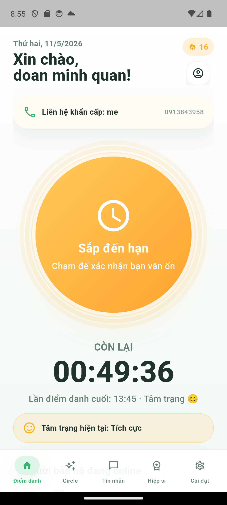
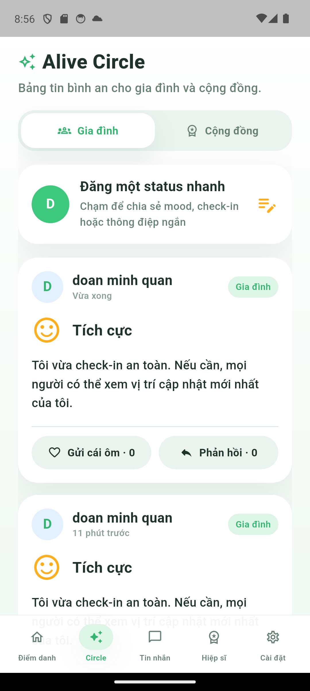
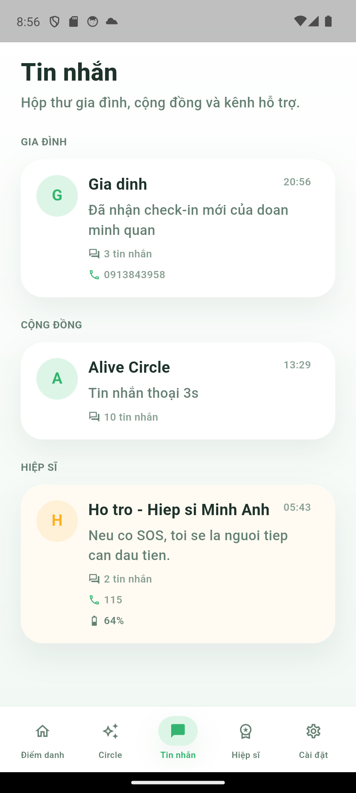
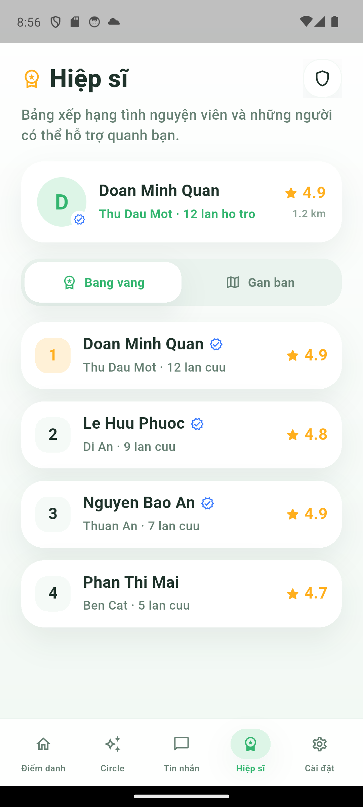
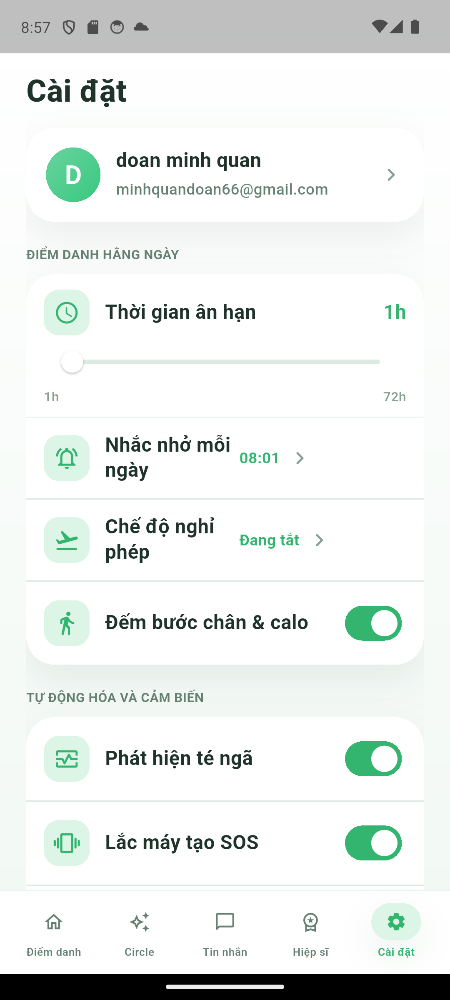

# SafeSolo

SafeSolo là hệ thống hỗ trợ an toàn cá nhân theo mô hình:

- ứng dụng Flutter cho người dùng
- backend Node.js + Express + MongoDB
- web admin điều phối

Mục tiêu của dự án là giúp người dùng:

- điểm danh an toàn theo chu kỳ
- tự động phát hiện mất liên lạc theo cơ chế dead-man switch
- kích hoạt SOS thủ công hoặc ngầm
- chia sẻ tín hiệu khẩn cấp cho người thân, cộng đồng và admin
- lưu hồ sơ y tế, vault và cấu hình bảo mật nâng cao

## Thành phần chính

### Flutter app

Thư mục:

- `lib/`
- `android/`
- `windows/`
- `web/`

Chức năng nổi bật:

- onboarding, auth, permissions
- Home check-in với vòng tròn trạng thái và đếm ngược
- mood prompt khi check-in
- Alive Circle
- Messenger, ghi âm thật, gọi điện
- SOS Map và Community Radar
- Heroes / Hiệp sĩ
- Settings, Medical ID, Network, Security, Vault, Achievements
- Stealth mode dạng máy tính
- đếm bước chân và calo
- song ngữ Việt / Anh

### Backend

Thư mục:

- `backend/`

Chức năng:

- quản lý user
- check-in, interaction events, alert policies
- dead-man worker
- medical, security, automation, device signals
- rescue incidents, volunteer response, community radar
- chat rooms, messages, emergency memos
- KYC
- vault
- admin APIs

### Web admin

Thư mục:

- `web-admin/`

Chức năng:

- dashboard điều phối
- danh sách user
- KYC queue
- sự cố đang xử lý
- alert timeline
- SMS logs
- export Excel
- bản đồ điều phối bằng MapTiler

## Cấu trúc repo

```text
SafeSolo/
├─ android/
├─ backend/
├─ docs/
├─ lib/
├─ test/
├─ web/
├─ web-admin/
├─ windows/
├─ flutter.env.example.json
└─ README.md
```

## Cách chạy nhanh

### Backend

```powershell
cd c:\Users\Admin\SafeSolo\backend
npm install
npm run dev
```

Health check:

- [http://127.0.0.1:4000/api/health](http://127.0.0.1:4000/api/health)

### Web admin

```powershell
cd c:\Users\Admin\SafeSolo\web-admin
npm install
npm run dev -- --host 0.0.0.0 --port 4173
```

Mở:

- [http://127.0.0.1:4173](http://127.0.0.1:4173)

### Flutter app

Tạo file local:

```powershell
Copy-Item flutter.env.example.json flutter.env.json
```

Ví dụ:

```json
{
  "API_BASE_URL": "http://127.0.0.1:4000/api",
  "MAPTILER_KEY": "your-key",
  "MAPTILER_STYLE": "streets-v2"
}
```

Chạy:

```powershell
flutter pub get
flutter run --dart-define-from-file=flutter.env.json
```

Nếu chạy trên máy thật Android, thay `127.0.0.1` bằng IP LAN của máy tính.

## Giao diện chính

Ảnh minh họa:

- 
- 
- 
- 
- 
- 

## Bảo mật và mã hóa dữ liệu

Backend hiện đã có lớp mã hóa thật cho dữ liệu nhạy cảm.

### Thuật toán

- `AES-256-GCM` cho payload nhạy cảm
- `bcrypt` cho `realPin` và `duressPin`
- hỗ trợ `kid` để rotate encryption key

### Dữ liệu đang được bảo vệ

- `medicalprofiles.encryptedProfile`
- `vaults.content`
- `users.encryptedSensitive`
  - `medicalNotes`
  - `approxAddress`
  - `emergencyContacts`
- `messages.encryptedPayload`
  - `content`
  - `metadata`
- `emergencymemos.encryptedPayload`
  - `victimName`
  - `approxAddress`
  - `contentUrl`
  - `transcript`
- `users.realPin`
- `users.duressPin`

Để vẫn hỗ trợ tra cứu theo guardian, backend giữ thêm:

- `users.emergencyContactPhones`

Đây là trường chỉ mục phục vụ truy vấn, còn nội dung liên hệ đầy đủ vẫn nằm trong payload đã mã hóa.

### Rotate encryption key

Trong `backend/.env` có thể dùng:

```env
DATA_ENCRYPTION_KEY_ID=primary
DATA_ENCRYPTION_KEY=current-secret
```

Hoặc keyring nhiều khóa:

```env
DATA_ENCRYPTION_KEYS=primary=current-secret;legacy-2025=older-secret
```

Sau khi đổi key, chạy:

```powershell
cd c:\Users\Admin\SafeSolo\backend
npm run migrate:encrypt-sensitive
```

Script này sẽ re-encrypt dữ liệu cũ sang key hiện tại.

## Tài liệu backend

Xem chi tiết hơn tại:

- [backend/README.md](backend/README.md)

## Lệnh hữu ích

### Flutter

```powershell
flutter analyze
flutter test
flutter build apk --release --dart-define-from-file=flutter.env.json
```

### Backend

```powershell
cd backend
npm run dev
npm run seed:demo-users
npm run migrate:encrypt-sensitive
```

### Web admin

```powershell
cd web-admin
npm run dev -- --host 0.0.0.0 --port 4173
npm run build
```
