# 🛡️ SAFESOLO - HỆ THỐNG CẢNH BÁO KHẨN CẤP TỰ ĐỘNG & ĐIỀU PHỐI CỨU HỘ THỜI GIAN THỰC
> **Hệ sinh thái Cứu hộ Đa nền tảng:** Flutter Mobile (Android/iOS) • Samsung Galaxy Watch 5 (WearOS) • Web Admin Dispatch Portal • Backend Node.js / MongoDB • AI & DSP Engine

---

## 📌 THÔNG TIN ĐỀ TÀI ĐỒ ÁN TỐT NGHIỆP
* **Tên đề tài:** Thiết kế và xây dựng hệ thống cảnh báo khẩn cấp tự động và điều phối cứu hộ thời gian thực - SafeSolo
* **Sinh viên thực hiện:** **Đoàn Minh Quân**
* **Mã số sinh viên:** **2224801030137**
* **Lớp:** **KTPM03**
* **Chuyên ngành:** Kỹ thuật Phần mềm (Software Engineering)

---

## 🌟 TỔNG QUAN HỆ THỐNG
SafeSolo là giải pháp an toàn cá nhân toàn diện dành cho người sống độc thân, người cao tuổi, người làm việc trong môi trường rủi ro cao hoặc di chuyển ban đêm. Hệ thống hoạt động theo nguyên lý **Edge-First Resilience** (Chủ động phát hiện tại thiết bị biên) kết hợp **Cloud Realtime Dispatch** (Điều phối cứu hộ thông minh thời gian thực):
1. **Theo dõi sinh tồn & Nhận diện bất thường:** Tự động phát hiện té ngã, nhịp tim bất thường ($BPM < 45$ hoặc $> 130$), thiếu oxy máu ($SpO_2 < 90\%$) thông qua cảm biến quang học PPG và gia tốc kế IMU.
2. **Cơ chế Điểm danh Sinh tồn (Dead-man's Switch):** Nhắc nhở người dùng check-in an toàn theo chu kỳ hẹn trước; tự động chuyển sang trạng thái báo động khẩn cấp nếu người dùng bất tỉnh hoặc mất liên lạc.
3. **Kích hoạt Khẩn cấp Đa phương thức:** Nhấn SOS tức thời, lắc mạnh điện thoại khi bị khống chế (*Shake-to-SOS*), ra lệnh bằng giọng nói (*Keyword Spotting*), hoặc nhập mã giả vờ phục tùng (*Duress PIN / Fake Calculator*).
4. **Mạng lưới Cứu hộ Hiệp sĩ (Community Radar):** Kết nối các tình nguyện viên đã xác minh CCCD/KYC trong bán kính $1 - 5	ext{ km}$ bằng thuật toán trắc địa Haversine.
5. **Điều phối Cứu hộ Đa kênh (Omnichannel Dispatch):** Tự động phát tin cứu hộ đồng thời qua 4 kênh: Telegram Bot Webhook, Zalo ZNS Template, Twilio SMS và Cuộc gọi khẩn cấp tự động (Voice Auto-Call Level 4).

---

## 🏗️ KIẾN TRÚC TỔNG THỂ HỆ THỐNG (SYSTEM ARCHITECTURE)

```
┌────────────────────────────────────────────────────────────────────────┐
│                        THIẾT BỊ BIÊN (EDGE DEVICES)                    │
├─────────────────────────────────────┬──────────────────────────────────┤
│ 📱 FLUTTER MOBILE APP (Android/iOS) │ ⌚ SAMSUNG GALAXY WATCH 5 (WearOS)│
│ • Dead-man's Switch & Check-in Loop │ • PPG Optical BioActive Sensor   │
│ • Stealth Mode (Fake Calculator)    │ • 3-Axis IMU (Gia tốc & Con quay)│
│ • KYC CCCD Upload & Trắc địa Waze   │ • Thuật toán té ngã (SVM & Tilt) │
│ • Lọc Butterworth & Dò đỉnh R (BPM) │ • Đồng bộ Bluetooth / Wi-Fi / API│
└──────────────────┬──────────────────┴─────────────────┬────────────────┘
                   │                                    │
                   │ RESTful API (HTTPS) / Socket.IO    │ POST /api/users/device-signal
                   ▼                                    ▼
┌────────────────────────────────────────────────────────────────────────┐
│               BACKEND SERVER (Node.js • Express • MongoDB)             │
├────────────────────────────────────────────────────────────────────────┤
│ • Authentication & JWT / OTP Xác minh số điện thoại                    │
│ • Deadman Background Worker (Quét trễ hạn check-in tự động)           │
│ • Duress & Stealth Worker (Giải mã mã ngụy trang)                      │
│ • Omnichannel Dispatch Engine (Telegram Bot, Zalo ZNS, SMS, Voice Call)│
│ • Radar Spatial Query (Tìm Hiệp sĩ gần nhất theo Haversine)           │
│ • AES-256 GCM Encryption (Bảo mật tuyệt đối hồ sơ CCCD & Y tế)         │
└──────────────────┬─────────────────────────────────────────────────────┘
                   │ Socket.IO Realtime Events / GeoJSON
                   ▼
┌────────────────────────────────────────────────────────────────────────┐
│             WEB ADMIN DISPATCH PORTAL (React • Vite • TanStack)         │
├────────────────────────────────────────────────────────────────────────┤
│ 🗺️ Live Map Cứu hộ: Giám sát tọa độ nạn nhân & Điều phối Hiệp sĩ      │
│ 🪪 KYC Management: Duyệt và xác thực căn cước công dân 2 mặt          │
│ 📡 Omnichannel Console: Giám sát trạng thái truyền tin đa kênh         │
│ ⌚ Galaxy Watch Simulator: Bàn thử nghiệm phát tín hiệu WearOS          │
│ 📈 Analytics & Revenue: Thống kê ca cứu hộ và phân tích rủi ro         │
└────────────────────────────────────────────────────────────────────────┘
```

---

## 📱 CHI TIẾT CÁC PHÂN HỆ VÀ CHỨC NĂNG

### 1. Ứng dụng Di động SafeSolo (Flutter Android / iOS)
* **Vòng tròn Điểm danh Sinh tồn (Home Screen & Check-in Circle):** Hiển thị trực quan thời gian còn lại trước hạn chót điểm danh, đo mức pin, tâm trạng (Mood Prompt) và ghi chú hoạt động.
* **Thanh Tóm tắt Sức khỏe & Trực thám Đồng hồ Trực tiếp (Home Live Health Glance):** Tích hợp ngay dưới lời chào trang chủ, hiển thị thời gian thực nhịp tim, SpO2, bước chân, pin Galaxy Watch và trạng thái giám sát té ngã IMU.
* **Trung tâm Sức khỏe & Sinh tồn Toàn diện (Health & Vitals Dashboard):**
  - **Vòng tròn Hoạt động 3 Lớp Đồng tâm (Concentric Activity Rings):** Trực quan hóa tiến độ Bước chân (Cyan), Tiêu hao Calo (Vivid Orange) và Quãng đường (Neon Green) lấy cảm hứng từ Apple Fitness & Samsung Health.
  - **Ma trận Sinh tồn (Biometrics Matrix):** Điểm số An toàn SafeSolo Health & Safety Score (0-100), đồ thị ECG nhịp tim thời gian thực, đồng hồ bão hòa oxy $SpO_2$, và cảm biến chống té ngã IMU.
* **Chế độ Khung giờ Yên tĩnh (Quiet Hours):** Tùy chỉnh khung giờ nghỉ ngơi (mặc định 23:00 - 06:00), tự động hạ mức báo động tránh làm phiền giấc ngủ nhưng vẫn duy trì giám sát ngầm.
* **Xác thực Danh tính Hiệp sĩ (KYC Upload CCCD):** Cho phép chụp/chọn 2 mặt ảnh Căn cước công dân từ camera/thư viện, mã hóa gửi lên máy chủ để được cấp huy hiệu Hiệp sĩ tin cậy (*Trust Score*).
* **Điều hướng Khẩn cấp 1-Chạm:** Tích hợp trực tiếp nút mở nhanh ứng dụng bản đồ **Waze Navigation** và **Google Maps** để Hiệp sĩ tới hiện trường với lộ trình ngắn nhất.
* **Chế độ Ngụy trang Bảo mật (Stealth Calculator):** Màn hình máy tính bỏ túi hoạt động bình thường; khi gõ mật khẩu ngụy trang (*Duress PIN*) hệ thống sẽ âm thầm phát báo động câm và truyền tọa độ mà kẻ xấu không hay biết.
* **Mạng lưới Người bảo hộ Phân cấp (Guardian Network):** Cấu hình người thân với 3 mức ưu tiên rõ ràng (Ưu tiên 1 - Người liên hệ chính, Ưu tiên 2, Ưu tiên 3) kèm tính năng gọi điện thoại khẩn cấp trực tiếp.
* **Hồ sơ Y tế Khẩn cấp (Medical ID & QR Code):** Nhóm máu, tiền sử dị ứng, liên hệ bác sĩ gia đình hiển thị trên màn hình khóa phục vụ sơ cứu viên.
* **Đếm bước chân & Lượng calo tiêu thụ (Pedometer Service):** Thu thập dữ liệu vận động thực tế, tự động tính calo đốt cháy ($Calo = Steps \times 0.04\text{ kcal}$).

---

### 2. Thiết bị Đeo Thông minh (Samsung Galaxy Watch 5 / Wear OS 4.0)
* **Đồng bộ Chỉ số Sinh tồn Thời gian thực:**
  - Nhịp tim ($BPM$): Tính toán liên tục qua cảm biến PPG với bộ lọc thông dải Butterworth và dò đỉnh thích nghi $V_{threshold}$.
  - Nồng độ Oxy hòa tan ($SpO_2$): Tính theo tỷ số $R$ định luật Beer-Lambert ($SpO_2 = 110 - 25R$).
* **Phát hiện Té ngã Tự động (Kinematic Fall Detection):**
  - Giám sát vector gia tốc $SVM = \sqrt{a_x^2 + a_y^2 + a_z^2}$.
  - Kích hoạt cảnh báo khi $SVM > 2.5g$ kết hợp góc nghiêng cơ thể $\theta > 60^\circ$.
* **Đếm bước chân & Calo:** Tự động đồng bộ bước chân về trung tâm điều phối.
* **Quản lý Thiết bị Đeo 3 Phân hệ Chuyên nghiệp (Smartwatch Companion 3-Tab):**
  - **Tab 1 - Sinh tồn:** Giám sát nhanh nhịp tim PPG BioActive, nồng độ oxy $SpO_2$, đếm bước chân, trạng thái đeo trên tay và phím kích hoạt SOS khẩn cấp trực tiếp.
  - **Tab 2 - Cảm biến & Ngã:** Phân tích dữ liệu gia tốc kế IMU 3 trục (X/Y/Z), độ lớn vector SVM (g), góc nghiêng cơ thể, độ nhạy chống té ngã và kiểm thử rung xúc giác đồng hồ.
  - **Tab 3 - Đồng bộ & SSWP:** Giao thức chuẩn hóa SafeSolo Smartwatch Protocol (SSWP v1.0), kiểm tra độ trễ Cloud Sync, mã hóa đường truyền E2E và trạng thái socket trực tiếp.
* **Đồng hồ Wear OS độc lập:** Ứng dụng Wear OS 4.0 One UI Watch chạy trực tiếp trên thiết bị smartwatch thật (Samsung Galaxy Watch 5/6) hoặc Wear OS emulator (`/wear-os`).

---

### 3. Trung tâm Điều phối Web Admin (Web Admin Dispatch Portal)
* **Bản đồ Giám sát Cứu hộ Thời gian thực (Live Map Dispatch):**
  - Hiển thị trực quan vị trí nạn nhân, bán kính ảnh hưởng, trạng thái ca cứu hộ.
  - Thẻ thông tin nạn nhân tích hợp chỉ số sinh tồn ($SpO_2$, $BPM$), mức pin, thời gian phát tín hiệu.
* **Quản lý & Duyệt Hồ sơ KYC (KYC Management):**
  - So sánh ảnh chân dung và 2 mặt CCCD, xác thực thông tin và cấp chứng nhận Hiệp sĩ cộng đồng.
* **Điều phối Đa kênh Khẩn cấp (Omnichannel Monitoring):**
  - Theo dõi trạng thái phát tin tức thời qua Telegram Bot, Zalo ZNS, Twilio SMS và Voice Call.
* **Báo cáo Thống kê & Doanh thu (Analytics & Revenue):**
  - Biểu đồ thống kê số ca cứu hộ thành công, thời gian đáp ứng trung bình, phân bổ địa lý.
* **Nhật ký Hệ thống (Audit Log & Telemetry):**
  - Ghi nhận toàn bộ thao tác hệ thống theo chuẩn an ninh bảo mật.

---

## 🧮 12 THUẬT TOÁN AI, DSP & TOÁN HỌC CỐT LÕI

| STT | Thuật toán | Vị trí cài đặt | Mục đích & Nguyên lý | Công thức / Ngưỡng |
| :---: | :--- | :--- | :--- | :--- |
| **1** | **Bộ lọc thông dải Butterworth (Bậc 2)** | `AiSignalProcessor.aiFilterPPG` | Khử trôi đường nền và nhiễu điện lưới trên tín hiệu PPG | Dải tần $0.5 - 5.0	ext{ Hz}$ ($30 - 300	ext{ BPM}$) |
| **2** | **Bộ lọc trung bình trượt (Moving Average)** | `AiSignalProcessor.smoothPPG` | Làm mượt dao động ngẫu nhiên | Cửa sổ trượt $N = 5$ điểm |
| **3** | **Dò đỉnh thích nghi động học (Dynamic Peak Detect)** | `AiSignalProcessor.detectHeartRate` | Tính nhịp tim BPM, chống đếm trùng sóng T | $V_{th} = \mu + 0.6\sigma$, Thời gian trơ $320	ext{ms}$ |
| **4** | **Tỷ số quang học Beer-Lambert (Ratio-of-Ratios)** | `AiSignalProcessor.calculateSpO2` | Đo nồng độ oxy trong máu không xâm lấn | $R = rac{AC_{red}/DC_{red}}{AC_{ir}/DC_{ir}}$, $SpO_2 = 110 - 25R$ |
| **5** | **Vector gia tốc tổng hợp (Kinematic SVM)** | `AiSignalProcessor.calculateSVM` | Bất biến với góc đặt máy, phát hiện va đập | $SVM = \sqrt{a_x^2 + a_y^2 + a_z^2} > 2.5g$ |
| **6** | **Góc nghiêng cơ thể (Body Tilt Angle)** | `AiSignalProcessor.calculateTiltAngle` | Phát hiện tư thế nằm bất động sau chấn thương | $	heta = rccos(a_z / SVM) 	imes rac{180}{\pi} > 60^\circ$ |
| **7** | **Bộ phân loại SVM (Linear SVM Classifier)** | `AiSignalProcessor.classifyFallSVM` | Phân biệt ngã thật với sinh hoạt thông thường (ADL) | $f(ec{x}) = 	ext{sign}(\mathbf{w}^T ec{x} + b)$ |
| **8** | **Chuỗi thời gian Rung lắc khẩn cấp (Shake-to-SOS)** | `AiSignalProcessor.detectShakeGesture` | Kích hoạt SOS ngầm khi bị đe dọa / giật máy | Cửa sổ 2s, $\ge 4$ lần đảo chiều gia tốc $> 18	ext{ m/s}^2$ |
| **9** | **Điểm rủi ro sinh tồn đa biến (Survival Risk Score)** | `AiSignalProcessor.calculateSurvivalRiskScore` | Ưu tiên điều phối xe cấp cứu theo mức nguy kịch | Thang điểm phi tuyến tính $0 - 100$ |
| **10** | **Khoảng cách trắc địa Haversine** | `backend/src/lib/utils.js` | Tìm Hiệp sĩ cứu hộ gần nạn nhân nhất | $d = 2R rcsin\left(\sqrt{\sin^2(\Delta\phi/2) + \cos\phi_1\cos\phi_2\sin^2(\Delta\lambda/2)}
ight)$ |
| **11** | **Nhận diện giọng nói khẩn cấp (Keyword Spotting)** | `AiSignalProcessor.evaluateVoiceDistress` | Kêu cứu rảnh tay khi bị trói hoặc kẹt tay | Trích xuất MFCC 13 dải, Tiny-CNN on-device |
| **12** | **Bộ lọc áp suất khí áp (Barometer Altitude)** | Sensor Fusion Engine | Phát hiện rơi tự do từ nhà cao tầng hoặc vách đá | $v_z = rac{dh}{dt} > 5	ext{ m/s}$ kết hợp $SVM > 3.0g$ |

---

## 📡 CƠ CHẾ ĐIỀU PHỐI CỨU HỘ ĐA KÊNH (OMNICHANNEL DISPATCH)

Khi kích hoạt SOS, hệ thống đồng thời kích hoạt 4 kênh cứu hộ độc lập:
1. **Telegram Emergency Bot Webhook:** Bắn bản tin khẩn cấp định dạng Markdown kèm tọa độ Google Maps và thông số sinh tồn nạn nhân vào Group Cứu hộ tác chiến.
2. **Zalo ZNS (Zalo Notification Service):** Gửi thông điệp chăm sóc khẩn cấp có bản quyền qua số điện thoại Zalo của Người bảo hộ.
3. **Twilio SMS Gateway:** Phát tin nhắn văn bản truyền thống đến toàn bộ số điện thoại trong danh bạ bảo hộ.
4. **Voice Auto-Call Level 4 (Tổng đài gọi khẩn cấp tự động):** Gọi trực tiếp đến máy người bảo hộ ưu tiên 1 và phát giọng đọc Text-to-Speech (TTS) đọc vị trí và tình trạng nguy cấp của nạn nhân.

---

## 🗄️ CẤU TRÚC CƠ SỞ DỮ LIỆU (MONGODB COLLECTIONS)

* **`users`:** Thông tin tài khoản, tọa độ mới nhất, trạng thái KYC, danh bạ bảo hộ, cấu hình Khung giờ yên tĩnh (*quietHoursStart/End*).
* **`emergencylogs`:** Nhật ký các ca SOS, mức độ nghiêm trọng, kinh độ/vĩ độ, trạng thái tiếp nhận, hiệp sĩ tiếp cứu.
* **`devicesignals`:** Lưu trữ lịch sử dữ liệu cảm biến từ Samsung Galaxy Watch 5 ($SpO_2$, $BPM$, $SVM$, gia tốc 3 trục).
* **`alertevents`:** Sự kiện cảnh báo phát sinh (té ngã, trễ check-in, còi hú, báo động mức 1/2).
* **`checkins`:** Lịch sử các lần điểm danh, ghi chú tâm trạng, trạng thái an toàn.
* **`chats` & `messages`:** Tin nhắn trao đổi, hình ảnh, file ghi âm giọng nói giữa nạn nhân và người cứu trợ.
* **`kycrequests`:** Dữ liệu duyệt thẻ Căn cước công dân (CCCD mặt trước, mặt sau, trạng thái duyệt).
* **`auditlogs`:** Dấu vết kiểm toán an toàn thông tin toàn hệ thống.

---


---


---


---

## 📸 HÌNH ẢNH THỰC TẾ & KẾT QUẢ KIỂM THỬ TỪNG CHỨC NĂNG (DEMO SCREENSHOTS)

> 💡 **Mẹo xem ảnh trực tiếp trên VS Code:**
> - Nhấn tổ hợp phím **`Ctrl + Shift + V`** (hoặc nhấn nút **Open Preview to the Side** 📖 ở góc phải trên cùng của VS Code) để xem giao diện ảnh trực quan.
> - Hoặc bấm chuột trực tiếp vào các đường link **`[Mở xem ảnh]`** dưới mỗi mục để mở trực tiếp file ảnh trong tab mới của VS Code.

---

### A. GIAO DIỆN ỨNG DỤNG DI ĐỘNG FLUTTER (ANDROID APP)

Dưới đây là bộ ảnh chụp thực tế toàn bộ các màn hình chức năng của ứng dụng di động SafeSolo chạy trên Android (chuẩn Pixel 7):

#### 1. Màn hình Giới thiệu & Điểm danh Bình an (Onboarding Screen)
* **Tuyến đường:** `/onboarding`
* **Mô tả:** Giới thiệu triết lý cốt lõi của SafeSolo - Chạm 1 nút mỗi ngày để báo an toàn cho gia đình, tự động bảo vệ khi sống độc thân hoặc di chuyển một mình.
* 🔗 **Mở xem ảnh:** [docs/screenshots/app_01_onboarding.png](file:///C:/Users/Admin/SafeSolo/docs/screenshots/app_01_onboarding.png)

<p align="center">
  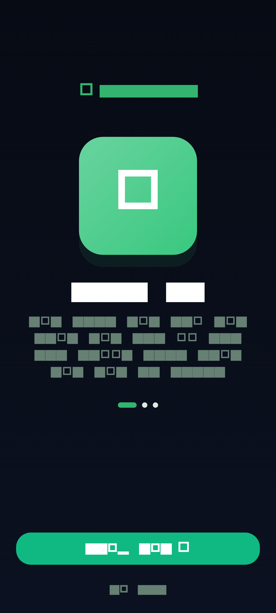
</p>

---

#### 2. Màn hình Cấp quyền Hệ thống (System Permissions)
* **Tuyến đường:** `/permissions`
* **Mô tả:** Xin cấp 4 quyền sống còn phục vụ cứu trợ khẩn cấp: Vị trí (GPS chính xác), Micro (Thu âm cầu cứu / ghi chú), Thông báo (Nhắc check-in & cảnh báo SOS lân cận) và Danh bạ (Thêm nhanh Người bảo hộ).
* 🔗 **Mở xem ảnh:** [docs/screenshots/app_02_permissions.png](file:///C:/Users/Admin/SafeSolo/docs/screenshots/app_02_permissions.png)

<p align="center">
  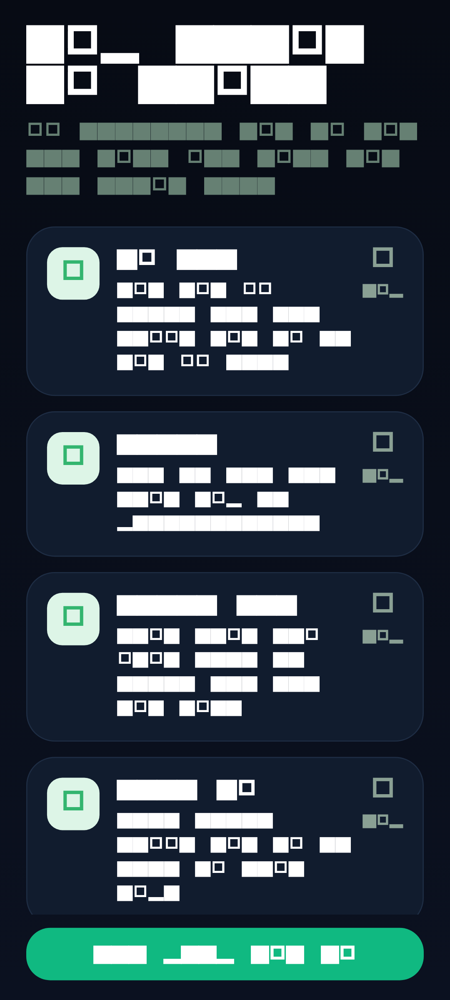
</p>

---

#### 3. Màn hình Đăng nhập & Tạo Hồ sơ Cá nhân (Auth & Profile Setup)
* **Tuyến đường:** `/auth`
* **Mô tả:** Xác thực số điện thoại, nhập thông tin liên hệ khẩn cấp và lựa chọn chu kỳ check-in mặc định (3h, 6h, 12h, 24h) phù hợp với nhịp sinh hoạt của từng người dùng.
* 🔗 **Mở xem ảnh:** [docs/screenshots/app_03_auth_login.png](file:///C:/Users/Admin/SafeSolo/docs/screenshots/app_03_auth_login.png)

<p align="center">
  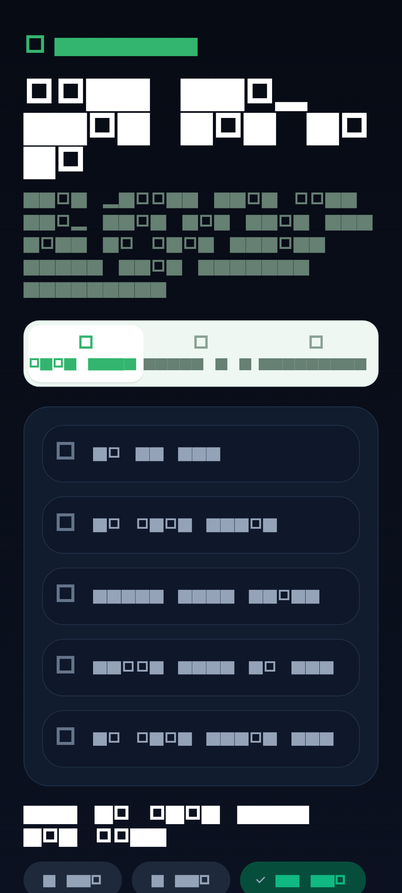
</p>

---

#### 4. Quản lý Kết nối & Thông số Đồng hồ Thông minh (Samsung Galaxy Watch 5)
* **Tuyến đường:** `/smartwatch` (hoặc `/watch-details`)
* **Mô tả:** Chức năng trực tiếp kết nối và hiển thị các thông số cụ thể từ đồng hồ qua Bluetooth LE: trạng thái ghép nối, mức pin %, cường độ sóng RSSI dBm, tình trạng đeo trên cổ tay (On-wrist / Off-wrist), nhịp tim PPG BioActive thời gian thực, nồng độ oxy hòa tan $SpO_2$, cảm biến gia tốc 3 trục IMU (SVM, trục X/Y/Z, góc nghiêng), phím rung tìm đồng hồ và nút phát tín hiệu SOS khẩn cấp trực tiếp.
* 🔗 **Mở xem ảnh:** [docs/screenshots/app_04_watch_simulator.png](file:///C:/Users/Admin/SafeSolo/docs/screenshots/app_04_watch_simulator.png)

<p align="center">
  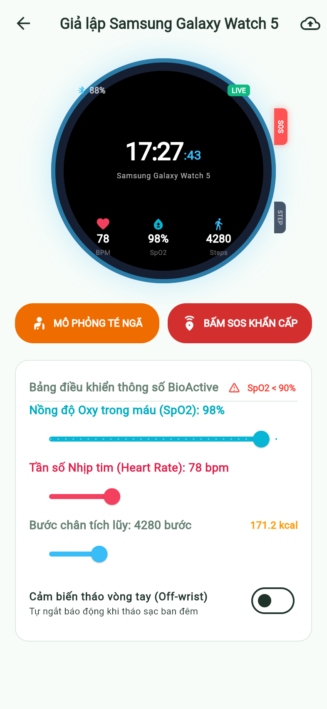
</p>

---

#### 5. Cài đặt Khung giờ Yên tĩnh (Quiet Hours 23:00 - 06:00)
* **Tuyến đường:** `/settings`
* **Mô tả:** Cho phép người dùng tùy chỉnh Khung giờ yên tĩnh (mặc định 23:00 đến 06:00 sáng hôm sau), cấu hình thời gian ân hạn điểm danh, kích hoạt tính năng đếm bước chân và tự động phát hiện té ngã.
* 🔗 **Mở xem ảnh:** [docs/screenshots/app_05_settings_quiet_hours.png](file:///C:/Users/Admin/SafeSolo/docs/screenshots/app_05_settings_quiet_hours.png)

<p align="center">
  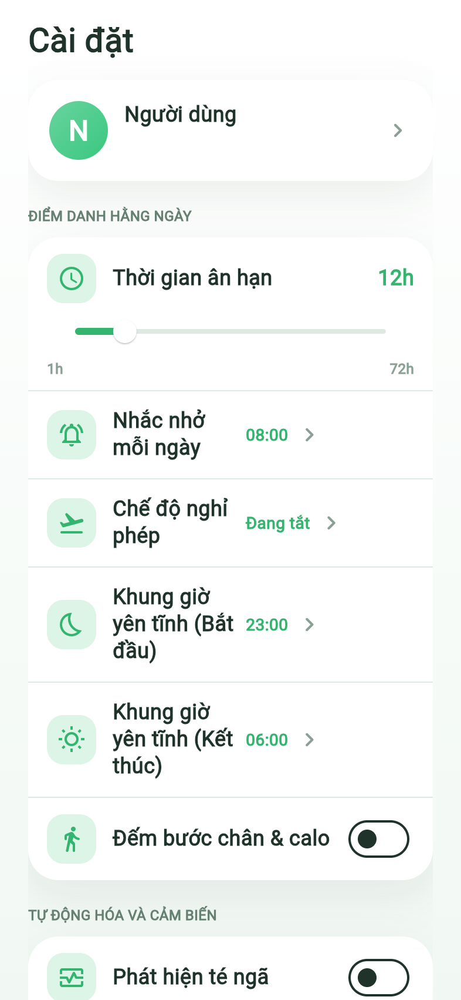
</p>

---

#### 6. Mạng lưới Người bảo hộ Phân cấp Ưu tiên (Guardian Network)
* **Tuyến đường:** `/network`
* **Mô tả:** Thiết lập tối đa 3 người bảo hộ được phân cấp ưu tiên (Cấp 1 là người liên hệ chính nhận SMS & Cuộc gọi khẩn cấp tự động đầu tiên, tiếp theo là Cấp 2 và Cấp 3).
* 🔗 **Mở xem ảnh:** [docs/screenshots/app_06_guardian_network.png](file:///C:/Users/Admin/SafeSolo/docs/screenshots/app_06_guardian_network.png)

<p align="center">
  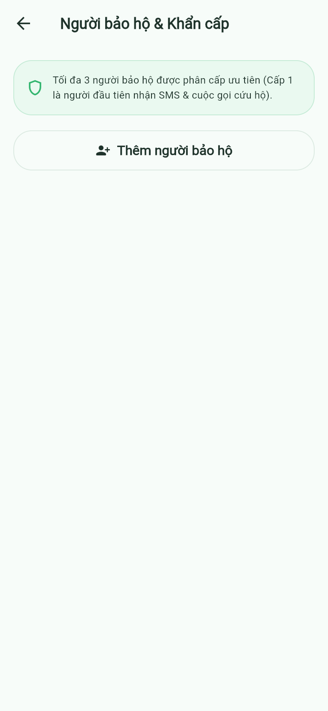
</p>

---

#### 7. Hồ sơ Y tế Khẩn cấp & Nhóm máu (Medical ID & QR Code)
* **Tuyến đường:** `/medical`
* **Mô tả:** Lưu trữ nhóm máu (O+, A, B, AB), tiền sử dị ứng, bệnh nền và thông tin thẻ CCCD phục vụ sơ cứu khẩn cấp. Hỗ trợ tạo mã QR tiện dụng.
* 🔗 **Mở xem ảnh:** [docs/screenshots/app_07_medical_id.png](file:///C:/Users/Admin/SafeSolo/docs/screenshots/app_07_medical_id.png)

<p align="center">
  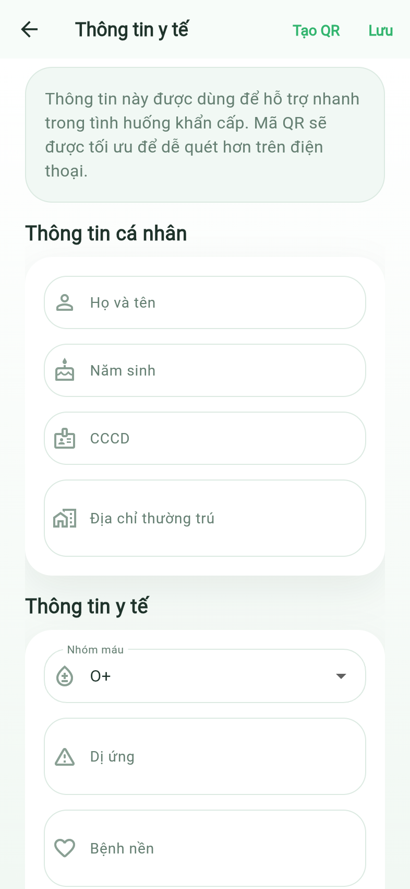
</p>

---

#### 8. Cài đặt Bảo mật & PIN giả Duress (Security & Stealth Mode)
* **Tuyến đường:** `/security`
* **Mô tả:** Cấu hình mật mã PIN thật và PIN giả (*Duress PIN*). Khi bị ép buộc mở ứng dụng, gõ PIN giả sẽ mở ra giao diện máy tính bỏ túi bình thường nhưng âm thầm phát báo động câm và tọa độ về trung tâm cứu hộ.
* 🔗 **Mở xem ảnh:** [docs/screenshots/app_08_security_stealth.png](file:///C:/Users/Admin/SafeSolo/docs/screenshots/app_08_security_stealth.png)

<p align="center">
  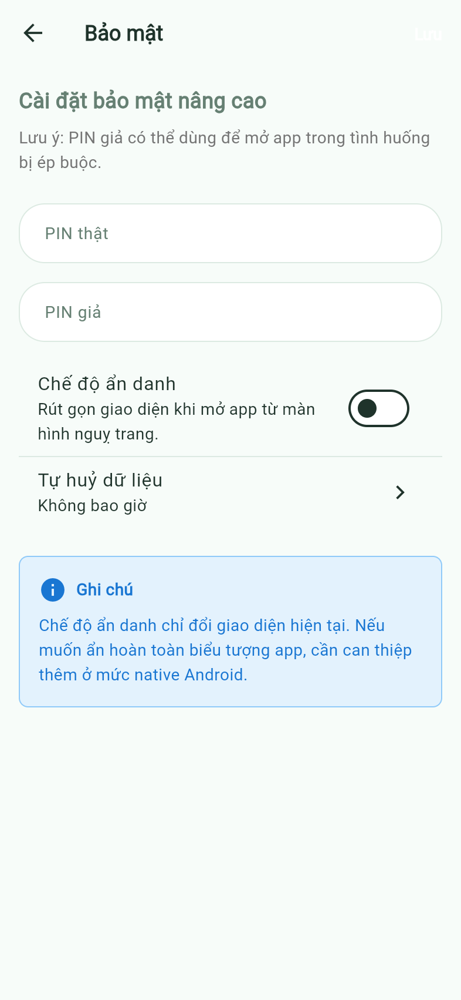
</p>

---

#### 9. Két sắt Sinh tử (Safety Vault & Dead-man's Switch)
* **Tuyến đường:** `/vault`
* **Mô tả:** Két mã hóa AES-256 lưu trữ checklist công việc, mật khẩu khẩn cấp và lời dặn dò. Két tự động mở gửi nội dung cho Người bảo hộ sau 72 giờ mất liên lạc liên tiếp.
* 🔗 **Mở xem ảnh:** [docs/screenshots/app_09_safety_vault.png](file:///C:/Users/Admin/SafeSolo/docs/screenshots/app_09_safety_vault.png)

<p align="center">
  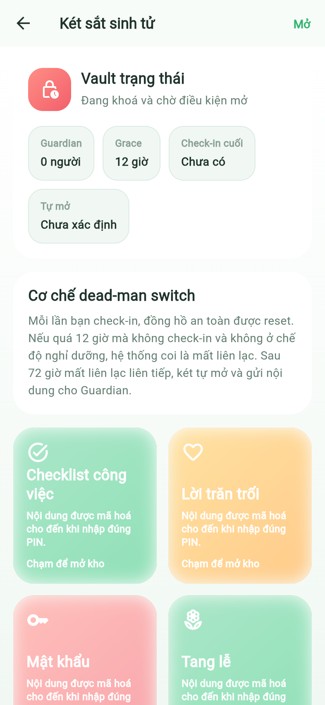
</p>

---

#### 10. Huy hiệu & Thành tích An toàn (Badges & Streaks)
* **Tuyến đường:** `/achievements`
* **Mô tả:** Hệ thống gamification khuyến khích duy trì thói quen điểm danh an toàn: Người cẩn thận, Đội trưởng bảo vệ, Kiên trì 100 ngày, Chiến binh y tế và Anh hùng cộng đồng.
* 🔗 **Mở xem ảnh:** [docs/screenshots/app_10_achievements.png](file:///C:/Users/Admin/SafeSolo/docs/screenshots/app_10_achievements.png)

<p align="center">
  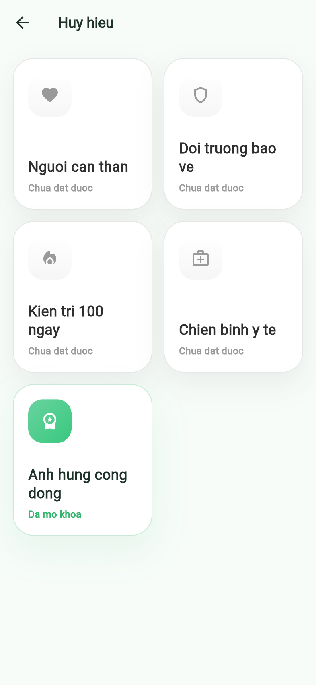
</p>

---

#### 11. Trung tâm Sức khỏe & Chỉ số Sinh tồn Toàn diện (Health & Vitals Hub)
* **Tuyến đường:** `/health-history`
* **Mô tả:** Giao diện trung tâm sức khỏe hoàn chỉnh lấy cảm hứng từ Apple Fitness & Samsung Health:
  - **Vòng tròn hoạt động 3 lớp đồng tâm (Concentric Activity Rings):** Trực quan hóa tiến độ Bước chân (Cyan), Tiêu hao Calo (Vivid Orange), và Quãng đường di chuyển (Emerald Green) thời gian thực cùng nút mô phỏng vận động nhanh.
  - **Ma trận Sinh tồn (Biometrics Matrix):** Thang điểm An toàn & Sức khỏe SafeSolo Score (0-100), Biểu đồ sóng điện tim nhịp tim thực PPG với hiệu ứng ECG Waveform, Đồng hồ đo bão hòa Oxy trong máu $SpO_2$, và Giám sát cảm biến IMU gia tốc chống ngã chủ động.
  - **Bộ lọc chu kỳ linh hoạt & Nhật ký:** Chuyển đổi Hôm nay / 7 ngày / 30 ngày, thống kê tuân thủ điểm danh và dòng thời gian sức khỏe.
* 🔗 **Mở xem ảnh:** [docs/screenshots/app_11_health_vitals_hub.png](file:///C:/Users/Admin/SafeSolo/docs/screenshots/app_11_health_vitals_hub.png)

<p align="center">
  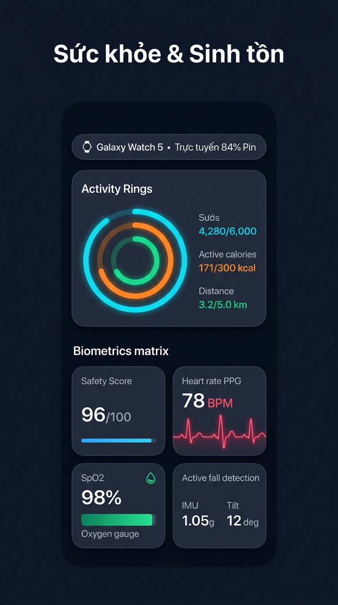
</p>

---

#### 12. Quản lý Thiết bị đeo 3 Phân hệ Chuyên nghiệp (Smartwatch Companion 3-Tab)
* **Tuyến đường:** `/smartwatch` (hoặc `/watch-details`)
* **Mô tả:** Nâng cấp cấu trúc điều khiển đồng hồ Samsung Galaxy Watch / Wear OS thành 3 Tab chuyên sâu:
  - **Tab 1 - Sinh tồn:** Giám sát nhanh nhịp tim PPG BioActive, nồng độ oxy $SpO_2$, đếm bước chân, trạng thái đeo trên tay và phím kích hoạt SOS khẩn cấp trực tiếp.
  - **Tab 2 - Cảm biến & Ngã:** Phân tích sâu dữ liệu gia tốc kế IMU 3 trục (X/Y/Z), độ lớn vector SVM (g), góc nghiêng cơ thể, độ nhạy chống té ngã và kiểm thử rung xúc giác đồng hồ.
  - **Tab 3 - Đồng bộ & SSWP:** Giao thức chuẩn hóa SafeSolo Smartwatch Protocol (SSWP v1.0), kiểm tra độ trễ Cloud Sync, mã hóa đường truyền E2E và trạng thái socket trực tiếp.
* 🔗 **Mở xem ảnh:** [docs/screenshots/app_12_smartwatch_companion.png](file:///C:/Users/Admin/SafeSolo/docs/screenshots/app_12_smartwatch_companion.png)

<p align="center">
  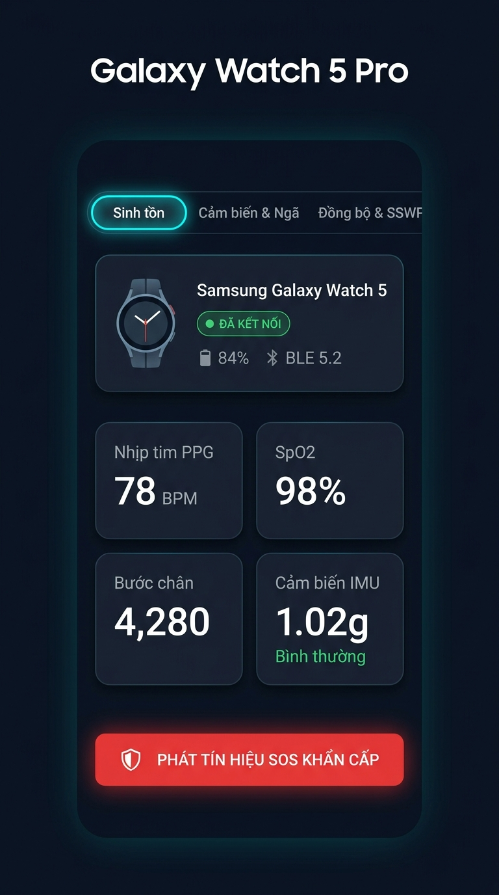
</p>

---

#### 13. Thẻ Tóm tắt Sức khỏe & Trực thám Đồng hồ tại Trang chủ (Home Live Health Glance)
* **Tuyến đường:** `/home`
* **Mô tả:** Thẻ trạng thái nổi bật ngay dưới lời chào đầu ngày trên màn hình chính:
  - Hiển thị nhịp đập chỉ số đồng hồ trực tiếp: Trực tuyến / Ngoại tuyến, mức pin %, nhịp tim BPM, $SpO_2$, bước chân và trạng thái cảm biến té ngã IMU.
  - Chạm 1 chạm dẫn thẳng vào Trung tâm Sức khỏe hoặc Quản lý Smartwatch.
* 🔗 **Mở xem ảnh:** [docs/screenshots/app_13_home_health_glance.png](file:///C:/Users/Admin/SafeSolo/docs/screenshots/app_13_home_health_glance.png)

<p align="center">
  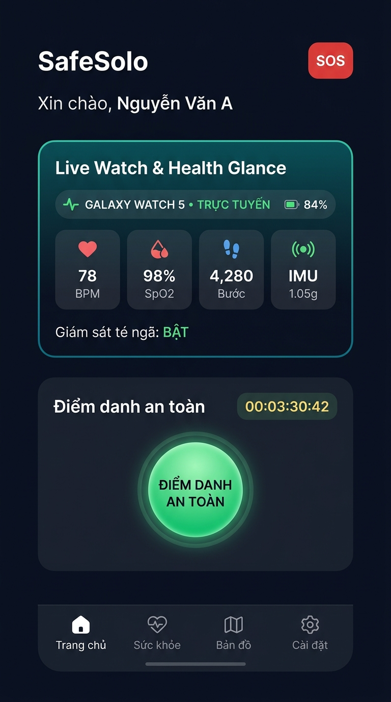
</p>

---

### B. GIAO DIỆN TRUNG TÂM ĐIỀU PHỐI CỨU HỘ (WEB ADMIN PORTAL)

#### 1. Bản đồ Cứu hộ Thời gian thực (Live Map SOS Dispatch)
* **Tuyến đường:** `/` (Web Admin)
* **Mô tả:** Giám sát trực quan tọa độ các ca SOS khẩn cấp, hiển thị bán kính cảnh báo 5km, chỉ số sinh tồn ($SpO_2$, $BPM$, pin thiết bị) và các Hiệp sĩ cứu hộ lân cận.
* 🔗 **Mở xem ảnh:** [docs/screenshots/01_live_map_dispatch.png](file:///C:/Users/Admin/SafeSolo/docs/screenshots/01_live_map_dispatch.png)

<p align="center">
  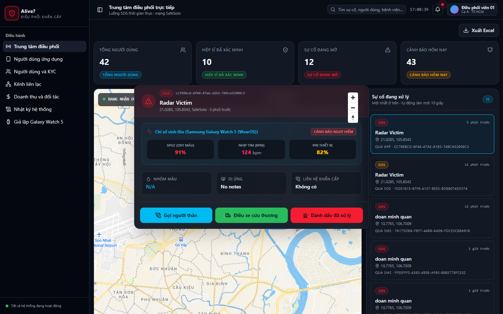
</p>

---

#### 2. Điều phối Cứu hộ Đa kênh (Omnichannel Emergency Dispatch)
* **Tuyến đường:** `/omnichannel` (Web Admin)
* **Mô tả:** Giám sát 4 luồng phát tin khẩn cấp đồng thời: Telegram Bot Webhook, Zalo ZNS, Twilio SMS và Voice Auto-Call Level 4.
* 🔗 **Mở xem ảnh:** [docs/screenshots/03_omnichannel_dispatch.png](file:///C:/Users/Admin/SafeSolo/docs/screenshots/03_omnichannel_dispatch.png)

<p align="center">
  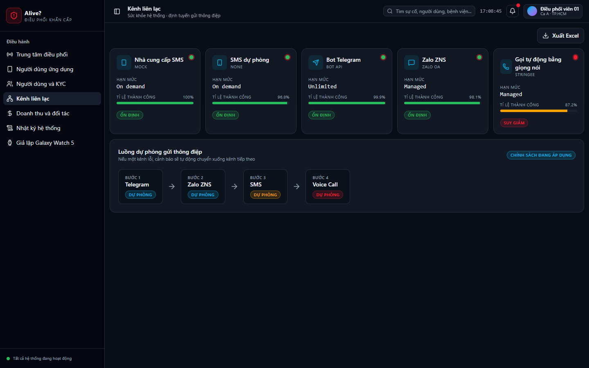
</p>

---

#### 3. Quản lý & Phê duyệt Xác minh Danh tính CCCD (KYC Verification)
* **Tuyến đường:** `/kyc` (Web Admin)
* **Mô tả:** Tiếp nhận ảnh chụp 2 mặt Căn cước công dân do người dùng tải lên từ camera điện thoại, phê duyệt và cấp huy hiệu Hiệp sĩ tin cậy.
* 🔗 **Mở xem ảnh:** [docs/screenshots/04_kyc_verification.png](file:///C:/Users/Admin/SafeSolo/docs/screenshots/04_kyc_verification.png)

<p align="center">
  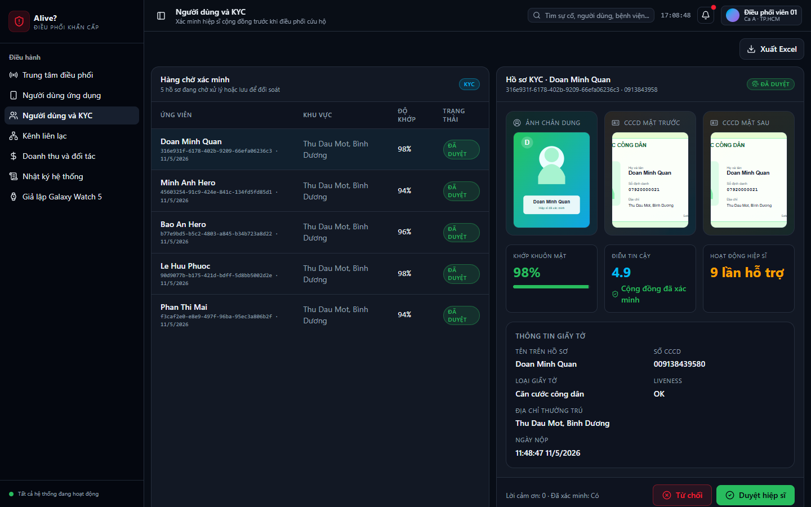
</p>

---

#### 4. Quản trị Người dùng & Mạng lưới Người bảo hộ (Users & Guardians)
* **Tuyến đường:** `/users` (Web Admin)
* **Mô tả:** Quản trị hồ sơ người dùng, phân cấp mức độ ưu tiên Người bảo hộ và kích hoạt chế độ gọi điện trực tiếp khi có sự cố.
* 🔗 **Mở xem ảnh:** [docs/screenshots/05_users_guardians.png](file:///C:/Users/Admin/SafeSolo/docs/screenshots/05_users_guardians.png)

<p align="center">
  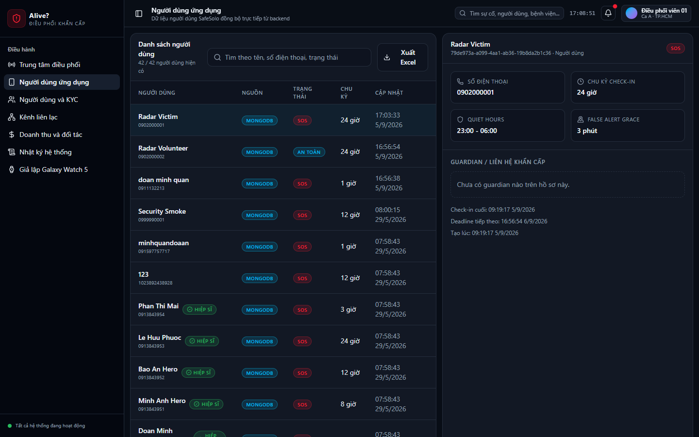
</p>

---

#### 5. Thống kê Ca cứu hộ & Báo cáo Doanh thu (Analytics & Revenue)
* **Tuyến đường:** `/revenue` (Web Admin)
* **Mô tả:** Biểu đồ trực quan thống kê số ca cứu hộ thành công, thời gian tiếp cứu trung bình và phân bổ địa bàn hoạt động.
* 🔗 **Mở xem ảnh:** [docs/screenshots/06_analytics_revenue.png](file:///C:/Users/Admin/SafeSolo/docs/screenshots/06_analytics_revenue.png)

<p align="center">
  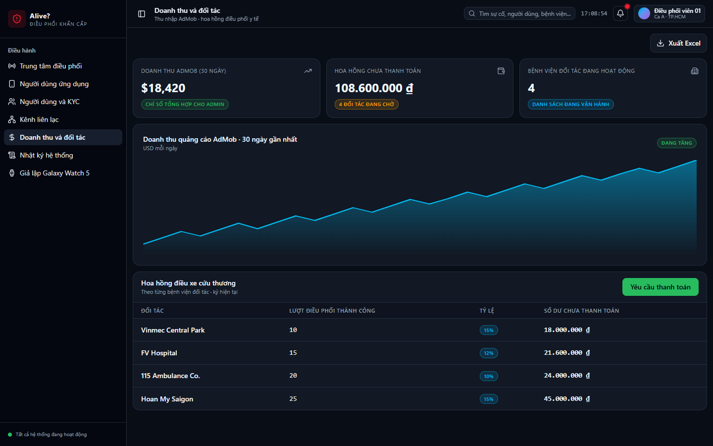
</p>

---

#### 6. Nhật ký Kiểm toán Hệ thống & An toàn Dữ liệu (Audit Log)
* **Tuyến đường:** `/audit` (Web Admin)
* **Mô tả:** Lưu vết không thể sửa xóa (audit trail) đối với mọi thao tác SOS, phân quyền và dữ liệu y tế theo chuẩn an toàn thông tin.
* 🔗 **Mở xem ảnh:** [docs/screenshots/07_system_audit.png](file:///C:/Users/Admin/SafeSolo/docs/screenshots/07_system_audit.png)

<p align="center">
  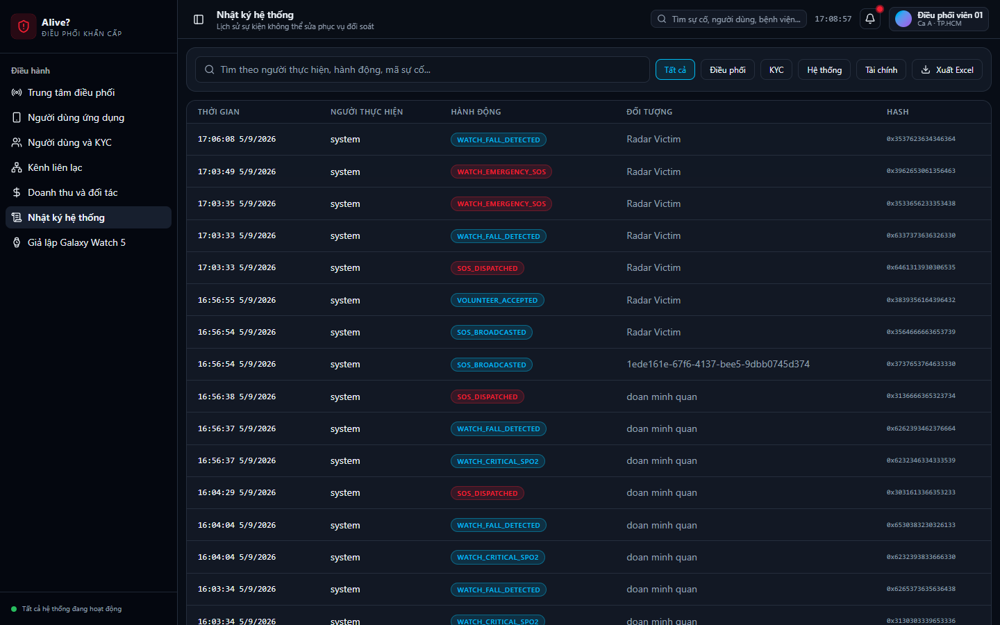
</p>

---

## 🚀 HƯỚNG DẪN CÀI ĐẶT & VẬN HÀNH TỪNG BƯỚC

### 1. Chuẩn bị Môi trường
* **Flutter SDK:** Version $\ge 3.24.0$
* **Node.js:** Version $\ge 18.x$
* **MongoDB:** Bản local hoặc MongoDB Atlas URI
* **Android Studio:** Android SDK Platform API 34+

---

### 2. Cài đặt & Khởi chạy Backend Server
```bash
# Di chuyển vào thư mục backend
cd backend

# Cài đặt thư viện phụ thuộc
npm install

# Cấu hình file môi trường .env (sao chép từ .env.example)
cp .env.example .env

# Khởi động Backend Server
npm run dev
# Server lắng nghe tại: http://localhost:4000
```

---

### 3. Cài đặt & Khởi chạy Web Admin Portal
```bash
# Di chuyển vào thư mục web-admin
cd web-admin

# Cài đặt dependencies
npm install

# Khởi chạy máy chủ phát triển
npm run dev
# Web Admin truy cập tại: http://localhost:8080
```

---

### 4. Chạy Ứng dụng Mobile App (Flutter Android)
* **Khởi chạy trên Thiết bị Android / Máy ảo Pixel:**
  ```bash
  # Khởi chạy emulator có sẵn
  flutter emulators --launch Pixel_6_API_34

  # Chạy app SafeSolo
  flutter run -d android
  ```
* **Hoặc sử dụng các file script tiện ích có sẵn trong thư mục gốc:**
  - `run_safesolo_android.bat` : Tự động khởi chạy trên thiết bị Android

---

## 🧪 HƯỚNG DẪN KIỂM THỬ TOÀN BỘ HỆ THỐNG (TEST SUITE)

Dự án đã được tích hợp quy trình kiểm thử tự động toàn diện từ Unit Test, Static Analysis đến API Integration Test:

### 1. Kiểm thử Thuật toán AI & Mobile App (Flutter Test)
```bash
# Chạy toàn bộ 10 bài test đơn vị (AI/DSP, Watch Simulator, Auth Widget)
flutter test

# Kiểm tra cú pháp và chất lượng mã nguồn (Static Analysis)
flutter analyze lib/
# Kết quả: No issues found!
```

### 2. Kiểm thử Tích hợp Backend & Tín hiệu Đồng hồ Galaxy Watch 5
```bash
cd backend

# Test xác thực và phân quyền
node scripts/testAuthEndpoint.js

# Test toàn diện API tín hiệu Samsung Galaxy Watch 5 (BPM, SpO2 < 90%, Fall 4.8g)
node scripts/testWatchSimulatorEndpoint.js

# Test Điều phối Cứu hộ Đa kênh (Telegram, Zalo, SMS, Voice Call)
node scripts/testOmnichannelSos.js

# Test Radar Cứu hộ và Quyền riêng tư của Hiệp sĩ
node scripts/testHeroProfilePrivacy.js
node scripts/testRadarHttp.js
```

### 3. Kiểm thử Biên dịch Web Admin
```bash
cd web-admin
npm run build
# Kết quả: 2004 modules transformed, Vite build thành công 100%!
```

---

## 🧪 HỆ THỐNG KIỂM THỬ & MA TRẬN TEST CASES TOÀN DIỆN

Hệ thống SafeSolo được bảo chứng chất lượng với bộ **97 Test Cases** đặc tả chi tiết toàn bộ các kịch bản kiểm thử chức năng và phi chức năng cho cả 3 phân hệ:

| Phân hệ kiểm thử | Số lượng TCs | P1 (Critical - Sinh tử) | P2 (High - Nghiệp vụ chính) | P3 (Medium - Tiện ích) |
| :--- | :---: | :---: | :---: | :---: |
| **1. Trung tâm điều phối Web Admin** | **38** | 17 | 16 | 5 |
| **2. Ứng dụng di động Mobile App** | **39** | 25 | 11 | 3 |
| **3. Đồng hồ Samsung Galaxy Watch 5** | **20** | 16 | 4 | 0 |
| **TỔNG CỘNG** | **97** | **58 (59.8%)** | **31 (32.0%)** | **8 (8.2%)** |

> 📖 **Xem toàn văn 97 Test Cases chi tiết tại:** [docs/TEST_CASES.md](file:///C:/Users/Admin/SafeSolo/docs/TEST_CASES.md)

### Các kịch bản kiểm thử tự động nổi bật:
1. **Kiểm thử Giao diện 7 Màn hình Galaxy Watch 5 (Wear OS):**
   ```bash
   flutter test test/galaxy_watch5_interface_test.dart
   ```
2. **Kiểm thử Giao thức SSWP & Đồng bộ Smartwatch (WatchSyncManager):**
   ```bash
   flutter test test/watch_sync_manager_test.dart
   ```
3. **Kiểm thử Bộ lọc Butterworth & Thuật toán Xử lý Tín hiệu AI:**
   ```bash
   flutter test test/ai_signal_processor_test.dart
   ```

---

## 📂 CẤU TRÚC MÃ NGUỒN DỰ ÁN

```
SafeSolo/
├── android/                         # Cấu hình Gradle và mã nguồn gốc Android
├── assets/                          # Âm thanh còi hú, icon, hình ảnh minh họa
├── backend/                         # Backend Node.js Express REST & Socket.IO
│   ├── scripts/                     # Kịch bản kiểm thử API tự động
│   ├── src/
│   │   ├── controllers/             # Bộ điều khiển SOS, Auth, User, KYC
│   │   ├── models/                  # Mongoose Schemas (User, EmergencyLog, ...)
│   │   ├── routes/                  # Định tuyến REST APIs
│   │   ├── services/                # sosService, notificationService, ...
│   │   └── workers/                 # deadmanWorker, duressWorker
│   └── server.js                    # File khởi chạy máy chủ Backend
├── docs/                            # Tài liệu học thuật & Đặc tả kỹ thuật đồ án
│   ├── TEST_CASES.md                # Bộ tài liệu 97 Test Cases toàn diện hệ thống
│   ├── co-so-du-lieu-chi-tiet.txt   # Chi tiết thiết kế Cơ sở dữ liệu
│   └── thuat-toan-ai-chi-tiet.md    # Chuyên sâu 12 thuật toán AI & DSP
├── lib/                             # Toàn bộ mã nguồn ứng dụng Flutter
│   ├── core/                        # Theme, hằng số, AppProvider
│   ├── models/                      # User, Contact, EmergencyEvent, watch_protocol
│   ├── services/                    # ai_signal_processor, api_service, watch_sync_manager
│   └── views/                       # Màn hình chức năng (Home, Radar, Health, ...)
│       ├── auth/                    # Đăng nhập, Đăng ký, Quên mật khẩu
│       ├── community_radar/         # Radar bản đồ, Duyệt KYC CCCD, Waze/Maps
│       ├── health/                  # Lịch sử sinh tồn, Concentric Activity Rings
│       ├── watch/                   # Smartwatch Companion 3-tab
│       ├── wear_os/                 # 7 màn hình Wear OS Galaxy Watch 5
│       ├── network/                 # Quản lý người bảo hộ phân cấp ưu tiên
│       └── settings/                # Khung giờ yên tĩnh (Quiet Hours), Bảo mật
├── test/                            # Bộ kiểm thử đơn vị tự động Flutter
│   ├── ai_signal_processor_test.dart# Test bộ lọc Butterworth, SVM, SpO2, Peak Detect
│   ├── galaxy_watch5_interface_test.dart # Test 7 màn hình tròn Galaxy Watch 5
│   ├── watch_sync_manager_test.dart # Test giao thức SSWP & Đồng bộ Smartwatch
│   └── widget_test.dart             # Test luồng giao diện khởi động
├── web-admin/                       # Trung tâm điều phối Web Admin (React + Vite)
│   ├── src/
│   │   ├── components/              # IncidentMap, AppSidebar, Topbar
│   │   └── routes/                  # Định tuyến TanStack Router
└── README.md                        # Tài liệu hướng dẫn đồ án (File này)
```

---

## 👨‍💻 TÁC GIẢ & BẢN QUYỀN
* **Tác giả:** Đoàn Minh Quân (MSSV: 2224801030137 - Lớp KTPM03)
* **Đơn vị:** Khoa Công nghệ Thông tin - Chuyên ngành Kỹ thuật Phần mềm
* **Phiên bản:** 1.0.0 (Release Candidate - Phục vụ Hội đồng Đồ án Tốt nghiệp)
* **Năm thực hiện:** 2026
