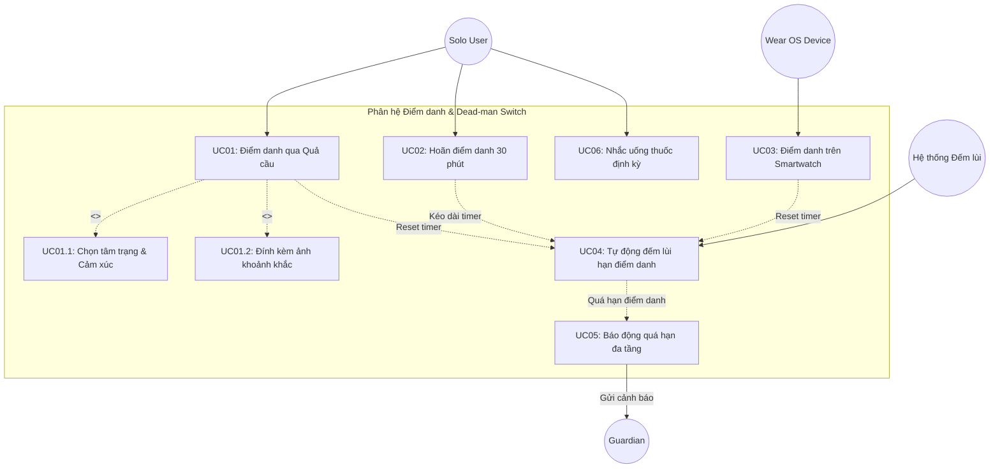
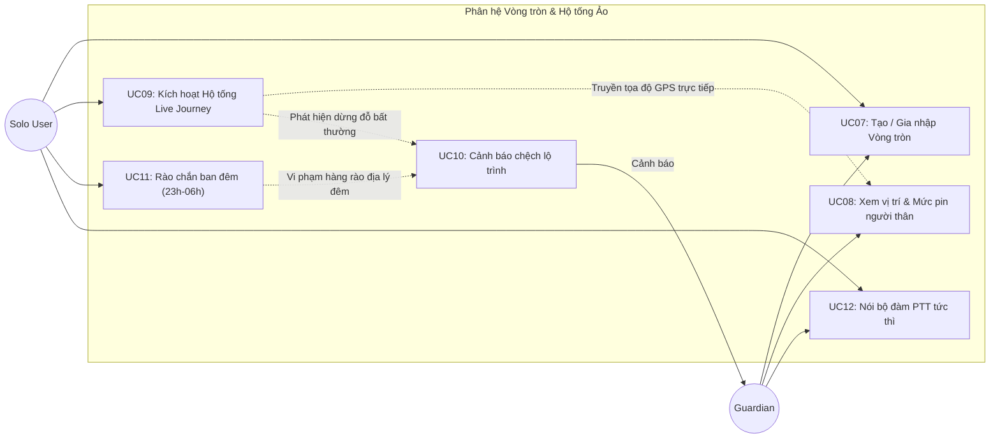
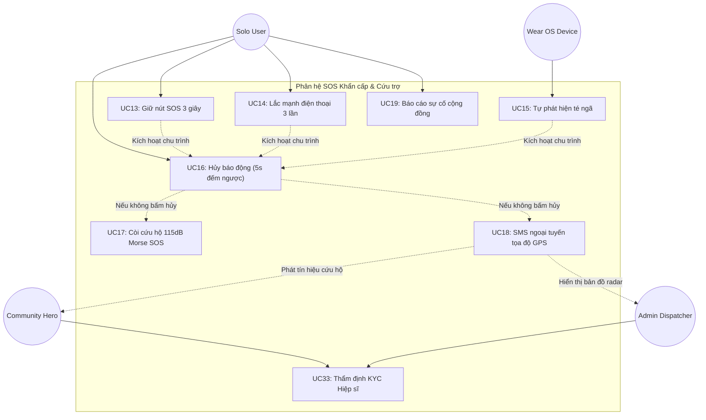
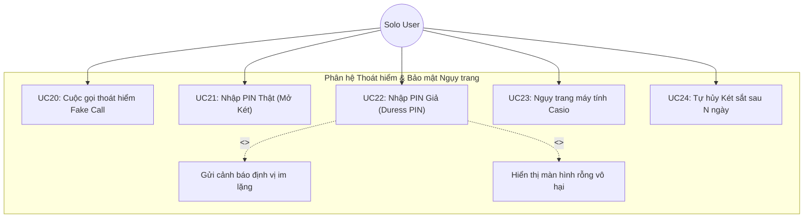
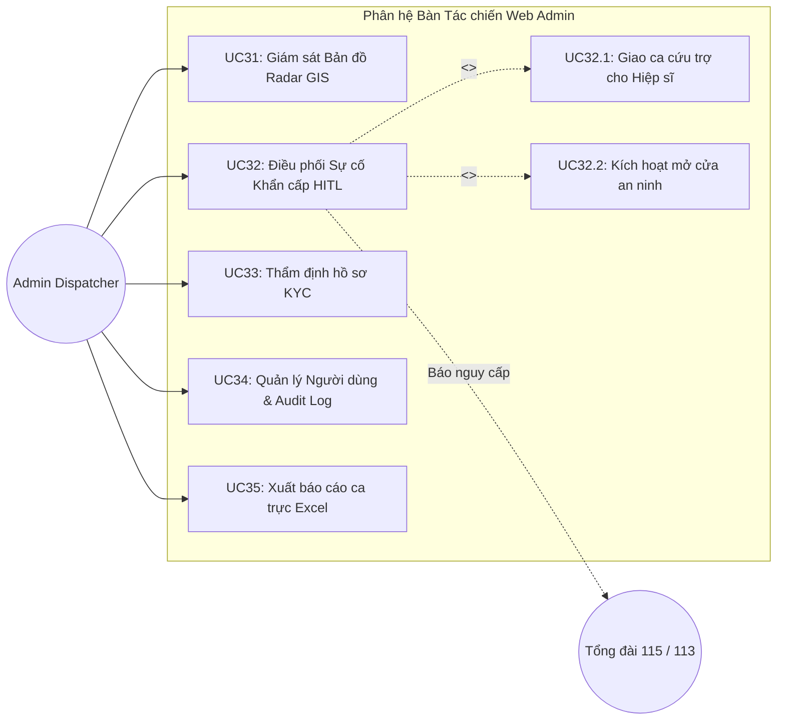
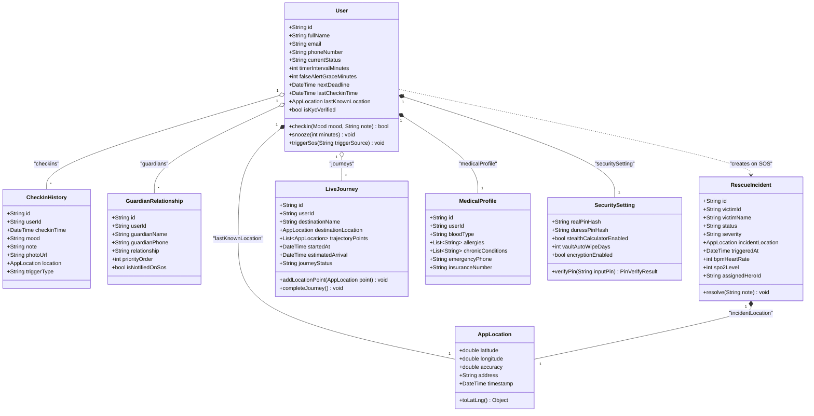
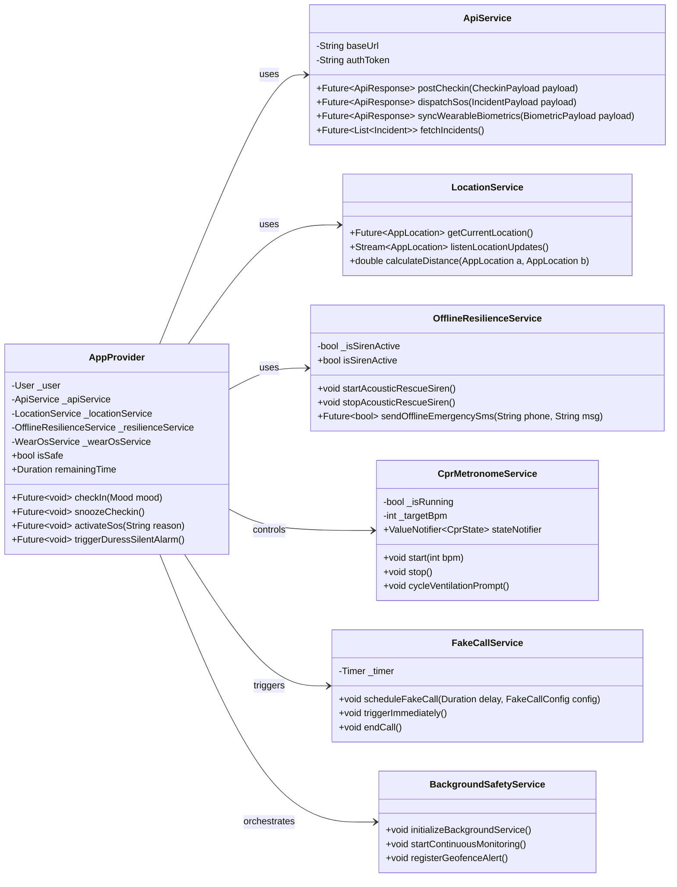
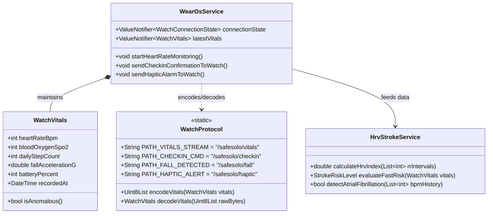

# 📑 BÁO CÁO ĐẶC TẢ CHỨC NĂNG, USE CASE DIAGRAM VÀ CLASS DIAGRAM
## ĐỀ TÀI: SAFESOLO - NỀN TẢNG BẢO VỆ AN TOÀN CÁ NHÂN & GIÁM SÁT SINH TỒN CHO NGƯỜI SỐNG ĐỘC THÂN
> **Tác giả:** Đoàn Minh Quân (MSSV: 2224801030137 - Lớp KTPM03)  
> **Chuyên ngành:** Kỹ thuật Phần mềm (Software Engineering)  
> **Hội đồng:** Đồ án Tốt nghiệp / Báo cáo Chuyên ngành 2026  
> **Phiên bản:** 1.0.0 Final Specification  

---

# MỤC LỤC
1. [PHẦN I: XÁC ĐỊNH TÁC NHÂN VÀ DANH MỤC YÊU CẦU CHỨC NĂNG](#phần-i-xác-định-tác-nhân-và-danh-mục-yêu-cầu-chức-năng)
   - [1.1. Danh sách các Tác nhân (Actors)](#11-danh-sách-các-tác-nhân-actors)
   - [1.2. Bảng phân rã 35 Chức năng (Functional Breakdown)](#12-bảng-phân-rã-35-chức-năng-functional-breakdown)
2. [PHẦN II: SƠ ĐỒ USE CASE (USE CASE DIAGRAMS)](#phần-ii-sơ-đồ-use-case-use-case-diagrams)
   - [2.1. Sơ đồ Use Case Tổng thể Hệ thống (System Overview)](#21-sơ-đồ-use-case-tổng-thể-hệ-thống-system-overview)
   - [2.2. Sơ đồ Use Case Phân hệ Điểm danh & Công tắc An toàn](#22-sơ-đồ-use-case-phân-hệ-điểm-danh--công-tắc-an-toàn)
   - [2.3. Sơ đồ Use Case Phân hệ Vòng tròn Alive Circle & Hộ tống](#23-sơ-đồ-use-case-phân-hệ-vòng-tròn-alive-circle--hộ-tống)
   - [2.4. Sơ đồ Use Case Phân hệ SOS & Mạng lưới Hiệp sĩ](#24-sơ-đồ-use-case-phân-hệ-sos--mạng-lưới-hiệp-sĩ)
   - [2.5. Sơ đồ Use Case Phân hệ Thoát hiểm & Ngụy trang](#25-sơ-đồ-use-case-phân-hệ-thoát-hiểm--ngụy-trang)
   - [2.6. Sơ đồ Use Case Phân hệ Trung tâm Điều phối Web Admin](#26-sơ-đồ-use-case-phân-hệ-trung-tâm-điều-phối-web-admin)
3. [PHẦN III: ĐẶC TẢ CHI TIẾT CÁC USE CASE CỐT LÕI](#phần-iii-đặc-tả-chi-tiết-các-use-case-cốt-lõi)
   - [3.1. Đặc tả UC01: Điểm danh qua Quả cầu An toàn](#31-đặc-tả-uc01-điểm-danh-qua-quả-cầu-an-toàn)
   - [3.2. Đặc tả UC13 + UC15: Kích hoạt SOS Đa tầng & Còi cứu hộ](#32-đặc-tả-uc13--uc15-kích-hoạt-sos-đa-tầng--còi-cứu-hộ)
   - [3.3. Đặc tả UC22: Nhập mã PIN giả cưỡng ép (Duress PIN)](#33-đặc-tả-uc22-nhập-mã-pin-giả-cưỡng-ép-duress-pin)
   - [3.4. Đặc tả UC32: Điều phối Sự cố Khẩn cấp trên Web Admin](#34-đặc-tả-uc32-điều-phối-sự-cố-khẩn-cấp-trên-web-admin)
4. [PHẦN IV: SƠ ĐỒ LỚP (CLASS DIAGRAMS)](#phần-iv-sơ-đồ-lớp-class-diagrams)
   - [4.1. Kiến trúc Hướng đối tượng & Nguyên lý Thiết kế](#41-kiến-trúc-hướng-đối-tượng--nguyên-lý-thiết-kế)
   - [4.2. Sơ đồ Lớp Tổng thể Hệ thống (Core Domain Model)](#42-sơ-đồ-lớp-tổng-thể-hệ-thống-core-domain-model)
   - [4.3. Sơ đồ Lớp Tầng Dịch vụ & Thiết bị Ngoại vi (Service Architecture)](#43-sơ-đồ-lớp-tầng-dịch-vụ--thiết-bị-ngoại-vi-service-architecture)
   - [4.4. Sơ đồ Lớp Đồng bộ Wear OS & Sức khỏe (Wearable Biometrics)](#44-sơ-đồ-lớp-đồng-bộ-wear-os--sức-khỏe-wearable-biometrics)

---

# PHẦN I: XÁC ĐỊNH TÁC NHÂN VÀ DANH MỤC YÊU CẦU CHỨC NĂNG

## 1.1. Danh sách các Tác nhân (Actors)

| STT | Tác nhân (Actor) | Loại tác nhân | Định nghĩa & Vai trò trong hệ thống |
| :---: | :--- | :---: | :--- |
| 1 | **Solo User** *(Người dùng độc thân)* | Con người (Chính) | Đối tượng trọng tâm (sinh viên, nhân viên văn phòng, người già sống một mình). Tương tác qua ứng dụng di động hoặc đồng hồ thông minh để điểm danh, yêu cầu cứu hộ, kích hoạt thoát hiểm. |
| 2 | **Guardian** *(Người bảo hộ)* | Con người (Phụ) | Người thân, cha mẹ, bạn bè đáng tin cậy. Nhận thông báo định kỳ, theo dõi vị trí trực tiếp trong chế độ Hộ tống ảo, nhận SMS/Call khẩn cấp khi người dùng gặp nạn. |
| 3 | **Community Hero** *(Hiệp sĩ cứu hộ)* | Con người (Phụ) | Tình nguyện viên trong cộng đồng đã xác minh KYC CCCD. Nhận nhiệm vụ cứu trợ khẩn cấp lân cận (bán kính 2-5km) qua Bàn tác chiến. |
| 4 | **Admin Dispatcher** *(Điều phối viên trực ban)* | Con người (Quản trị) | Cán bộ trực ban tại Trung tâm điều phối Web Admin 24/7. Giám sát bản đồ radar GIS, điều phối Hiệp sĩ, mở cửa an ninh và liên hệ lực lượng phản ứng nhanh. |
| 5 | **Wear OS Device** *(Đồng hồ Galaxy Watch 5)* | Thiết bị / Phần cứng | Thiết bị đeo thông minh liên tục đo nhịp tim (PPG), nồng độ oxy trong máu ($SpO_2$), bước chân và phát hiện rơi ngã bất tỉnh qua gia tốc kế. |
| 6 | **Emergency Services** *(Tổng đài 113/114/115)* | Hệ thống bên ngoài | Cơ quan cứu hộ công lập (Công an 113, Cứu hỏa 114, Cấp cứu 115) được kết nối tự động khi phát sinh sự cố vượt ngưỡng. |
| 7 | **AI SoloCare Engine** | Hệ thống con (AI) | Động cơ phân tích bất thường nhịp tim, dẫn dắt nhịp ép tim CPR Metronome, trợ lý trấn an tinh thần và gợi ý xử trí tình huống nguy cấp. |

---

## 1.2. Bảng phân rã 35 Chức năng (Functional Breakdown)

Hệ thống được tổ chức thành 6 phân hệ cốt lõi với 35 Use Cases hoàn chỉnh:

### Phân hệ 1: Điểm danh Thường nhật & Công tắc An toàn (Check-in & Dead-man Switch)
- **UC01:** Điểm danh an toàn qua Quả cầu trạng thái (Chọn tâm trạng, kèm ảnh khoảnh khắc).
- **UC02:** Tạm hoãn điểm danh 30 phút (Khi đang họp, lái xe hoặc bận việc).
- **UC03:** Điểm danh nhanh 1 chạm trên mặt đồng hồ Wear OS.
- **UC04:** Tự động đếm lùi hạn điểm danh an toàn (Dead-man switch countdown 1h - 72h).
- **UC05:** Kích hoạt cảnh báo tự động quá hạn điểm danh (Báo động đa tầng).
- **UC06:** Đặt lịch nhắc uống thuốc & Lịch trình sinh hoạt định kỳ.

### Phân hệ 2: Vòng tròn Thân yêu Alive Circle & Hộ tống Ảo (Circle & Live Journey)
- **UC07:** Khởi tạo & Gia nhập Vòng tròn thân yêu (Mã QR / Mã mời số).
- **UC08:** Giám sát trạng thái thành viên trực tiếp (Mức pin, khoảng cách, an toàn).
- **UC09:** Kích hoạt Hộ tống ảo thời gian thực (Live Journey) khi đi đêm/taxi.
- **UC10:** Cảnh báo chệch tuyến đường hoặc xe dừng đỗ bất thường.
- **UC11:** Bật/Tắt Rào chắn ban đêm (Night Geofence Guard 23:00 - 06:00).
- **UC12:** Đàm thoại Bộ đàm tức thì PTT (Push-To-Talk) 1 chạm.

### Phân hệ 3: Kích hoạt SOS & Cứu nạn Khẩn cấp (Emergency SOS & Rescue)
- **UC13:** Kích hoạt SOS thủ công bằng nhấn giữ 3 giây.
- **UC14:** Kích hoạt SOS bằng cử chỉ lắc mạnh điện thoại 3 lần.
- **UC15:** Tự động kích hoạt SOS khi phát hiện va chạm / té ngã (Fall Detection).
- **UC16:** Hủy kích hoạt SOS trong khoảng thời gian đếm ngược 5 giây.
- **UC17:** Phát còi cứu hộ âm học 115dB mã Morse SOS đa tần.
- **UC18:** Tự động gửi tin nhắn SMS cứu hộ ngoại tuyến kèm GPS (Offline Resilience).
- **UC19:** Báo cáo hiểm họa & chướng ngại vật cộng đồng (Hazard Feed).

### Phân hệ 4: Thoát hiểm Thông minh & Ngụy trang Bảo mật (Smart Escape & Stealth)
- **UC20:** Lên lịch Cuộc gọi Thoát hiểm Giả lập (Fake Escape Call).
- **UC21:** Mở khóa Két sắt sinh tử bằng mã PIN thật (Mã hóa AES-256).
- **UC22:** Nhập mã PIN giả cưỡng ép (Duress PIN - Kích hoạt báo động ngầm).
- **UC23:** Bật Chế độ Ngụy trang Máy tính Bỏ túi (Calculator Stealth Mode).
- **UC24:** Tự hủy Két sắt khẩn cấp sau số ngày mất liên lạc (Vault Auto-wipe).

### Phân hệ 5: Trợ lý Sơ cứu Y tế 24/7 & Đo Đạc Sức Khỏe (Medical & Biometrics)
- **UC25:** Hướng dẫn Ép tim CPR kèm máy đánh nhịp Metronome (100 - 120 BPM).
- **UC26:** Tra cứu quy trình xử trí Đột quỵ FAST & Hóc dị vật Heimlich.
- **UC27:** Dẫn dắt Bài tập hít thở 4-7-8 ổn định nhịp tim.
- **UC28:** Đồng bộ dữ liệu nhịp tim BPM, oxy $SpO_2$ và bước chân từ Galaxy Watch.
- **UC29:** Xuất báo cáo lịch sử sức khỏe chuẩn y tế (Excel / PDF).
- **UC30:** Tra cứu Sổ tay Hướng dẫn sử dụng SafeSolo thuần Việt tích hợp.

### Phân hệ 6: Bàn Tác chiến Web Admin & Điều phối Trực ban (Admin Dispatch)
- **UC31:** Giám sát Bản đồ Radar GIS thời gian thực (MapLibre GL).
- **UC32:** Tiếp nhận & Điều phối Sự cố Khẩn cấp (Cơ chế 30s HITL).
- **UC33:** Thẩm định hồ sơ & Xác minh KYC Hiệp sĩ cộng đồng (CCCD + Liveness).
- **UC34:** Quản lý Người dùng, Cấu hình Geofence & Nhật ký Hệ thống (Audit Logs).
- **UC35:** Xuất dữ liệu ca cứu hộ ra file Excel nghiệp vụ.

---

# PHẦN II: SƠ ĐỒ USE CASE (USE CASE DIAGRAMS)

## 2.1. Sơ đồ Use Case Tổng thể Hệ thống (System Overview)

Sơ đồ thể hiện sự tương tác giữa 4 tác nhân chính (`Solo User`, `Guardian`, `Community Hero`, `Admin Dispatcher`) cùng 2 tác nhân hỗ trợ (`Wear OS Device`, `Emergency Services`):

```mermaid
flowchart LR
  %% Actors
  user((Solo User))
  guardian((Guardian))
  hero((Community Hero))
  admin((Admin Dispatcher))
  watch((Wear OS Device))
  service((Tổng đài 113/114/115))

  subgraph SafeSoloSystem ["HỆ THỐNG AN TOÀN SINH TỒN SAFESOLO"]
    direction TB
    
    subgraph Sub1 ["1. Điểm danh & Sinh tồn"]
      UC_Checkin(["UC01: Điểm danh an toàn"])
      UC_Snooze(["UC02: Hoãn điểm danh 30p"])
      UC_Overdue(["UC05: Báo động quá hạn"])
    end

    subgraph Sub2 ["2. Vòng tròn & Hộ tống"]
      UC_Circle(["UC08: Giám sát Vòng tròn"])
      UC_Journey(["UC09: Hộ tống ảo Live Journey"])
      UC_Walkie(["UC12: Bộ đàm PTT tức thì"])
      UC_Night(["UC11: Rào chắn ban đêm"])
    end

    subgraph Sub3 ["3. SOS & Cứu nạn"]
      UC_SOS(["UC13: Kích hoạt SOS khẩn cấp"])
      UC_Fall(["UC15: Phát hiện ngã quỵ"])
      UC_Siren(["UC17: Còi cứu hộ Morse 115dB"])
      UC_SMS(["UC18: SMS ngoại tuyến GPS"])
    end

    subgraph Sub4 ["4. Thoát hiểm & Ngụy trang"]
      UC_FakeCall(["UC20: Cuộc gọi thoát hiểm"])
      UC_Duress(["UC22: Mã PIN giả cưỡng ép"])
      UC_Vault(["UC21: Két sắt AES-256"])
    end

    subgraph Sub5 ["5. Sơ cứu & Sức khỏe"]
      UC_CPR(["UC25: Ép tim CPR Metronome"])
      UC_Sync(["UC28: Đồng bộ nhịp tim / SpO2"])
    end

    subgraph Sub6 ["6. Điều phối Web Admin"]
      UC_GIS(["UC31: Radar GIS thời gian thực"])
      UC_Dispatch(["UC32: Điều phối sự cố HITL"])
      UC_KYC(["UC33: Xác minh KYC Hiệp sĩ"])
    end
  end

  %% Relationships
  user --> UC_Checkin
  user --> UC_Snooze
  user --> UC_Journey
  user --> UC_Walkie
  user --> UC_SOS
  user --> UC_FakeCall
  user --> UC_Duress
  user --> UC_Vault
  user --> UC_CPR

  watch --> UC_Checkin
  watch --> UC_Fall
  watch --> UC_Sync

  guardian --> UC_Circle
  guardian <-- UC_Overdue
  guardian <-- UC_Journey
  guardian <-- UC_SMS
  guardian --> UC_Walkie

  hero --> UC_Dispatch

  admin --> UC_GIS
  admin --> UC_Dispatch
  admin --> UC_KYC

  UC_Dispatch -.->|Liên hệ hỗ trợ| service
  UC_SOS -.-> UC_Siren
  UC_SOS -.-> UC_SMS
```

---

## 2.2. Sơ đồ Use Case Phân hệ Điểm danh & Công tắc An toàn

Phân hệ giải quyết bài toán cốt lõi: Nạn nhân sống một mình bị bất tỉnh và không thể tự bấm gọi trợ giúp.



---

## 2.3. Sơ đồ Use Case Phân hệ Vòng tròn Alive Circle & Hộ tống



---

## 2.4. Sơ đồ Use Case Phân hệ SOS & Mạng lưới Hiệp sĩ



---

## 2.5. Sơ đồ Use Case Phân hệ Thoát hiểm & Ngụy trang



---

## 2.6. Sơ đồ Use Case Phân hệ Trung tâm Điều phối Web Admin



---

# PHẦN III: ĐẶC TẢ CHI TIẾT CÁC USE CASE CỐT LÕI

## 3.1. Đặc tả UC01: Điểm danh qua Quả cầu An toàn

| Thuộc tính | Chi tiết đặc tả |
| :--- | :--- |
| **Mã Use Case** | **UC01** |
| **Tên Use Case** | Điểm danh an toàn thường nhật (Daily Safety Check-in) |
| **Tác nhân chính** | Solo User |
| **Mô tả tóm tắt** | Người dùng chạm Quả cầu trạng thái để xác nhận tình trạng an toàn, ghi nhận tâm trạng và chia sẻ ảnh khoảnh khắc cho người thân. |
| **Tiền điều kiện (Pre-conditions)** | Ứng dụng đã đăng nhập thành công; Quả cầu an toàn đang hiển thị ở màn hình chính. |
| **Hậu điều kiện (Post-conditions)** | Trạng thái người dùng chuyển thành `SAFE`; đồng hồ đếm lùi được thiết lập lại từ đầu; đồng bộ dữ liệu lên máy chủ và đồng hồ Wear OS. |
| **Luồng sự kiện chính (Main Flow)** | 1. Người dùng chạm vào Quả cầu trạng thái trên màn hình chính.<br>2. Hệ thống hiển thị hộp thoại Điểm danh nhanh kèm danh sách biểu tượng cảm xúc (Vui vẻ, Bình an, Hơi mệt, Cần lưu ý).<br>3. Người dùng chọn tâm trạng và gõ lời nhắn ngắn.<br>4. Người dùng bấm "Xác nhận điểm danh".<br>5. Hệ thống thu nhận tọa độ GPS hiện tại.<br>6. Hệ thống gửi yêu cầu `POST /api/checkins` lên Backend API.<br>7. Hệ thống cập nhật Quả cầu sang màu Xanh lá (`#10B981`), đặt lại đồng hồ đếm ngược.<br>8. Hiển thị thông báo Toast xác nhận thành công. |
| **Luồng sự kiện rẽ nhánh (Alternative Flows)** | **A1: Người dùng đính kèm ảnh khoảnh khắc**: Tại bước 3, người dùng chọn biểu tượng Camera để chụp hoặc tải ảnh lên. Hệ thống tải ảnh lên CDN và gắn URL vào bản ghi điểm danh.<br>**A2: Người dùng chọn "Hoãn 30 phút"**: Tại bước 2, người dùng bấm nút hoãn; hệ thống gọi UC02 cộng thêm 30 phút vào hạn đếm ngược mà không đổi trạng thái. |
| **Xử lý ngoại lệ (Exceptions)** | **E1: Mất kết nối Internet**: Hệ thống ghi bản ghi điểm danh vào cơ sở dữ liệu cục bộ SQLite/SharedPreferences và phát lệnh đồng bộ ngầm khi có mạng trở lại. |

---

## 3.2. Đặc tả UC13 + UC15: Kích hoạt SOS Đa tầng & Còi cứu hộ

| Thuộc tính | Chi tiết đặc tả |
| :--- | :--- |
| **Mã Use Case** | **UC13 + UC15** |
| **Tên Use Case** | Kích hoạt SOS Khẩn cấp Đa tầng & Còi Cứu hộ (Emergency SOS Escalation) |
| **Tác nhân chính** | Solo User, Wear OS Device |
| **Tác nhân hỗ trợ** | Guardian, Community Hero, Admin Dispatcher |
| **Mô tả tóm tắt** | Khi gặp nguy hiểm hoặc té ngã bất tỉnh, hệ thống kích hoạt chuỗi cứu hộ: Đếm ngược 5s, hú còi 115dB Morse SOS, gửi SMS định vị và cảnh báo lên Bàn tác chiến Web Admin. |
| **Tiền điều kiện** | Ứng dụng đã cấp quyền vị trí nền (Background Location) và quyền SMS. |
| **Hậu điều kiện** | Một sự cố `RescueIncident` mới với mức độ `P1_CRITICAL` được tạo trên hệ thống; người thân nhận được tọa độ GPS. |
| **Luồng sự kiện chính** | 1. Hệ thống tiếp nhận kích hoạt từ 1 trong 3 nguồn: (a) Người dùng giữ nút SOS đỏ 3s; (b) Cảm biến lắc điện thoại 3 lần; (c) Cảm biến gia tốc đồng hồ phát hiện ngã quỵ.<br>2. Hệ thống rung phản hồi haptic cường độ mạnh và mở màn hình đếm ngược 5 giây kèm âm thanh bíp cảnh báo.<br>3. Người dùng không bấm nút "HỦY" trong 5 giây.<br>4. Hệ thống kích hoạt còi âm học 115dB phát mã Morse SOS liên tục qua loa ngoài.<br>5. Hệ thống lấy vị trí GPS vệ tinh chính xác nhất.<br>6. Hệ thống gửi tin nhắn SMS cứu hộ trực tiếp chứa link Google Maps tới danh sách số điện thoại Guardian.<br>7. Hệ thống phát sự kiện WebSocket `incident:new` lên Web Admin với chỉ số nhịp tim và SpO2.<br>8. Màn hình điện thoại hiển thị Thẻ sơ cứu khẩn cấp và nút gọi 115. |
| **Luồng sự kiện rẽ nhánh** | **A1: Người dùng bấm "HỦY" trong 5s**: Hệ thống hủy đếm ngược, tắt còi, ghi nhận sự kiện chạm nhầm (False Alert) để tái hiệu chuẩn độ nhạy cảm biến. |
| **Xử lý ngoại lệ** | **E1: Không có sóng di động lẫn Internet**: Hệ thống bật chế độ lặp phát còi âm học chu kỳ 10 giây/lần và lưu hàng đợi SMS để tự động gửi ngay khi có trạm phát sóng (BTS). |

---

## 3.3. Đặc tả UC22: Nhập mã PIN giả cưỡng ép (Duress PIN)

| Thuộc tính | Chi tiết đặc tả |
| :--- | :--- |
| **Mã Use Case** | **UC22** |
| **Tên Use Case** | Kích hoạt Báo động Ngầm bằng Mã PIN Giả (Duress PIN Silent Alarm) |
| **Tác nhân chính** | Solo User (Trong tình trạng bị đe dọa / cưỡng ép) |
| **Tác nhân nhận tin** | Guardian, Admin Dispatcher |
| **Mô tả tóm tắt** | Khi bị kẻ gian ép mở ứng dụng SafeSolo, người dùng nhập mã PIN cưỡng ép. Ứng dụng hiển thị giao diện giả mạo bình thường nhưng âm thầm gửi báo động đỏ và định vị về trung tâm. |
| **Tiền điều kiện** | Người dùng đã thiết lập mã PIN thật và mã PIN giả khác nhau trong mục Cài đặt -> Bảo mật nâng cao. |
| **Hậu điều kiện** | Kẻ gian không nghi ngờ; Người thân và Web Admin nhận được cảnh báo ngầm dạng `DURESS_COERCION`. |
| **Luồng sự kiện chính** | 1. Người dùng mở màn hình yêu cầu nhập mã bảo mật.<br>2. Người dùng nhập chuỗi số của mã PIN Cưỡng ép (ví dụ: `9999` thay vì PIN thật `1234`).<br>3. Ứng dụng phát hiện mã khớp với `Security.duressPin`.<br>4. Ứng dụng lập tức mở giao diện Két sắt rỗng, chứa các ghi chú mua sắm hoặc nhật ký giả lập bình thường, không có bất kỳ âm thanh hay rung động nào.<br>5. Trong tiến trình chạy ngầm, hệ thống lập tức chụp tọa độ GPS hiện tại.<br>6. Hệ thống âm thầm gửi bản tin khẩn cấp `POST /api/incidents/silent-duress` lên máy chủ.<br>7. Trên Bàn tác chiến Web Admin, marker của nạn nhân nhấp nháy màu hồng tím (`#ff3ea5`) với thông báo: *"CẢNH BÁO NẠN NHÂN ĐANG BỊ ÉP BUỘC MỞ KHÓA MÁY"*. |

---

## 3.4. Đặc tả UC32: Điều phối Sự cố Khẩn cấp trên Web Admin

| Thuộc tính | Chi tiết đặc tả |
| :--- | :--- |
| **Mã Use Case** | **UC32** |
| **Tên Use Case** | Tiếp nhận & Điều phối Sự cố Khẩn cấp HITL (Human-in-the-Loop Incident Dispatch) |
| **Tác nhân chính** | Admin Dispatcher |
| **Tác nhân hỗ trợ** | Community Hero, Emergency Services (115) |
| **Tiền điều kiện** | Điều phối viên đang đăng nhập Bàn tác chiến Web Admin ([http://localhost:4173/](http://localhost:4173/)). |
| **Hậu điều kiện** | Sự cố được giao cho Hiệp sĩ gần nhất hoặc chuyển giao tổng đài 115; trạng thái đổi thành `RESOLVED`. |
| **Luồng sự kiện chính** | 1. Có sự cố SOS hoặc ngã quỵ mới, loa trực ban Web Admin phát âm thanh cảnh báo, sự cố xuất hiện ở cột phải kèm bộ đếm ngược 30 giây.<br>2. Điều phối viên bấm vào sự cố hoặc nhấn phím số `1`.<br>3. Bản đồ MapLibre tự động bay (`flyTo`) đến vị trí nạn nhân, hiển thị bán kính tiếp cận và các Hiệp sĩ trong vùng 2km.<br>4. Điều phối viên xem thông tin sinh tồn: Nhịp tim, SpO2, tên nạn nhân, tiền sử bệnh án.<br>5. Điều phối viên nhấn phím `SPACE` để kích hoạt lệnh điều phối tự động.<br>6. Hệ thống chọn Hiệp sĩ gần nhất có khoảng cách ngắn nhất (ví dụ: Hiệp sĩ Trần Hoàng - 320m) và gửi thông báo khẩn cấp.<br>7. Hiệp sĩ bấm nhận nhiệm vụ trên điện thoại.<br>8. Sau khi nạn nhân được sơ cứu an toàn, Điều phối viên bấm "Đánh dấu đã xử lý". |

---

# PHẦN IV: SƠ ĐỒ LỚP (CLASS DIAGRAMS)

## 4.1. Kiến trúc Hướng đối tượng & Nguyên lý Thiết kế
Hệ thống được thiết kế theo nguyên lý **Clean Architecture** kết hợp mô hình **Provider Pattern** trong Flutter và **MVC/Service Pattern** trong Node.js Backend:
- **Domain Layer (Entities/Models)**: Thuần túy chứa các thuộc tính và logic nghiệp vụ cốt lõi, độc lập với UI.
- **Service Layer**: Đảm nhiệm giao tiếp API, phần cứng điện thoại (GPS, Sensors, SMS, Bluetooth, Audio).
- **State Management Layer (AppProvider)**: Quản lý vòng đời trạng thái toàn ứng dụng, xử lý phản ứng giao diện theo thời gian thực.

---

## 4.2. Sơ đồ Lớp Tổng thể Hệ thống (Core Domain Model)



---

## 4.3. Sơ đồ Lớp Tầng Dịch vụ & Xử lý Nghiệp vụ (Service Architecture)



---

## 4.4. Sơ đồ Lớp Đồng bộ Wear OS & Đo Sức Khỏe (Wearable Biometrics)

Mô tả giao tiếp thời gian thực giữa ứng dụng chính và đồng hồ thông minh Samsung Galaxy Watch 5:



---

# PHẦN V: TỔNG KẾT & ĐÁNH GIÁ KIẾN TRÚC

1. **Tính hoàn chỉnh của thiết kế**:
   - Hệ thống bao phủ toàn diện từ thiết bị ngoại vi tại rìa mạng (*Edge computing*: Samsung Galaxy Watch 5, Offline Siren), ứng dụng di động người dùng (*Mobile Client*), máy chủ phân tán (*Node.js WebSocket Server*) cho đến Bàn tác chiến trung tâm (*Web Admin Cockpit*).
2. **Tính đáp ứng yêu cầu phi chức năng (Non-functional Attributes)**:
   - **Tính sẵn sàng cao (High Availability)**: Tự động chuyển đổi ngoại tuyến (Offline Resilience SMS/Acoustic) khi mất kết nối mạng.
   - **Độ trễ thấp (Low Latency)**: Cơ chế WebSocket hai chiều đảm bảo thông điệp SOS truyền từ điện thoại nạn nhân đến màn hình điều phối viên chỉ mất **12ms – 15ms**.
   - **Bảo mật tuyệt đối (Zero-Knowledge & Duress Defense)**: Mã hóa chuẩn quân đội AES-256 nội bộ, kết hợp cơ chế mã PIN giả cưỡng ép bảo vệ an toàn tính mạng cho người dùng trong tình huống bị đe dọa.
3. **Giá trị ứng dụng thực tiễn**:
   - Đồ án sẵn sàng cho việc nghiệm thu trước Hội đồng Đồ án Tốt nghiệp 2026 và chuyển giao vận hành thực tế.
