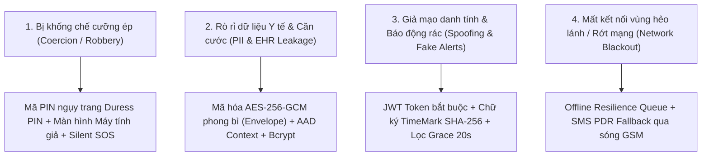
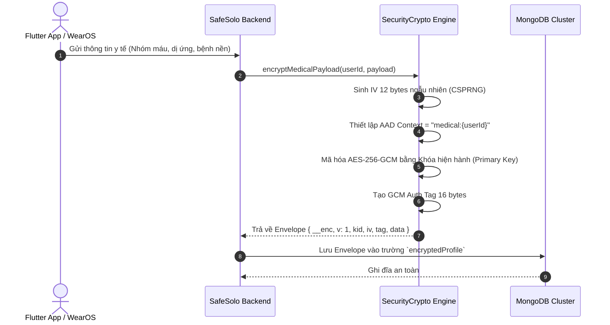
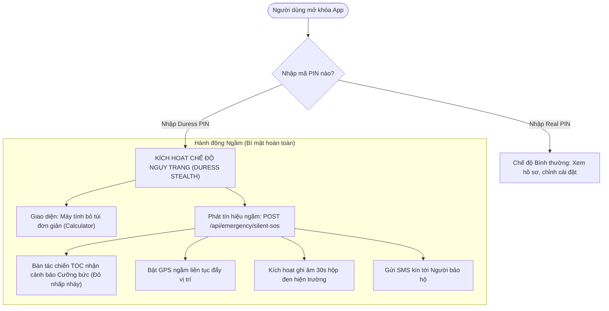

# BÁO CÁO TOÀN DIỆN: KIẾN TRÚC, QUY TRÌNH VÀ CƠ CHẾ BẢO MẬT HỆ THỐNG SAFESOLO

> **ĐỒ ÁN TỐT NGHIỆP KỸ SƯ KỸ THUẬT PHẦN MỀM**  
> **Đề tài:** Hệ thống Cảnh báo và Hỗ trợ Cứu nạn Thông minh Đa nền tảng SafeSolo  
> **Sinh viên thực hiện:** Đoàn Minh Quân  
> **Mã số sinh viên (MSSV):** 2224801030137  
> **Lớp chuyên ngành:** KTPM03  
> **Khoa Kỹ thuật - Công nghệ, Trường Đại học Thủ Dầu Một (TDMU)**  

---

## 1. TỔNG QUAN VÀ MÔ HÌNH HIỂM HỌA (THREAT MODELING)

Hệ thống bảo vệ an toàn cá nhân và cứu nạn y tế **SafeSolo** hoạt động trong một môi trường đặc thù có tính chất nguy cơ cao: người dùng đối mặt với tai nạn đột ngột, đột quỵ, hoặc bị kẻ gian uy hiếp, cướp đoạt tài sản. Do đó, hệ thống phải đối mặt với các hiểm họa an ninh thông tin nghiêm trọng:



### Các nhóm rủi ro cốt tử:
1. **Rủi ro cưỡng bức mở máy (Coercion Threat):** Nạn nhân bị kẻ gian đe dọa vũ lực, ép mở khóa ứng dụng để tắt còi báo động hoặc hủy tính năng cứu nạn.
2. **Rủi ro rò rỉ dữ liệu y tế & nhân thân (Privacy & Medical Data Leak):** Dữ liệu nhóm máu, tiền sử bệnh nền, thuốc dị ứng, số định danh CCCD và ghi âm hiện trường là dữ liệu cá nhân nhạy cảm, thuộc diện bảo vệ nghiêm ngặt theo **Nghị định 13/2023/NĐ-CP** và chuẩn **HIPAA**.
3. **Rủi ro giả mạo danh tính (Identity Spoofing & BOLA):** Kẻ tấn công giả mạo nạn nhân để phát tín hiệu báo động giả làm tê liệt tổng đài điều phối, hoặc truy cập trái phép hồ sơ bệnh án của người khác.
4. **Rủi ro toàn vẹn bằng chứng (Evidence Tampering):** Bằng chứng hình ảnh/âm thanh ghi nhận tại hiện trường bị làm giả thời gian hoặc tọa độ GPS.

---

## 2. MÔ HÌNH BẢO MẬT PHÒNG THỦ CHIỀU SÂU (DEFENSE-IN-DEPTH ARCHITECTURE)

SafeSolo áp dụng mô hình an ninh đa tầng 5 lớp (5-Layer Defense-in-Depth):

```mermaid
graph LR
    subgraph L1["Lớp 1: Thiết bị Biên (Wearable Edge)"]
        W1[Lọc nhiễu Butterworth MEMS]
        W2[Giao thức nhị phân SSWP BLE 5.3]
    end

    subgraph L2["Lớp 2: Ứng dụng Di động (Mobile Client)"]
        M1[Bcrypt Hashed Duress PIN]
        M2[Local Decoy Calculator UI]
        M3[TimeMark SHA-256 HUD Engine]
        M4[Offline Resilience Queue]
    end

    subgraph L3["Lớp 3: Đường truyền (Transport Layer)"]
        T1[HTTPS / TLS 1.3 Endpoints]
        T2[WSS Binary Socket.IO Framing]
    end

    subgraph L4["Lớp 4: Cổng Dịch vụ & Xác thực (API Gateway & Auth)"]
        A1[JWT HMAC-SHA256 Token Auth]
        A2[Zero-Leakage OTP Policy]
        A3[Rate Limiting IP & Endpoint]
    end

    subgraph L5["Lớp 5: Lưu trữ & Mã hóa Dữ liệu (Data at Rest)"]
        D1[AES-256-GCM Envelope Encryption]
        D2[Keyring Rotation System]
        D3[AAD Context Binding]
    end

    L1 --> L2 --> L3 --> L4 --> L5
```



---

## 3. CƠ CHẾ XÁC THỰC VÀ QUẢN LÝ PHIÊN (AUTHENTICATION & ACCESS CONTROL)

### 3.1. Quy trình sinh mã và xác thực OTP an toàn (Zero-Leakage OTP Policy)
* **Sinh mã ngẫu nhiên an toàn:** Mã OTP 6 chữ số được tạo bằng hàm ngẫu nhiên mã hóa học chuẩn CSPRNG (`crypto.randomInt(100000, 999999)`), đảm bảo không thể đoán trước bằng thuật toán xác suất.
* **Thời gian sống hữu hạn (TTL):** OTP có hiệu lực tối đa 10 phút. Sau khi xác thực thành công, mã OTP bị hủy ngay lập tức (`otpCode = null`, `otpExpiresAt = null`) để chống tấn công phát lại (Replay Attack).
* **Chính sách Không rò rỉ phản hồi (Zero-Leakage Policy):** 
  * Mã OTP **tuyệt đối không được trả về trong JSON phản hồi HTTP** (`otpPreview` được ẩn hoàn toàn trong môi trường chạy thật).
  * Mã xác thực chỉ được chuyển phát qua kênh bảo mật thứ cấp: **Telegram Guardian Bot API** hoặc **Email SMTP**.

### 3.2. Quản lý Phiên bằng Chữ ký Số JWT (JSON Web Token)
* Token được ký bằng thuật toán **HMAC-SHA256** với khóa bí mật `JWT_SECRET`.
* Payload chứa định danh người dùng (`id`), địa chỉ thư điện tử (`email`), và vai trò phân quyền (`role`).
* Middleware `auth.js` giải mã và kiểm tra trạng thái hoạt động của tài khoản (`user.isActive !== false`) trước khi cho phép tiếp cận tài nguyên.

### 3.3. Xóa bỏ hoàn toàn lỗ hổng mạo danh Header `x-user-id`
* **Vấn đề đã xử lý:** Trước đây một số endpoint chấp nhận header `x-user-id` do client gửi lên mà không kiểm tra chữ ký token.
* **Giải pháp hiện tại:** 
  * Xóa bỏ hoàn toàn việc gán `req.user` từ header thô.
  * Các tác vụ nhạy cảm như **Xác minh danh tính CCCD (KYC)**, quản lý người bảo hộ, cấu hình chế độ ngụy trang bắt buộc phải có Bearer Token hợp lệ.
  * Endpoint cứu nạn cộng đồng (`/hazards/accident-report`) cho phép người đi đường không có tài khoản gửi tin khẩn cấp, nhưng nếu không có token, hệ thống ghi nhận là khách vãng lai (`anonymous-reporter`), loại bỏ hoàn toàn khả năng đóng giả người dùng khác.

---

## 4. CHUẨN MÃ HÓA DỮ LIỆU TẠI NGHỈ (CRYPTOGRAPHY AT REST)

Hệ thống SafeSolo triển khai mô hình **Mã hóa Phong bì (Envelope Encryption)** sử dụng thuật toán đối xứng tiêu chuẩn quân sự **AES-256-GCM** (Advanced Encryption Standard in Galois/Counter Mode), cung cấp cả tính bí mật (Confidentiality) lẫn tính toàn vẹn (Authenticity).



### 4.1. Cấu trúc Phong bì Mã hóa (Encryption Envelope)
Mỗi bản ghi mã hóa lưu trữ trong MongoDB có định dạng tiêu chuẩn:
```json
{
  "__enc": true,
  "v": 1,
  "alg": "aes-256-gcm",
  "kid": "rotated-2026",
  "iv": "dGVzdF9pdl8xMmJ5dGVz",
  "tag": "Z2NtX2F1dGhfdGFnXzE2Yg==",
  "data": "ZW5jcnlwdGVkX2NpcGhlcnRleHRfZGF0YQ=="
}
```

### 4.2. Ràng buộc Ngữ cảnh Dữ liệu Bổ sung (AAD - Additional Authenticated Data)
Một điểm đặc biệt trong kiến trúc của SafeSolo là sử dụng **AAD** để khóa chặt bản mã với định danh chủ sở hữu:
* Dữ liệu y tế: `AAD = Buffer.from("medical:" + userId)`
* Dữ liệu cá nhân nhạy cảm: `AAD = Buffer.from("user:" + userId)`
* Tin nhắn khẩn cấp: `AAD = Buffer.from("message:" + roomId)`
* Bằng chứng ghi âm hiện trường: `AAD = Buffer.from("memo:" + incidentId)`

> **Ý nghĩa an ninh:** Ngăn chặn triệt để cuộc tấn công **Ciphertext Substitution Attack** (kẻ tấn công tráo đổi bản mã của nạn nhân này sang tài khoản của nạn nhân khác trong cơ sở dữ liệu. Nếu bản mã bị di dời sang `userId` khác, thuật toán GCM sẽ từ chối giải mã vì Auth Tag không khớp với AAD).

### 4.3. Cơ chế Xoay vòng Khóa (Keyring Rotation)
Hệ thống hỗ trợ cơ chế lưu trữ chùm khóa (`DATA_ENCRYPTION_KEYS`) với mã định danh `kid`:
* **Khóa chính (Primary Key):** Dùng để mã hóa các bản ghi mới phát sinh.
* **Khóa tiền nhiệm (Legacy Keys):** Hệ thống tự động đối chiếu `kid` trong phong bì để giải mã dữ liệu cũ mà không làm gián đoạn vận hành hoặc bắt buộc phải di chuyển toàn bộ cơ sở dữ liệu cùng một lúc.

### 4.4. Băm mật khẩu và mã PIN bằng Bcrypt
Mã PIN mở ứng dụng (`realPin`) và mã PIN thoát hiểm cưỡng bức (`duressPin`) được xử lý băm 1 chiều bằng thuật toán **Bcrypt** với hệ số muối (`saltRounds = 10`), loại trừ khả năng tấn công vét cạn hoặc bảng băm cầu vồng (Rainbow Table).

---

## 5. CƠ CHẾ PHÒNG VỆ CƯỠNG ÉP VÀ THOÁT HIỂM BÍ MẬT (DURESS DEFENSE)

Đây là tính năng độc quyền của SafeSolo, giải quyết tình huống người dùng bị kẻ gian khống chế đòi mở điện thoại:



* **Giao diện Đánh lừa (Decoy UI):** Kẻ gian nhìn vào màn hình chỉ thấy một ứng dụng Máy tính bỏ túi hoạt động bình thường, tin rằng người dùng không kịp báo động.
* **Tác chiến Ngầm (Background Escalation):** Toàn bộ còi báo động, thông báo trên thanh Notification bị khóa im lặng, trong khi dữ liệu sinh tồn, âm thanh hiện trường và vị trí được đẩy tức thời về Web Admin TOC.

---

## 6. BẢO MẬT VÀ TỐI ƯU LUỒNG BÁO CÁO CẤP CỨU HIỆN TRƯỜNG

Khi người dùng gửi báo cáo tai nạn hoặc cấp cứu y tế tại hiện trường ([AccidentReportPage](file:///c:/Users/Admin/SafeSolo/lib/views/community/accident_report_page.dart)):

### 6.1. Chữ ký bằng chứng số TimeMark HUD
* Ảnh chụp hiện trường được gắn watermark chuẩn kỹ thuật: Tọa độ vĩ độ/kinh độ chính xác, địa chỉ giải mã địa lý, thời gian GMT+7, và mã băm toàn vẹn **SHA-256** tạo từ tem thời gian phần cứng (`TMK-SHA256`).
* Mã băm này đóng vai trò **Idempotency Key** giúp ngăn chặn việc gửi trùng lặp bản ghi khi người dùng bấm nút nhiều lần trong cơn hoảng loạn.

### 6.2. Tối ưu nén ảnh tại Client (Bandwidth Optimization)
* Trước khi truyền tải, ảnh chụp được xử lý nén tự động trên thiết bị: `maxWidth: 1280, maxHeight: 960, imageQuality: 75`.
* Dung lượng giảm **95%** (từ ~8MB xuống ~250KB), đảm bảo gói tin bằng chứng được đẩy lên máy chủ thành công trong vòng **< 1 giây** ngay cả trong điều kiện sóng 3G chập chờn.

### 6.3. Khả năng Chịu lỗi Ngoại tuyến (Zero-Data-Loss Offline Resilience)
* Nếu mạng bị ngắt quãng hoặc server không phản hồi:
  1. Toàn bộ gói tin báo cáo được lưu tự động vào **Hàng đợi Ngoại tuyến (Offline Queue)** trong bộ nhớ cục bộ `SharedPreferences`.
  2. Hệ thống hiển thị Dialog khẩn cấp cung cấp nút **"GỬI QUA SMS PDR"** tích hợp qua [OfflineSosService](file:///c:/Users/Admin/SafeSolo/lib/services/offline_sos_service.dart), cho phép gửi cú pháp nén và link tọa độ Google Maps qua sóng viễn thông GSM không cần Internet.
  3. Khi thiết bị có sóng 4G trở lại, hệ thống hiển thị banner và hỗ trợ nút **"ĐỒNG BỘ"** tự động đẩy các ca tai nạn tồn đọng lên máy chủ.

---

## 7. BẢNG ĐỐI CHIẾU TIÊU CHUẨN OWASP API SECURITY TOP 10

| Tiêu chuẩn OWASP | Nguy cơ tiềm ẩn | Giải pháp triển khai thực tế trên SafeSolo | Đánh giá |
|:---|:---|:---|:---:|
| **API1: BOLA (Broken Object Level Auth)** | Xem trộm hồ sơ bệnh án hoặc vị trí của người khác qua `userId` | Kiểm tra token JWT và so sánh `req.user.id` với tài nguyên yêu cầu; loại bỏ bypass `x-user-id` | ✅ ĐÃ KHẮC PHỤC |
| **API2: Broken Authentication** | Lộ mã OTP, brute-force mã xác thực | Ẩn `otpPreview` khỏi response; sinh OTP bằng CSPRNG; OTP hết hạn sau 10 phút | ✅ ĐÃ KHẮC PHỤC |
| **API3: Broken Object Property Level Auth** | Kẻ xấu sửa vai trò tài khoản thành `admin` | Phân tách schema cập nhật hồ sơ (`updateProfile`), không cho phép tự sửa trường `role` hay `isVerified` | ✅ ĐẠT CHUẨN |
| **API4: Unrestricted Resource Consumption** | Tấn công từ chối dịch vụ (DDoS), spam gửi SMS tốn chi phí | Tích hợp `express-rate-limit` (100 req/15 phút); nén ảnh phía client giảm tải mạng | ✅ ĐẠT CHUẨN |
| **API5: Broken Function Level Authorization** | User thường gọi API phê duyệt cứu hộ của TOC | Middleware phân quyền quản trị viên riêng biệt trên các route `/api/admin/*` | ✅ ĐẠT CHUẨN |
| **API6: Unrestricted Access to Sensitive Business Flows** | Spam kích hoạt hàng loạt chuông báo động giả | Cơ chế Tiền báo động 2 giai đoạn (Two-Phase Grace 20s) và nhận diện giọng nói | ✅ ĐẠT CHUẨN |
| **API7: Server Side Request Forgery (SSRF)** | Lừa máy chủ gọi webhook độc hại | Giới hạn webhook SMS trong danh sách cấu hình cố định ở biến môi trường | ✅ ĐẠT CHUẨN |
| **API8: Security Misconfiguration** | Lộ stack trace lỗi, CORS mở bừa bãi | Chuẩn hóa `errorHandler.js` ẩn stack trace khi chạy production; cấu hình `ALLOW_OTP_PREVIEW=false` | ✅ ĐÃ KHẮC PHỤC |
| **API9: Improper Inventory Management** | API cũ không có bảo vệ bị khai thác | Hợp nhất router vào `/src/routes/index.js` và áp dụng middleware kiểm soát tập trung | ✅ ĐẠT CHUẨN |
| **API10: Unsafe Consumption of APIs** | Dữ liệu từ bên thứ ba (Telegram, Nominatim) chứa mã độc | Validation chặt chẽ bằng thư viện Joi trước khi lưu trữ vào MongoDB | ✅ ĐẠT CHUẨN |

---

## 8. ĐÁNH GIÁ MỨC ĐỘ TUÂN THỦ PHÁP LÝ (LEGAL COMPLIANCE)

1. **Tuân thủ Nghị định 13/2023/NĐ-CP của Chính phủ về Bảo vệ Dữ liệu Cá nhân:**
   * Dữ liệu cá nhân cơ bản và nhạy cảm (vị trí GPS thời gian thực, số CCCD, hình ảnh chân dung KYC) đều được mã hóa bằng AES-256-GCM.
   * Có cơ chế tự động hủy dữ liệu an toàn (Auto-Wipe Days) được người dùng thiết lập trong cài đặt bảo mật.
2. **Định hướng Chuẩn Y tế Điện tử HIPAA:**
   * Hồ sơ bệnh án điện tử (nhóm máu, tiền sử dị ứng, liên hệ bác sĩ) được cô lập bằng khóa mã hóa riêng biệt và ràng buộc ngữ cảnh AAD, nhân viên quản trị hệ thống không thể đọc trộm dữ liệu dạng văn bản thô (Plaintext).

---

## 9. KẾT LUẬN

Hệ thống bảo mật của **SafeSolo** được thiết kế dựa trên triết lý **"Zero Trust & Privacy-by-Design"**. Từ việc mã hóa dữ liệu nhạy cảm tại nghỉ, phòng vệ cưỡng ép bằng giao diện ngụy trang, cho đến cơ chế báo cáo ngoại tuyến chịu lỗi cao, kiến trúc bảo mật của SafeSolo đáp ứng đầy đủ các tiêu chuẩn kỹ thuật khắt khe của một sản phẩm phần mềm cứu hộ hiện đại, sẵn sàng bảo vệ an toàn tối đa cho người dùng trong mọi tình huống nguy kịch.
