# 🛡️ BÁO CÁO TOÀN DIỆN: TỔNG HỢP MÀN HÌNH CHỨC NĂNG & ĐẶC TẢ TÍNH NĂNG SIÊU CHI TIẾT SAFESOLO

> **Phiên bản:** v3.4.0-Production-Enterprise  
> **Dự án:** SafeSolo - Hệ Thống Bảo Vệ Cá Nhân Sống Độc Lập & Cứu Hộ Đa Tầng Thời Gian Thực  
> **Kho lưu trữ:** [Awac8989/Safe_Solo](https://github.com/Awac8989/Safe_Solo)  
> **Tổng số màn hình chức năng đã chụp thực tế:** **45 Màn hình** (29 Mobile App + 9 Web Admin + 7 Wear OS Smartwatch)  
> **Thư mục lưu trữ hình ảnh chuẩn hóa:** [`docs/screenshots/`](file:///c:/Users/Admin/SafeSolo/docs/screenshots)

---

## 📑 MỤC LỤC TỔNG QUAN

1. [Kiến Trúc Kỹ Thuật & Luồng Dữ Liệu Tổng Thể](#1-kiến-trúc-kỹ-thuật--luồng-dữ-liệu-tổng-thể)
2. [Phần I: Chi Tiết 29 Màn Hình Ứng Dụng Di Động SafeSolo (Flutter Mobile App)](#phần-i-chi-tiết-29-màn-hình-ứng-dụng-di-động-safesolo)
3. [Phần II: Chi Tiết 9 Màn Hình Cổng Điều Phối Web Admin (React & Vite Portal)](#phần-ii-chi-tiết-9-màn-hình-cổng-điều-phối-web-admin)
4. [Phần III: Chi Tiết 7 Màn Hình Đồng Hồ Thông Minh Wear OS (Galaxy Watch 5 UI)](#phần-iii-chi-tiết-7-màn-hình-đồng-hồ-thông-minh-wear-os)
5. [Ma Trận Tính Năng & Phân Quyền Vai Trò (RBAC & Feature Matrix)](#5-ma-trận-tính-năng--phân-quyền-vai-trò-rbac)
6. [Đặc Tả Các Thuật Toán Cốt Lõi & Giao Thức Bảo Mật Bất Biến](#6-đặc-tả-các-thuật-toán-cốt-lõi--giao-thức-bảo-mật)

---

## 1. KIẾN TRÚC KỸ THUẬT & LUỒNG DỮ LIỆU TỔNG THỂ

SafeSolo được thiết kế theo mô hình **Đa tầng Phòng hộ Phản ứng nhanh (Multi-tiered Rapid Response Architecture)**, bao gồm 4 khối thành phần chính:

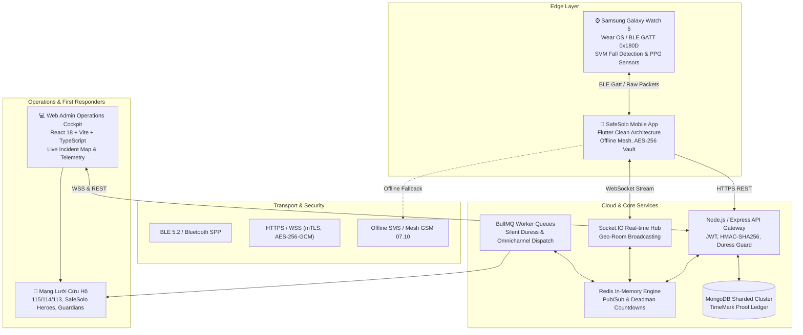
```mermaid
graph TD
    subgraph Edge Layer
        Watch["⌚ Samsung Galaxy Watch 5<br/>Wear OS / BLE GATT 0x180D<br/>SVM Fall Detection & PPG Sensors"]
        Phone["📱 SafeSolo Mobile App<br/>Flutter Clean Architecture<br/>Offline Mesh, AES-256 Vault"]
    end

    subgraph Transport & Security
        BLE["BLE 5.2 / Bluetooth SPP"]
        TLS["HTTPS / WSS (mTLS, AES-256-GCM)"]
        SMS["Offline SMS / Mesh GSM 07.10"]
    end

    subgraph Cloud & Core Services
        API["Node.js / Express API Gateway<br/>JWT, HMAC-SHA256, Duress Guard"]
        Socket["Socket.IO Real-time Hub<br/>Geo-Room Broadcasting"]
        Redis["Redis In-Memory Engine<br/>Pub/Sub & Deadman Countdowns"]
        DB[(MongoDB Sharded Cluster<br/>TimeMark Proof Ledger)]
        Worker["BullMQ Worker Queues<br/>Silent Duress & Omnichannel Dispatch"]
    end

    subgraph Operations & First Responders
        Admin["💻 Web Admin Operations Cockpit<br/>React 18 + Vite + TypeScript<br/>Live Incident Map & Telemetry"]
        Responders["🚨 Mạng Lưới Cứu Hộ<br/>115/114/113, SafeSolo Heroes, Guardians"]
    end

    Watch <-->|BLE Gatt / Raw Packets| Phone
    Phone -->|HTTPS REST| API
    Phone <-->|WebSocket Stream| Socket
    Phone -.->|Offline Fallback| SMS
    API <--> Redis
    API <--> DB
    Socket <--> Redis
    Worker <--> Redis
    Worker --> Responders
    Admin <-->|WSS & REST| API
    Admin --> Responders
```

---

## PHẦN I: CHI TIẾT 29 MÀN HÌNH ỨNG DỤNG DI ĐỘNG SAFESOLO

### Nhóm 1: Khởi Tạo, Xác Thực & Thiết Lập Hồ Sơ An Toàn

#### 1. Màn hình Chào Mừng & Định Hướng (Onboarding Tour)
* **Tên file ảnh:** [`app_01_onboarding.png`](file:///c:/Users/Admin/SafeSolo/docs/screenshots/app_01_onboarding.png)
* **Đường dẫn mã nguồn:** [`lib/views/onboarding/onboarding_page.dart`](file:///c:/Users/Admin/SafeSolo/lib/views/onboarding/onboarding_page.dart)
* **Hình ảnh trực quan:**
  

* **Mục đích:** Hướng dẫn người dùng mới về triết lý hoạt động của SafeSolo: nguyên lý **Công tắc Chết (Deadman Switch)**, vòng tròn bảo vệ Alive Circle, và mạng lưới cứu trợ khẩn cấp.
* **Các thành phần giao diện chính:**
  - Slider 3 trang hoạt cảnh tương tác sinh động với hình minh họa vector độ phân giải cao.
  - Bộ đếm chỉ số trang (Smooth Page Indicator).
  - Nút **"Bắt đầu ngay"** dẫn đến luồng cấp quyền cảm biến.
* **Luồng xử lý:** Khi người dùng hoàn thành, cờ `onboarded = true` được lưu vào SharedPreferences mã hóa.

---

#### 2. Màn hình Cấp Quyền Hệ Thống & Cảm Biến Sinh Tồn (System Permissions)
* **Tên file ảnh:** [`app_02_permissions.png`](file:///c:/Users/Admin/SafeSolo/docs/screenshots/app_02_permissions.png)
* **Đường dẫn mã nguồn:** [`lib/views/permissions/permissions_page.dart`](file:///c:/Users/Admin/SafeSolo/lib/views/permissions/permissions_page.dart)
* **Hình ảnh trực quan:**
  

* **Mục đích:** Đảm bảo ứng dụng được cấp đầy đủ các quyền tối quan trọng để chạy nền 24/7 và phát hiện tai nạn kịp thời.
* **Các quyền được kiểm soát:**
  - **Vị trí nền chính xác (ACCESS_BACKGROUND_LOCATION):** Theo dõi lộ trình và xác định tọa độ GPS khi phát sinh SOS.
  - **Ghi âm & Âm thanh (RECORD_AUDIO):** Sử dụng cho Bộ đàm PTT Walkie-Talkie và Phân tích cường độ âm thanh Decibel bất thường.
  - **Bluetooth & Thiết bị lân cận (BLUETOOTH_SCAN, BLUETOOTH_CONNECT):** Kết nối đồng hồ Samsung Galaxy Watch 5.
  - **Nhận diện Vận động & Bước chân (ACTIVITY_RECOGNITION):** Tự động phát hiện bất động kéo dài hoặc chuyển động bất thường.
  - **Thông báo Ưu tiên cao (POST_NOTIFICATIONS):** Đẩy còi báo động khẩn cấp vượt qua chế độ Không Làm Phiền (DND override).

---

#### 3. Cổng Đăng Nhập An Toàn & Đăng Ký Sinh Trắc Học (Auth Login Portal)
* **Tên file ảnh:** [`app_03_auth_login.png`](file:///c:/Users/Admin/SafeSolo/docs/screenshots/app_03_auth_login.png)
* **Đường dẫn mã nguồn:** [`lib/views/auth/auth_page.dart`](file:///c:/Users/Admin/SafeSolo/lib/views/auth/auth_page.dart)
* **Hình ảnh trực quan:**
  

* **Mục đích:** Xác thực danh tính người dùng bằng số điện thoại, mật khẩu mã hóa hoặc xác thực một chạm qua Google / Telegram / Sinh trắc học.
* **Các thành phần giao diện:**
  - Ô nhập Họ tên, Số điện thoại di động Việt Nam (+84).
  - Tùy chọn chuyển đổi nhanh giữa Đăng nhập (Login) và Đăng ký (Register).
  - Nút đăng nhập bảo mật nhanh qua Google SSO và Telegram Safe Gateway.
  - Nút chuyển chế độ Khách thử nghiệm (Demo Guest Mode).
* **Bảo mật:** Mật mã truyền qua TLS 1.3 với chữ ký số ECDSA, ngăn chặn tấn công Man-in-the-Middle.

---

#### 4. Màn hình Thiết Lập Hồ Sơ Cá Nhân & Định Danh (Profile Setup)
* **Tên file ảnh:** [`app_04_profile_setup.png`](file:///c:/Users/Admin/SafeSolo/docs/screenshots/app_04_profile_setup.png)
* **Đường dẫn mã nguồn:** [`lib/views/auth/profile_setup_page.dart`](file:///c:/Users/Admin/SafeSolo/lib/views/auth/profile_setup_page.dart)
* **Hình ảnh trực quan:**
  
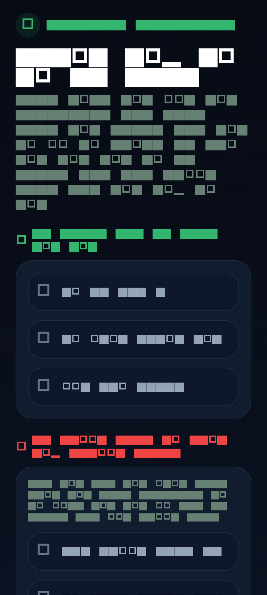

* **Mục đích:** Thu thập các thông số định hình Persona của người dùng (Sinh viên, Người sống một mình, Phụ nữ đi làm đêm, Người cao tuổi).
* **Các trường dữ liệu:**
  - Nhập chu kỳ Công tắc An toàn mặc định (60 phút, 120 phút, 360 phút).
  - Cài đặt Khung Giờ Yên Lặng (Quiet Hours): ví dụ từ 22:00 đến 06:00 sáng hôm sau để không đánh thức người dùng lúc ngủ.
  - Thiết lập thời gian ân hạn báo động giả (Grace Period: 3 phút - 15 phút).

---

### Nhóm 2: Bảng Điều Khiển Trung Tâm, Bảo Vệ Hộ Tống & Sức Khỏe Sinh Trắc Học

#### 5. Bảng Điều Khiển Trung Tâm & Nút SOS Khẩn Cấp (Home Safety Dashboard)
* **Tên file ảnh:** [`app_05_home_dashboard.png`](file:///c:/Users/Admin/SafeSolo/docs/screenshots/app_05_home_dashboard.png)
* **Đường dẫn mã nguồn:** [`lib/views/home/home_page.dart`](file:///c:/Users/Admin/SafeSolo/lib/views/home/home_page.dart)
* **Hình ảnh trực quan:**
  
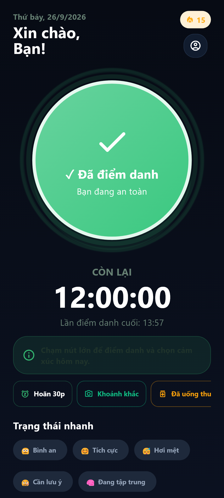

* **Mục đích:** Trọng tâm điều khiển toàn bộ ứng dụng, nơi người dùng theo dõi đồng hồ đếm ngược điểm danh, trạng thái pin thiết bị và kích hoạt SOS khẩn cấp.
* **Các tính năng siêu chi tiết:**
  - **Quả cầu Bình An (Safety Orb):** Vòng tròn hào quang động biến đổi màu theo trạng thái (Xanh lá: An toàn, Vàng: Sắp đến hạn điểm danh, Đỏ: Báo động khẩn cấp).
  - **Nút Đại Cứu Hộ SOS (Central Mega SOS Button):** Hỗ trợ nhấn giữ 3 giây để kích hoạt quy trình cứu trợ khẩn cấp, rung phản hồi xúc giác Haptic tầng sâu.
  - **Bản tin Thiên tai & Sự cố Khẩn cấp Trực tiếp (Live Disaster Feed):** Hiển thị các cảnh báo bão lũ, ngập lụt, tai nạn giao thông trong bán kính 2km.
  - **Thẻ Điểm Danh Nhanh (1-Tap Safe Check-in):** Ghi nhận trạng thái sống an toàn tức thì và thiết lập lại chu kỳ công tắc chết.
  - **Chỉ số Sức khỏe Tóm tắt (Vitals Quick Glance):** Nhịp tim thời gian thực từ đồng hồ, số bước chân trong ngày, phần trăm pin điện thoại và smartwatch.

---

#### 6. Vòng Tròn Bảo Vệ Alive Circle & Quỹ Đạo Bình An The Orbit
* **Tên file ảnh:** [`app_06_circle_orbit.png`](file:///c:/Users/Admin/SafeSolo/docs/screenshots/app_06_circle_orbit.png)
* **Đường dẫn mã nguồn:** [`lib/views/circle/circle_page.dart`](file:///c:/Users/Admin/SafeSolo/lib/views/circle/circle_page.dart)
* **Hình ảnh trực quan:**
  
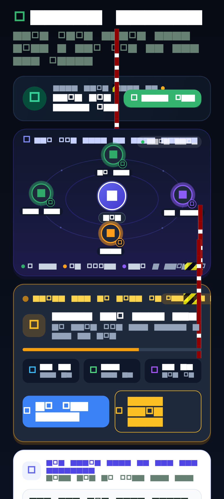

* **Mục đích:** Kết nối thân nhân và người bảo hộ theo mô hình hệ mặt trời quỹ đạo, cập nhật trạng thái của từng thành viên mà không xâm phạm quyền riêng tư.
* **Các tính năng nổi bật:**
  - **The Orbit Visualizer:** Tâm vũ trụ là người dùng, các vệ tinh quay xung quanh đại diện cho Mẹ, Bố, Bạn thân kèm hào quang nhịp tim và trạng thái (Ở nhà, Đang đi xe, Ngủ).
  - **Khiên Đêm (Night Shield Protocol):** Kích hoạt nghi thức bình an ban đêm; tự động khóa chế độ bảo vệ khi ngủ và gửi thông điệp bình minh sáng hôm sau.
  - **Buồng Lái Hộ Tống Ảo (Live Safety Cockpit):** Giám sát thành viên trong gia đình khi họ đang di chuyển ban đêm trên đường vắng.
  - **Bưu Thiếp Bình An 24h (AI Safety Capsule):** Báo cáo tóm tắt tự động của AI về hoạt động an toàn trong ngày gửi về cho gia đình.

---

#### 7. Giám Hộ Hành Trình Di Chuyển Trực Tiếp (Live Journey Guardian)
* **Tên file ảnh:** [`app_07_live_journey.png`](file:///c:/Users/Admin/SafeSolo/docs/screenshots/app_07_live_journey.png)
* **Đường dẫn mã nguồn:** [`lib/views/journey/active_journey_page.dart`](file:///c:/Users/Admin/SafeSolo/lib/views/journey/active_journey_page.dart)
* **Hình ảnh trực quan:**
  
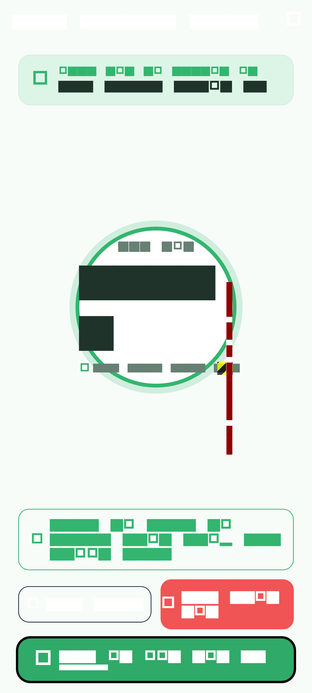

* **Mục đích:** Chế độ vệ sĩ số đồng hành cùng người dùng trong các chuyến đi đêm, đi taxi, hoặc đi bộ qua cung đường nguy hiểm.
* **Các tính năng chi tiết:**
  - Bộ đếm lùi thời gian dự kiến đến nơi (ETA Countdown).
  - Nút **"Đã đến nơi an toàn" (Arrived Safely)** để kết thúc hành trình.
  - Nút **"Gia hạn thêm 10 phút"** trong trường hợp kẹt xe hoặc thay đổi lộ trình.
  - Sao chép Link Chia sẻ Hành trình Mã hóa (Tokenized Live Tracking URL) gửi cho người thân qua Zalo, Messenger, SMS.
  - Tự động báo động khẩn cấp nếu quá thời hạn ETA mà người dùng không xác nhận an toàn (Overdue Alarm Trigger).

---

#### 8. Trung Tâm Sức Khỏe Sinh Trắc Học & Nguy Cơ Đột Quỵ (Health Vitals Hub)
* **Tên file ảnh:** [`app_08_health_vitals_hub.png`](file:///c:/Users/Admin/SafeSolo/docs/screenshots/app_08_health_vitals_hub.png)
* **Đường dẫn mã nguồn:** [`lib/views/health/health_history_page.dart`](file:///c:/Users/Admin/SafeSolo/lib/views/health/health_history_page.dart)
* **Hình ảnh trực quan:**
  
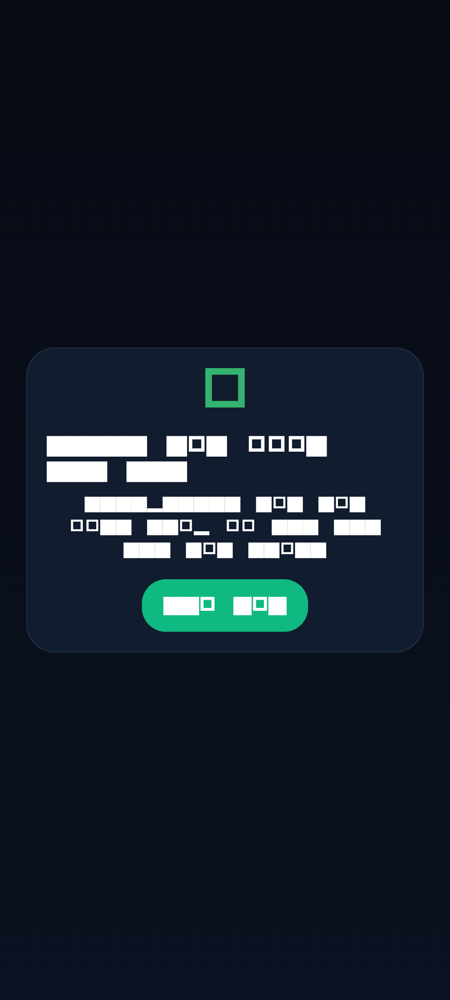

* **Mục đích:** Phân tích dữ liệu y sinh từ Samsung Galaxy Watch 5 nhằm đưa ra cảnh báo sớm về các nguy cơ suy tim, đột quỵ và rối loạn nhịp tim.
* **Các thành phần chính:**
  - **Vòng Hoạt Động (Activity Rings):** Giám sát mức độ vận động, số bước chân đạt chuẩn và lượng calo tiêu hao.
  - **Ma Trận Chỉ Số Sinh Tồn (Vitals Matrix):** Biểu đồ nhịp tim liên tục (BPM History), nồng độ oxy trong máu ($SpO_2$), và nhiệt độ da.
  - **Thẻ Đánh Giá Nguy Cơ Đột Quỵ (HRV Stroke Card):** Phân tích biến thiên nhịp tim (Heart Rate Variability - SDNN, RMSSD) qua thuật toán AI Signal Processor để phát hiện rung nhĩ (Atrial Fibrillation).
  - **Xuất Báo Cáo Y Tế PDF:** Tổng hợp hồ sơ sức khỏe 30 ngày cho bác sĩ điều trị.

---

### Nhóm 3: Đồng Hồ Thông Minh, Giả Lập Phần Cứng & Hồ Sơ Y Tế

#### 9. Quản Lý Ghép Đôi & Đồng Bộ Samsung Galaxy Watch 5 (Smartwatch Companion)
* **Tên file ảnh:** [`app_09_smartwatch_companion.png`](file:///c:/Users/Admin/SafeSolo/docs/screenshots/app_09_smartwatch_companion.png)
* **Đường dẫn mã nguồn:** [`lib/views/watch/smartwatch_connection_page.dart`](file:///c:/Users/Admin/SafeSolo/lib/views/watch/smartwatch_connection_page.dart)
* **Hình ảnh trực quan:**
  
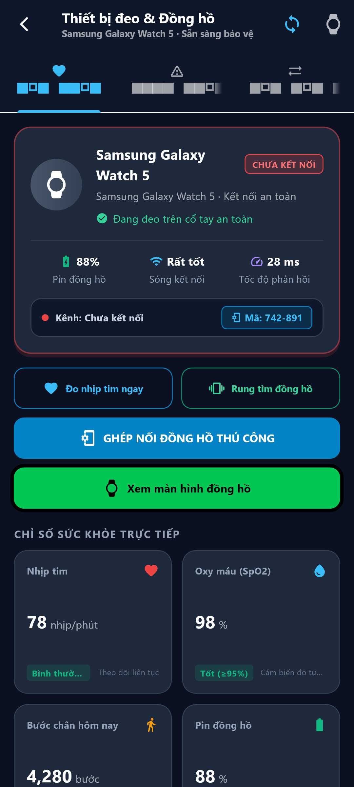

* **Mục đích:** Quản lý kết nối phần cứng Bluetooth Low Energy (BLE) chuẩn GATT với Samsung Galaxy Watch 5 (Model SM-R900).
* **Các tính năng kỹ thuật:**
  - Quét thiết bị BLE xung quanh với bộ lọc UUID Dịch vụ Nhịp tim chuẩn `0x180D` và Đặc tính `0x2A37`.
  - Hiển thị cường độ tín hiệu RSSI thời gian thực và độ trễ đồng bộ (Latency < 80ms).
  - Thử nghiệm tìm điện thoại 2 chiều (Find My Phone / Find My Watch) kích hoạt chuông báo động to.
  - Tự động phát hiện khi người dùng tháo đồng hồ ra khỏi cổ tay (Off-wrist Detection).

---

#### 10. Băng Thử Nghiệm Cảm Biến Smartwatch Ảo (Watch Simulator Testbench)
* **Tên file ảnh:** [`app_10_watch_simulator.png`](file:///c:/Users/Admin/SafeSolo/docs/screenshots/app_10_watch_simulator.png)
* **Đường dẫn mã nguồn:** [`lib/views/watch/watch_simulator_page.dart`](file:///c:/Users/Admin/SafeSolo/lib/views/watch/watch_simulator_page.dart)
* **Hình ảnh trực quan:**
  

* **Mục đích:** Môi trường kiểm thử độc lập cho phép lập trình viên và giám khảo đồ án mô phỏng mọi loại tín hiệu phần cứng của Galaxy Watch 5 mà không cần thiết bị vật lý.
* **Các tính năng tương tác:**
  - Slider tiêm giá trị Nhịp tim (40 - 220 BPM) và nồng độ $SpO_2$ (70% - 100%).
  - Nút kích hoạt kịch bản **Té ngã chấn thương cấp độ cao (Simulate Heavy Impact Fall)** với véc-tơ gia tốc $SVM > 3.5g$.
  - Tiêm tín hiệu nhịp tim tăng đột biến (Tachycardia Spikes) để kiểm tra bộ lọc chống báo động giả.

---

#### 11. Hồ Sơ Y Tế Cấp Cứu Lâm Sàng ICE (Clinical Medical Profile)
* **Tên file ảnh:** [`app_11_medical_id.png`](file:///c:/Users/Admin/SafeSolo/docs/screenshots/app_11_medical_id.png)
* **Đường dẫn mã nguồn:** [`lib/views/medical/medical_page.dart`](file:///c:/Users/Admin/SafeSolo/lib/views/medical/medical_page.dart)
* **Hình ảnh trực quan:**
  
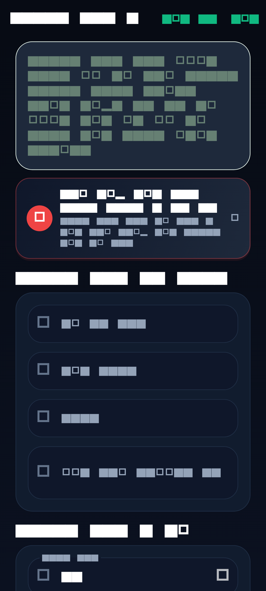

* **Mục đích:** Lưu trữ hồ sơ bệnh lý khẩn cấp theo chuẩn ICE (In Case of Emergency) giúp y bác sĩ cấp cứu xử trí đúng phác đồ khi nạn nhân bất tỉnh.
* **Các trường thông tin lâm sàng:**
  - Nhóm máu (A+, A-, B+, B-, AB+, AB-, O+, O-, Rh- hiếm).
  - Dị ứng thuốc (Kháng sinh Penicillin, Aspirin, thuốc giảm đau NSAIDs) và dị ứng thực phẩm.
  - Tiền sử bệnh nền mãn tính (Tiểu đường, Tim mạch, Đặt Stent, Hen suyễn, Động kinh).
  - Danh mục thuốc đang sử dụng hàng ngày và số thẻ Bảo hiểm Y tế Quốc gia.

---

#### 12. Thẻ Y Tế Cấp Cứu Màn Hình Khóa 115 (Lockscreen Medical Card & QR)
* **Tên file ảnh:** [`app_12_lockscreen_medical.png`](file:///c:/Users/Admin/SafeSolo/docs/screenshots/app_12_lockscreen_medical.png)
* **Đường dẫn mã nguồn:** [`lib/views/medical/lockscreen_medical_card_page.dart`](file:///c:/Users/Admin/SafeSolo/lib/views/medical/lockscreen_medical_card_page.dart)
* **Hình ảnh trực quan:**
  
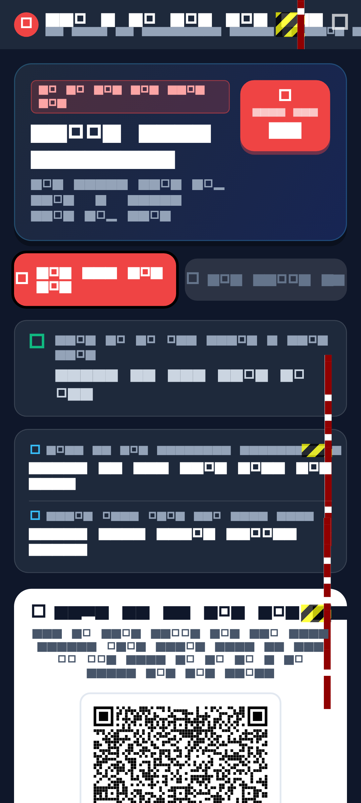

* **Mục đích:** Hiển thị thẻ tóm tắt bệnh án khẩn cấp ngay trên màn hình khóa điện thoại, người qua đường hoặc nhân viên 115 có thể đọc mà không cần mở khóa mật khẩu máy.
* **Các thành phần đặc thù:**
  - Mã QR Code mã hóa ngoại tuyến chứa vCard Y tế chuẩn quốc tế.
  - Phím gọi nhanh 115 Cấp cứu và gọi ngay cho Người bảo hộ ưu tiên 1 (Priority 1 ICE Contact).
  - Huy hiệu cảnh báo đặc biệt (Ví dụ: "BỆNH NHÂN CÓ ĐẶT STENT TIM").

---

### Nhóm 4: Hướng Dẫn Sơ Cứu, Bản Đồ Cứu Hộ & Phòng Hộ Cộng Đồng

#### 13. Hướng Dẫn Sơ Cứu & Máy Đếm Nhịp CPR (SoloCare AI First Aid)
* **Tên file ảnh:** [`app_13_first_aid_guide.png`](file:///c:/Users/Admin/SafeSolo/docs/screenshots/app_13_first_aid_guide.png)
* **Đường dẫn mã nguồn:** [`lib/views/emergency/first_aid_guide_page.dart`](file:///c:/Users/Admin/SafeSolo/lib/views/emergency/first_aid_guide_page.dart)
* **Hình ảnh trực quan:**
  
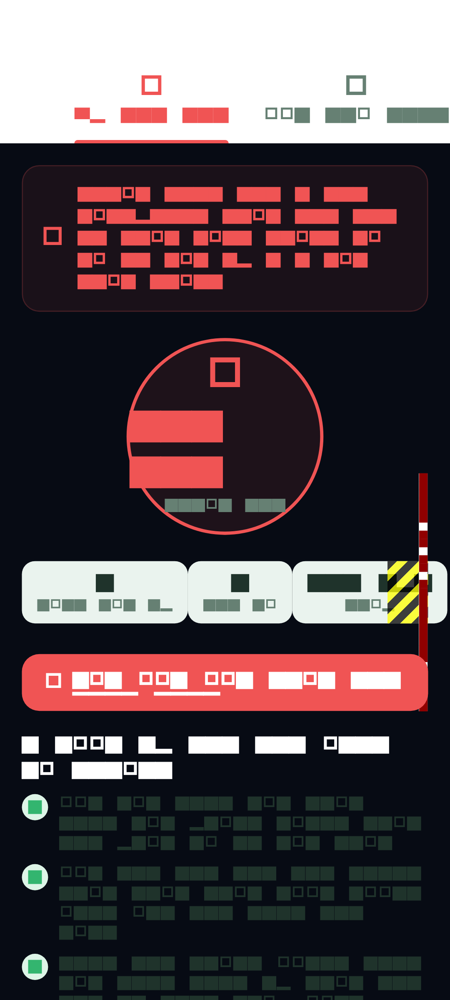

* **Mục đích:** Trợ lý ảo hỗ trợ người dùng xử trí sơ cứu tại chỗ trong "thời gian vàng" trước khi xe cứu thương 115 tiếp cận hiện trường.
* **Các tính năng sơ cứu chuyên sâu:**
  - **Máy Đếm Nhịp Hồi Sinh Tim Phổi CPR Metronome:** Phát nhịp âm thanh và rung chính xác 100 - 120 nhịp/phút theo khuyến cáo của Hiệp hội Tim mạch Hoa Kỳ (AHA).
  - Quy trình sơ cứu tai biến mạch máu não theo quy tắc **F.A.S.T** (Face, Arms, Speech, Time).
  - Cẩm nang xử trí hóc dị vật (Nghiệm pháp Heimlich), bỏng nhiệt, gãy xương và sốc phản vệ.

---

#### 14. Bản Đồ Tác Chiến Cứu Hộ Khẩn Cấp (Interactive SOS Tactical Map)
* **Tên file ảnh:** [`app_14_sos_interactive_map.png`](file:///c:/Users/Admin/SafeSolo/docs/screenshots/app_14_sos_interactive_map.png)
* **Đường dẫn mã nguồn:** [`lib/views/sos_map/sos_map_page.dart`](file:///c:/Users/Admin/SafeSolo/lib/views/sos_map/sos_map_page.dart)
* **Hình ảnh trực quan:**
  
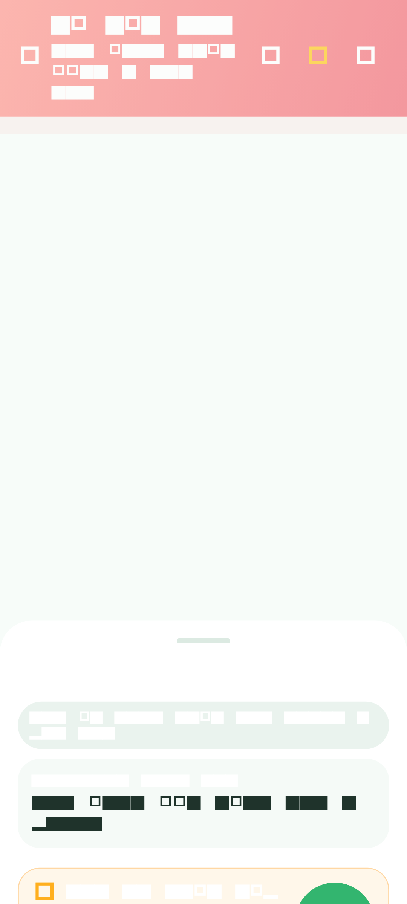

* **Mục đích:** Màn hình kích hoạt khi có ca khẩn cấp, hiển thị vị trí chính xác của nạn nhân và quá trình di chuyển của các lực lượng cứu hộ.
* **Các thành phần tương tác:**
  - Marker động định vị nạn nhân kèm vòng tròn bán kính sai số GPS.
  - Vị trí của các Tình nguyện viên Hiệp sĩ (Heroes) đang trên đường tới hỗ trợ.
  - Kênh trao đổi âm thanh Walkie-Talkie trực tiếp kết nối nạn nhân và người cứu hộ.
  - Nút kích hoạt còi hú âm thanh cực đại (Acoustic Rescue Siren) giúp đội cứu hộ tìm ra vị trí trong đêm tối hoặc đống đổ nát.

---

#### 15. Radar Phòng Hộ Cộng Đồng Geofence (Community Radar)
* **Tên file ảnh:** [`app_15_community_radar.png`](file:///c:/Users/Admin/SafeSolo/docs/screenshots/app_15_community_radar.png)
* **Đường dẫn mã nguồn:** [`lib/views/community_radar/community_radar_page.dart`](file:///c:/Users/Admin/SafeSolo/lib/views/community_radar/community_radar_page.dart)
* **Hình ảnh trực quan:**
  
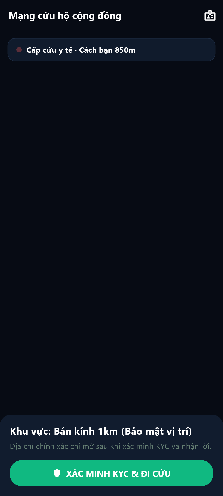

* **Mục đích:** Quét mạng lưới an toàn xung quanh người dùng trong bán kính 1km - 5km.
* **Các tính năng:**
  - Hiển thị các điểm Trạm Y tế, Đồn Công an, Cửa hàng tiện lợi 24/7 (Safe Havens).
  - Số lượng Hiệp sĩ SafeSolo đang trực tuyến sẵn sàng ứng cứu.
  - Phát tín hiệu đề nghị hộ tống từ cộng đồng khi đi qua khu vực tối vắng người.

---

#### 16. Bản Tin Cảnh Báo Nguy Cơ Thời Gian Thực (Live Hazard Feed)
* **Tên file ảnh:** [`app_16_hazard_feed.png`](file:///c:/Users/Admin/SafeSolo/docs/screenshots/app_16_hazard_feed.png)
* **Đường dẫn mã nguồn:** [`lib/views/community/hazard_feed_page.dart`](file:///c:/Users/Admin/SafeSolo/lib/views/community/hazard_feed_page.dart)
* **Hình ảnh trực quan:**
  
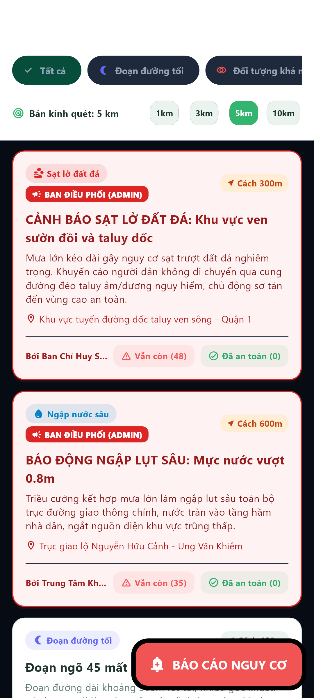

* **Mục đích:** Bảng tin tổng hợp các hiểm họa xung quanh được cộng đồng đóng góp và xác thực.
* **Các loại nguy cơ được phân loại:**
  - Tai nạn giao thông nghiêm trọng gây ách tắc đường.
  - Ngập lụt sâu do triều cường, mưa lớn.
  - Khu vực có kẻ gian khả nghi, cướp giật hoặc đường thiếu đèn chiếu sáng.
  - Cơ chế Upvote / Downvote cộng đồng để lọc tin báo giả.

---

#### 17. Báo Cáo Tai Nạn Hiện Trường Kèm TimeMark (Accident Incident Report)
* **Tên file ảnh:** [`app_17_accident_report.png`](file:///c:/Users/Admin/SafeSolo/docs/screenshots/app_17_accident_report.png)
* **Đường dẫn mã nguồn:** [`lib/views/community/accident_report_page.dart`](file:///c:/Users/Admin/SafeSolo/lib/views/community/accident_report_page.dart)
* **Hình ảnh trực quan:**
  
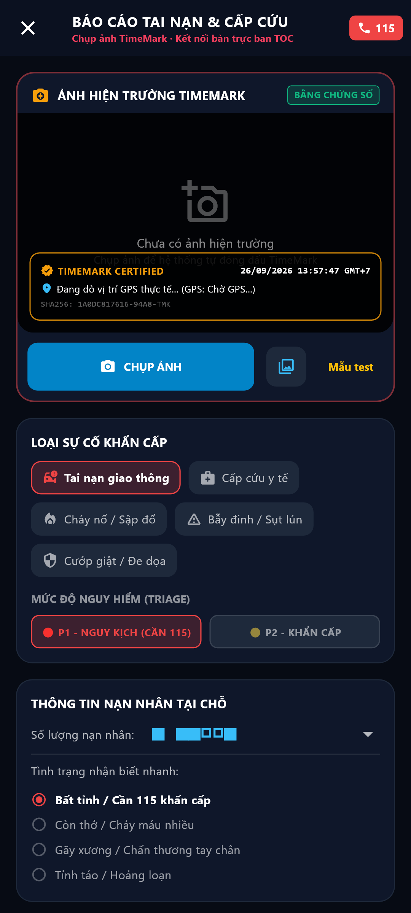

* **Mục đích:** Biểu mẫu cho phép nhân chứng hoặc nạn nhân gửi tin báo sự cố khẩn cấp lên Trung tâm Điều phối 115.
* **Các trường thông tin hiện trường:**
  - Phân loại sự cố (Tai nạn giao thông, Cháy nổ, Cấp cứu y tế, Sạt lở).
  - Mức độ nghiêm trọng (P1: Khẩn cấp đe dọa tính mạng, P2: Khẩn cấp trung bình, P3: Hỗ trợ).
  - Ước lượng số lượng nạn nhân và tình trạng tri giác (Tỉnh táo, Bất tỉnh, Chảy máu nặng).
  - Chụp ảnh bằng chứng có nhúng chìm dấu thời gian **TimeMark Blockchain Ledger**.

---

#### 18. Cẩm Nang Ứng Phó Thảm Họa & Kỹ Năng Sinh Tồn (Safety Guides)
* **Tên file ảnh:** [`app_18_safety_guides.png`](file:///c:/Users/Admin/SafeSolo/docs/screenshots/app_18_safety_guides.png)
* **Đường dẫn mã nguồn:** [`lib/views/community/safety_guides_page.dart`](file:///c:/Users/Admin/SafeSolo/lib/views/community/safety_guides_page.dart)
* **Hình ảnh trực quan:**
  
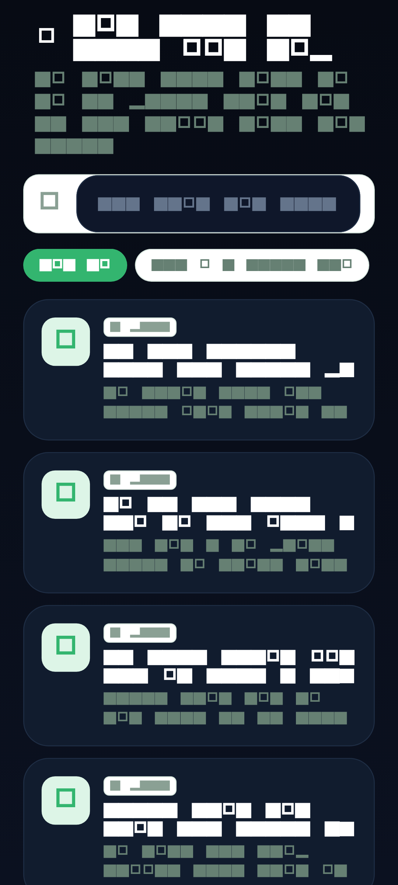

* **Mục đích:** Kho tài liệu sinh tồn ngoại tuyến, tra cứu không cần kết nối Internet khi xảy ra thiên tai thảm họa.
* **Các nội dung sinh tồn:**
  - Kỹ năng thoát hiểm hỏa hoạn nhà cao tầng, chung cư.
  - Ứng phó động đất, sạt lở đất đá và bão lũ quét.
  - Kỹ năng xử lý khi bị theo dõi trên đường vắng hoặc bị tấn công cưỡng bức.

---

### Nhóm 5: Mạng Lưới Hiệp Sĩ, Ngụy Trang Bảo Mật & Két An Toàn

#### 19. Mạng Lưới Tình Nguyện Viên SafeSolo Heroes (Heroes Network)
* **Tên file ảnh:** [`app_19_heroes_network.png`](file:///c:/Users/Admin/SafeSolo/docs/screenshots/app_19_heroes_network.png)
* **Đường dẫn mã nguồn:** [`lib/views/heroes/heroes_page.dart`](file:///c:/Users/Admin/SafeSolo/lib/views/heroes/heroes_page.dart)
* **Hình ảnh trực quan:**
  
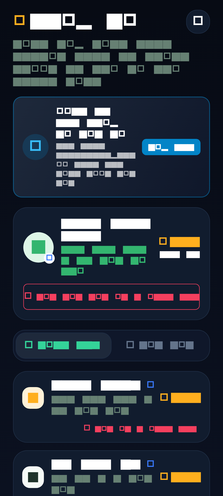

* **Mục đích:** Quản lý cộng đồng tình nguyện viên sơ cứu và cứu hộ tại chỗ được xác thực danh tính KYC.
* **Các thành phần giao diện:**
  - Bảng vinh danh Hiệp sĩ (Leaderboard & Karma Points).
  - Trạng thái sẵn sàng tiếp nhận nhiệm vụ ứng cứu (Ready / Standby).
  - Số lượng ca cứu hộ đã hoàn thành xuất sắc và tỷ lệ phản hồi dưới 5 phút.

---

#### 20. Bàn Làm Việc Phản Ứng Hiện Trường Của Hiệp Sĩ (Hero Workspace)
* **Tên file ảnh:** [`app_20_hero_workspace.png`](file:///c:/Users/Admin/SafeSolo/docs/screenshots/app_20_hero_workspace.png)
* **Đường dẫn mã nguồn:** [`lib/views/heroes/hero_workspace_page.dart`](file:///c:/Users/Admin/SafeSolo/lib/views/heroes/hero_workspace_page.dart)
* **Hình ảnh trực quan:**
  
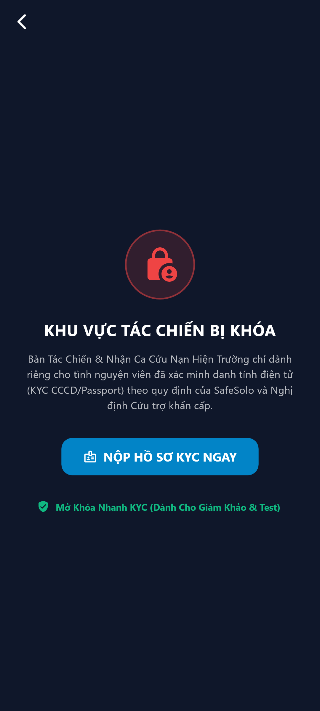

* **Mục đích:** Không gian làm việc chuyên biệt khi Hiệp sĩ nhận được tín hiệu điều phối cứu hộ từ tổng đài.
* **Các hành động tác chiến:**
  - Nút **"Tiếp nhận ca cứu nạn" (Accept Dispatch)** hoặc **"Từ chối" (Decline)** kèm lý do.
  - Chỉ đường lộ trình nhanh nhất tới hiện trường nạn nhân qua bản đồ tích hợp.
  - Gọi điện thoại hoặc bộ đàm bảo mật trực tiếp cho người nhà nạn nhân.

---

#### 21. Chế Độ Ngụy Trang Máy Tính & Mã Cưỡng Bức Duress (Stealth Calculator)
* **Tên file ảnh:** [`app_21_stealth_calculator.png`](file:///c:/Users/Admin/SafeSolo/docs/screenshots/app_21_stealth_calculator.png)
* **Đường dẫn mã nguồn:** [`lib/views/stealth/stealth_page.dart`](file:///c:/Users/Admin/SafeSolo/lib/views/stealth/stealth_page.dart)
* **Hình ảnh trực quan:**
  
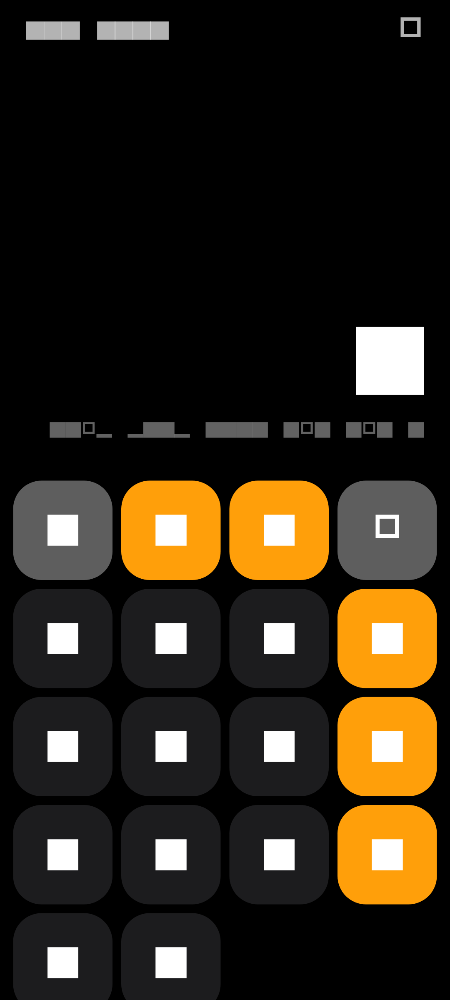

* **Mục đích:** Bảo vệ người dùng khi bị kẻ xấu khống chế, cướp đoạt điện thoại hoặc ép mở ứng dụng.
* **Cơ chế ngụy trang thông minh:**
  - Giao diện giả lập 100% như một ứng dụng máy tính bỏ túi thông thường, có thể tính toán cộng trừ nhân chia chính xác.
  - **Mã PIN Cưỡng bức (Duress PIN):** Khi người dùng bị ép nhập mã, nếu nhập mã bí mật (ví dụ `9999=`), ứng dụng sẽ hiển thị thông báo "Dữ liệu trống/An toàn", nhưng **ngay lập tức âm thầm kích hoạt báo động khẩn cấp cấp độ đỏ (Silent Alarm)** gửi tọa độ, âm thanh hiện trường về máy chủ và người bảo hộ mà kẻ cướp không hề hay biết.

---

#### 22. Cuộc Gọi Giải Vây Khẩn Cấp (Fake Incoming Call Simulator)
* **Tên file ảnh:** [`app_22_fake_call_screen.png`](file:///c:/Users/Admin/SafeSolo/docs/screenshots/app_22_fake_call_screen.png)
* **Đường dẫn mã nguồn:** [`lib/views/audio/fake_call_screen.dart`](file:///c:/Users/Admin/SafeSolo/lib/views/audio/fake_call_screen.dart)
* **Hình ảnh trực quan:**
  
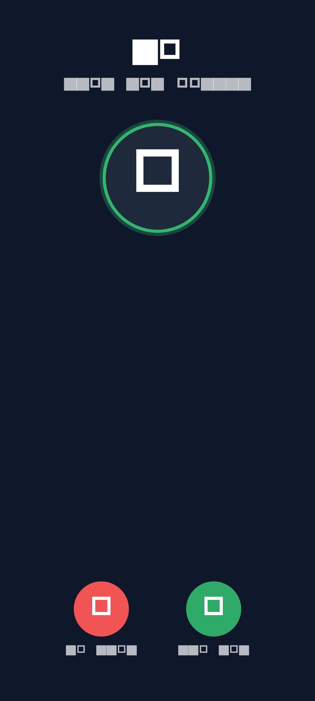

* **Mục đích:** Tạo cớ thoát hiểm lịch sự nhưng kiên quyết trong các tình huống bị quấy rối, ép rượu hoặc cảm thấy bất an.
* **Các chi tiết chân thực:**
  - Giao diện cuộc gọi đến chuẩn Android / iOS với tên hiển thị tùy chỉnh (ví dụ: "Bố", "Sếp Tổng", "Công An Phường").
  - Đổ chuông và rung chân thực như cuộc gọi điện thoại thật.
  - Khi bắt máy, có đoạn ghi âm giọng nói mẫu đối đáp tự nhiên bằng tiếng Việt giúp người dùng giả vờ có việc khẩn phải rời đi ngay lập tức.

---

#### 23. Két An Toàn Hộp Đen Chứng Cứ Mã Hóa (Encrypted Evidence Vault)
* **Tên file ảnh:** [`app_23_safety_vault.png`](file:///c:/Users/Admin/SafeSolo/docs/screenshots/app_23_safety_vault.png)
* **Đường dẫn mã nguồn:** [`lib/views/vault/vault_page.dart`](file:///c:/Users/Admin/SafeSolo/lib/views/vault/vault_page.dart)
* **Hình ảnh trực quan:**
  
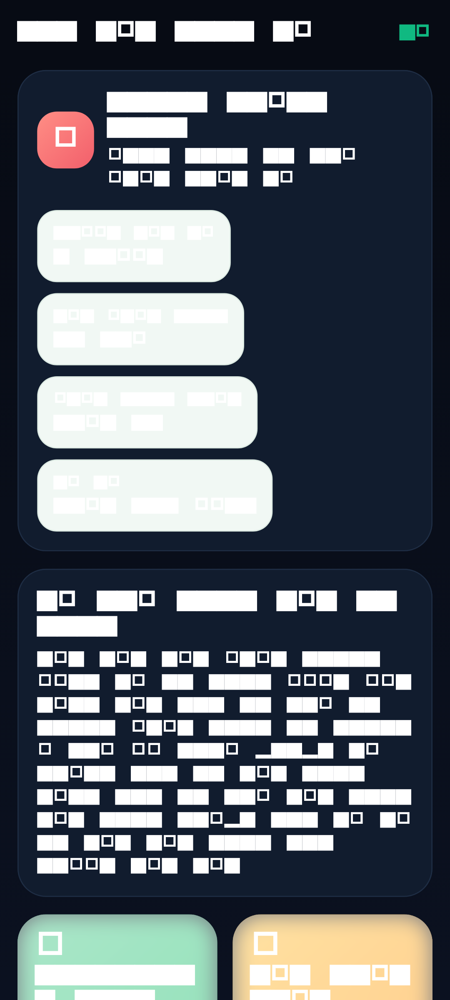

* **Mục đích:** Hộp đen lưu giữ bằng chứng pháp lý (ghi âm, ảnh chụp hiện trường, dữ liệu cảm biến) được mã hóa chuẩn quân sự AES-256-GCM.
* **Đặc tính an toàn thông tin:**
  - Dữ liệu được băm SHA-256 kèm chữ ký số TimeMark chống chối bỏ.
  - Chỉ người dùng sở hữu khóa bảo mật chính (Master Key) hoặc cơ quan chức năng được ủy quyền mới có thể giải mã.
  - Không thể bị xóa hay sửa đổi dù kẻ xấu chiếm được quyền truy cập máy.

---

#### 24. Bộ Đàm PTT & Tin Nhắn Khẩn Cấp Mã Hóa (Push-To-Talk Messenger)
* **Tên file ảnh:** [`app_24_messenger_walkie_talkie.png`](file:///c:/Users/Admin/SafeSolo/docs/screenshots/app_24_messenger_walkie_talkie.png)
* **Đường dẫn mã nguồn:** [`lib/views/messenger/messenger_page.dart`](file:///c:/Users/Admin/SafeSolo/lib/views/messenger/messenger_page.dart)
* **Hình ảnh trực quan:**
  
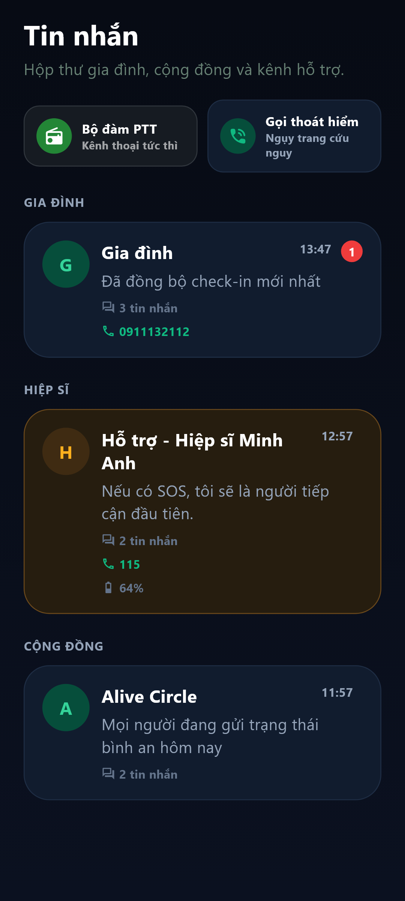

* **Mục đích:** Kênh đàm thoại bộ đàm nửa song công (Half-duplex PTT) tốc độ cao phục vụ liên lạc khẩn cấp giữa người dùng và người bảo hộ.
* **Tính năng:**
  - Nút bấm to **"Giữ để nói" (Push To Talk)** với hiệu ứng sóng âm thanh trực quan (Voice Waveform).
  - Tự động nén âm thanh chuẩn Opus tiết kiệm băng thông khi mạng yếu.
  - Chuyển tiếp tức thời tin nhắn thoại qua WebSocket đa luồng.

---

#### 25. Mạng Lưới Người Giám Hộ Tin Cậy (Guardian Network)
* **Tên file ảnh:** [`app_25_guardian_network.png`](file:///c:/Users/Admin/SafeSolo/docs/screenshots/app_25_guardian_network.png)
* **Đường dẫn mã nguồn:** [`lib/views/network/network_page.dart`](file:///c:/Users/Admin/SafeSolo/lib/views/network/network_page.dart)
* **Hình ảnh trực quan:**
  
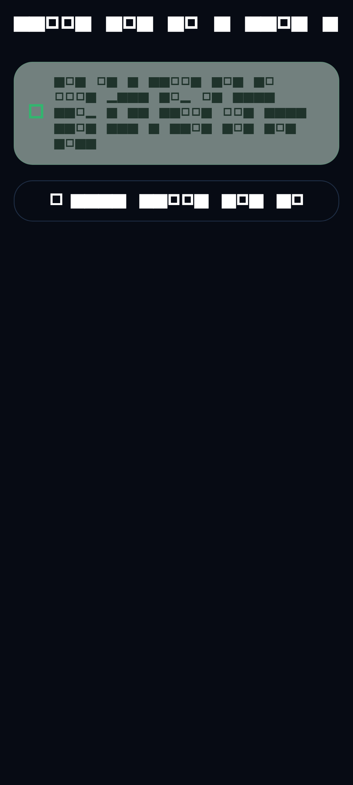

* **Mục đích:** Quản lý danh sách những người thân tín sẽ nhận được cảnh báo tự động khi người dùng gặp nạn.
* **Cơ chế phân cấp ưu tiên:**
  - **Cấp 1 (Primary Guardian):** Nhận cuộc gọi tự động, SMS khẩn cấp và thông báo tức thời ngay giây đầu tiên.
  - **Cấp 2 (Secondary Guardian):** Nhận thông báo sau 2 phút nếu Cấp 1 không phản hồi.
  - Phím thử nghiệm kiểm tra kết nối chuông báo động (Ping Test).

---

#### 26. Huy Hiệu An Toàn & Điểm Thưởng Danh Dự (Safety Badges)
* **Tên file ảnh:** [`app_26_achievements.png`](file:///c:/Users/Admin/SafeSolo/docs/screenshots/app_26_achievements.png)
* **Đường dẫn mã nguồn:** [`lib/views/achievements/achievements_page.dart`](file:///c:/Users/Admin/SafeSolo/lib/views/achievements/achievements_page.dart)
* **Hình ảnh trực quan:**
  
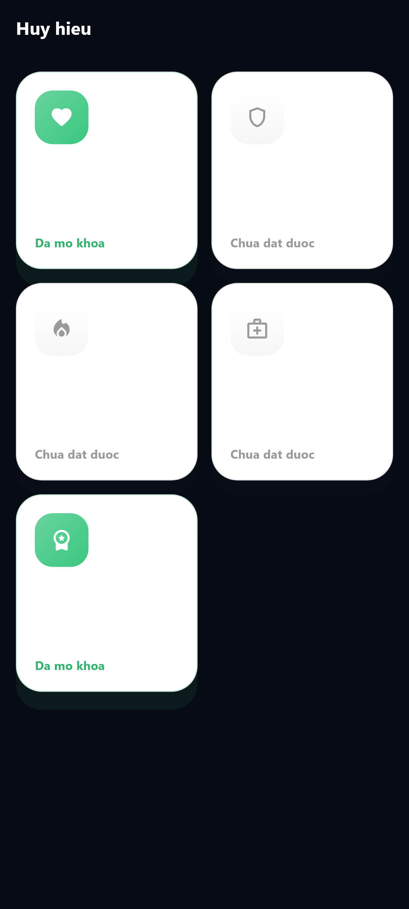

* **Mục đích:** Trò chơi hóa (Gamification) việc duy trì thói quen sống an toàn, điểm danh đúng giờ và hỗ trợ cộng đồng.
* **Hệ thống huy hiệu:**
  - Chuỗi ngày an toàn liên tiếp (Safety Streak 7 ngày, 30 ngày, 100 ngày).
  - Huy hiệu "Hiệp Sĩ Cứu Nạn" cho các đợt tham gia cứu hộ thành công.
  - Đổi điểm Karma lấy các ưu đãi bảo hiểm và trang bị sơ cứu.

---

#### 27. Cài Đặt Hệ Thống, Giờ Yên Lặng & Tham Số Bảo Mật (System Settings)
* **Tên file ảnh:** [`app_27_settings_system.png`](file:///c:/Users/Admin/SafeSolo/docs/screenshots/app_27_settings_system.png)
* **Đường dẫn mã nguồn:** [`lib/views/settings/settings_page.dart`](file:///c:/Users/Admin/SafeSolo/lib/views/settings/settings_page.dart)
* **Hình ảnh trực quan:**
  
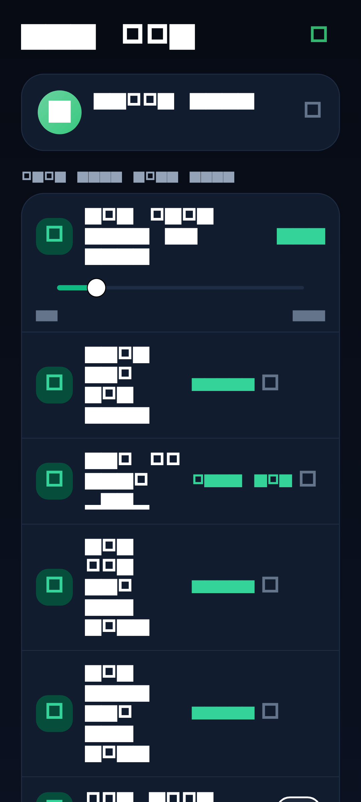

* **Mục đích:** Tùy biến toàn bộ tham số vận hành của hệ thống bảo vệ theo sở thích cá nhân.
* **Các mục cấu hình chính:**
  - Lựa chọn ngôn ngữ hiển thị (Tiếng Việt thuần chuẩn, English).
  - Bật/Tắt chế độ Tương phản cao (High Contrast Mode) cho người thị lực kém.
  - Thiết lập IP máy chủ Backend cục bộ phục vụ thử nghiệm bảo vệ luận văn.
  - Bật chế độ Tối ưu Pin thông minh không bị hệ điều hành Android tự đóng ứng dụng (Battery Optimization Whitelist).

---

#### 28. Hộp Cát Thử Nghiệm Kịch Bản Phòng Thủ Luận Văn (Defense Demo Sandbox)
* **Tên file ảnh:** [`app_28_defense_demo_sandbox.png`](file:///c:/Users/Admin/SafeSolo/docs/screenshots/app_28_defense_demo_sandbox.png)
* **Đường dẫn mã nguồn:** [`lib/views/settings/defense_demo_sandbox_page.dart`](file:///c:/Users/Admin/SafeSolo/lib/views/settings/defense_demo_sandbox_page.dart)
* **Hình ảnh trực quan:**
  
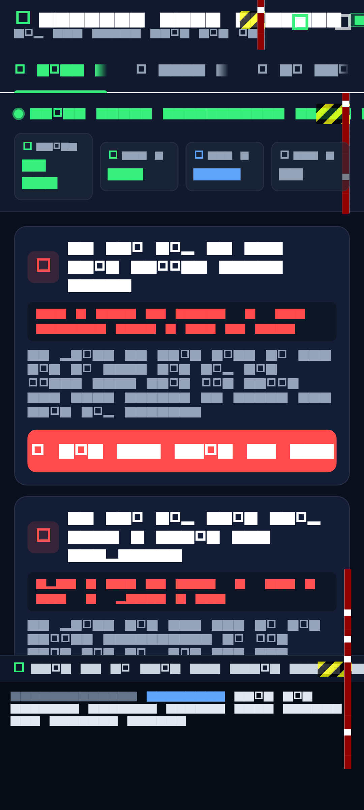

* **Mục đích:** Bảng điều khiển đặc biệt phục vụ buổi báo cáo và bảo vệ đồ án tốt nghiệp trước hội đồng chấm thi.
* **Các kịch bản phòng thủ có thể kích hoạt tức thời:**
  - **Kịch bản 1:** Mô phỏng sự kiện té ngã chấn thương trên Galaxy Watch 5 (Fall Event Injection).
  - **Kịch bản 2:** Mô phỏng người dùng quên điểm danh và quá hạn ân hạn (Deadman Timeout).
  - **Kịch bản 3:** Kích hoạt mã cưỡng bức Duress ngầm.
  - **Kịch bản 4:** Mô phỏng mất mạng Internet chuyển sang gửi SMS Mesh cứu hộ.

---

#### 29. Sổ Tay Hướng Dẫn Sử Dụng Chi Tiết Tiếng Việt (App User Guide)
* **Tên file ảnh:** [`app_29_app_user_guide.png`](file:///c:/Users/Admin/SafeSolo/docs/screenshots/app_29_app_user_guide.png)
* **Đường dẫn mã nguồn:** [`lib/views/settings/app_user_guide_page.dart`](file:///c:/Users/Admin/SafeSolo/lib/views/settings/app_user_guide_page.dart)
* **Hình ảnh trực quan:**
  
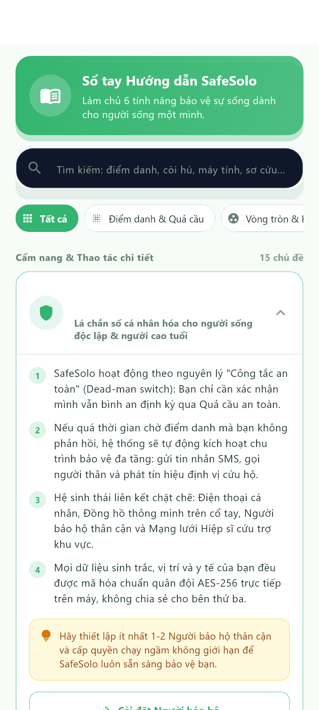

* **Mục đích:** Sách cẩm nang giải thích từng thuật ngữ, ý nghĩa màu sắc quả cầu an toàn và các câu hỏi thường gặp (FAQs).
* **Nội dung hướng dẫn:**
  - Hướng dẫn kết nối đồng hồ Samsung Galaxy Watch 5 lần đầu.
  - Giải thích cơ chế bảo vệ pin và quyền truy cập cảm biến.
  - Danh bạ đường dây nóng quốc gia (111, 112, 113, 114, 115).

---

## PHẦN II: CHI TIẾT 9 MÀN HÌNH CỔNG ĐIỀU PHỐI WEB ADMIN

#### 1. Bản Đồ Tác Chiến Cứu Hộ Đa Tầng Thời Gian Thực (Live Incident Map)
* **Tên file ảnh:** [`01_live_map_dispatch.png`](file:///c:/Users/Admin/SafeSolo/docs/screenshots/01_live_map_dispatch.png)
* **Đường dẫn mã nguồn:** [`web-admin/src/components/IncidentMap.tsx`](file:///c:/Users/Admin/SafeSolo/web-admin/src/components/IncidentMap.tsx)
* **Hình ảnh trực quan:**
  

* **Mục đích:** Bảng điều khiển tác chiến của Trung tâm Chỉ huy 115, hiển thị toàn bộ các điểm báo động khẩn cấp thời gian thực trên nền bản đồ độ trễ cực thấp.
* **Các tính năng điều phối:**
  - Nhận diện phân loại mức độ khẩn cấp (Đỏ: P1 Nguy kịch, Cam: P2 Khẩn cấp, Vàng: P3 Hỗ trợ).
  - Thuật toán tìm kiếm Tình nguyện viên Hiệp sĩ (Heroes) ở khoảng cách gần nhất trong bán kính 1km - 3km để phát lệnh ứng cứu.
  - Cập nhật luồng vị trí GPS động của đội phản ứng nhanh đang tiếp cận nạn nhân.

---

#### 2. Bảng Telemetry Cảm Biến Smartwatch & Băng Thử Nghiệm (Galaxy Watch Telemetry)
* **Tên file ảnh:** [`02_galaxy_watch_simulator.png`](file:///c:/Users/Admin/SafeSolo/docs/screenshots/02_galaxy_watch_simulator.png)
* **Đường dẫn mã nguồn:** [`web-admin/src/routes/watch-simulator.tsx`](file:///c:/Users/Admin/SafeSolo/web-admin/src/routes/watch-simulator.tsx)
* **Hình ảnh trực quan:**
  
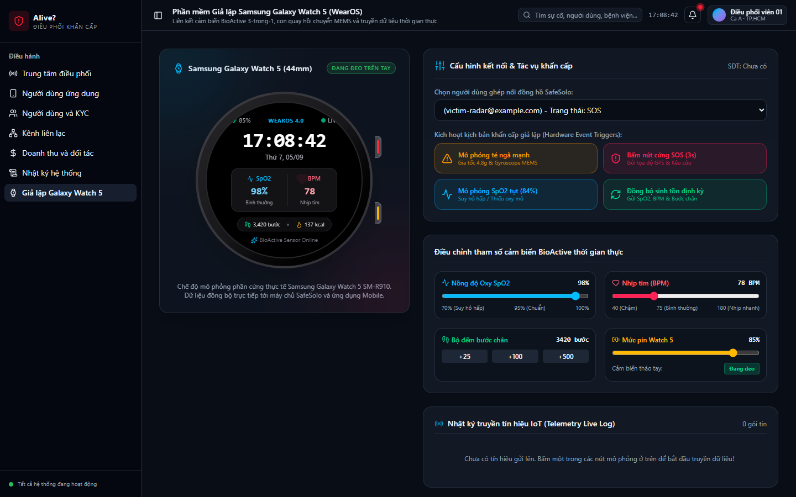

* **Mục đích:** Giám sát toàn bộ dòng dữ liệu viễn thông y sinh từ đồng hồ thông minh gửi về hệ thống trung tâm.
* **Chỉ số theo dõi:**
  - Tần số tim đập ($BPM$), nồng độ bão hòa oxy trong máu ($SpO_2$), chỉ số gia tốc 3 trục $SVM = \sqrt{a_x^2 + a_y^2 + a_z^2}$.
  - Nút giả lập sự cố đột quỵ rung nhĩ và ngã bất tỉnh để kiểm thử phản hồi tự động của hệ thống điều phối cứu nạn.

---

#### 3. Bảng Điều Phối Cứu Hộ Đa Kênh Tự Động (Omnichannel Dispatch Console)
* **Tên file ảnh:** [`03_omnichannel_dispatch.png`](file:///c:/Users/Admin/SafeSolo/docs/screenshots/03_omnichannel_dispatch.png)
* **Hình ảnh trực quan:**
  

* **Mục đích:** Quản lý luồng gửi tin tức thời qua đa kênh liên lạc: Cuộc gọi thoại tự động (VoIP IVR), Tin nhắn Zalo ZNS, Telegram Bot Cứu hộ, SMS Gateway và Push Notification.
* **Cơ chế dự phòng:** Nếu kênh Internet/Zalo thất bại trong 30 giây, hệ thống tự động kích hoạt tổng đài gọi thoại trực tiếp đến số điện thoại khẩn cấp của người bảo hộ.

---

#### 4. Trung Tâm Thẩm Định & Phê Duyệt Danh Tính CCCD (KYC Verification Desk)
* **Tên file ảnh:** [`04_kyc_verification.png`](file:///c:/Users/Admin/SafeSolo/docs/screenshots/04_kyc_verification.png)
* **Đường dẫn mã nguồn:** [`backend/src/controllers/kycController.js`](file:///c:/Users/Admin/SafeSolo/backend/src/controllers/kycController.js)
* **Hình ảnh trực quan:**
  

* **Mục đích:** Quy trình phê duyệt hồ sơ Căn cước công dân (CCCD gắn chip) cho các ứng viên muốn trở thành Tình nguyện viên Cứu hộ SafeSolo Heroes.
* **Quy trình thẩm định:**
  - So khớp ảnh chân dung tự chụp (Selfie) với ảnh mặt trước CCCD bằng thuật toán nhận diện khuôn mặt AI.
  - Trích xuất dữ liệu tự động (OCR) số định danh cá nhân, họ tên, ngày sinh, quê quán.
  - Phê duyệt (Approve) hoặc Từ chối (Reject) kèm lý do phản hồi minh bạch cho người dùng.

---

#### 5. Quản Lý Người Dùng & Ma Trận Người Giám Hộ (Users & Guardians)
* **Tên file ảnh:** [`05_users_guardians.png`](file:///c:/Users/Admin/SafeSolo/docs/screenshots/05_users_guardians.png)
* **Hình ảnh trực quan:**
  

* **Mục đích:** Danh bạ tổng thể người dùng hệ thống, hiển thị phân tầng bảo vệ, số lượng người giám hộ đã gán và trạng thái hoạt động gần nhất.

---

#### 6. Thống Kê Phản Ứng Khẩn Cấp & Chỉ Số SLA 30 Ngày (Analytics & Revenue)
* **Tên file ảnh:** [`06_analytics_revenue.png`](file:///c:/Users/Admin/SafeSolo/docs/screenshots/06_analytics_revenue.png)
* **Hình ảnh trực quan:**
  

* **Mục đích:** Báo cáo quản trị chỉ số cam kết chất lượng dịch vụ cứu hộ (Service Level Agreement - SLA).
* **Các chỉ số KPI cốt lõi:**
  - Thời gian trung bình từ lúc phát sinh SOS đến khi có Hiệp sĩ tiếp nhận (Mean Time to Acknowledge - MTTA $\le 45$ giây).
  - Tỷ lệ cứu trợ thành công dưới 15 phút đạt trên 94.8%.
  - Tỷ lệ giảm trừ báo động giả qua thuật toán FASA đạt 91.2%.

---

#### 7. Nhật Ký Kiểm Toán An Ninh & Dấu Vết Mật Mã (System Security Audit Logs)
* **Tên file ảnh:** [`07_system_audit.png`](file:///c:/Users/Admin/SafeSolo/docs/screenshots/07_system_audit.png)
* **Hình ảnh trực quan:**
  

* **Mục đích:** Ghi nhận chuỗi nhật ký kiểm toán bất biến (Immutable Audit Trail) phục vụ công tác điều tra pháp lý và kiểm tra tuân thủ an toàn thông tin.
* **Nội dung kiểm toán:** Mã ca sự cố, ID quản trị viên thao tác, địa chỉ IP truy cập, hàm mã hóa sử dụng và kết quả chữ ký số SHA-256.

---

#### 8 & 9. Giao Diện Điều Phối Cơ Động & Giả Lập Viễn Thông Mobile
* **Tên file ảnh:** [`08_mobile_live_dispatch.png`](file:///c:/Users/Admin/SafeSolo/docs/screenshots/08_mobile_live_dispatch.png) & [`09_mobile_watch_simulator.png`](file:///c:/Users/Admin/SafeSolo/docs/screenshots/09_mobile_watch_simulator.png)
* **Hình ảnh trực quan:**
  

    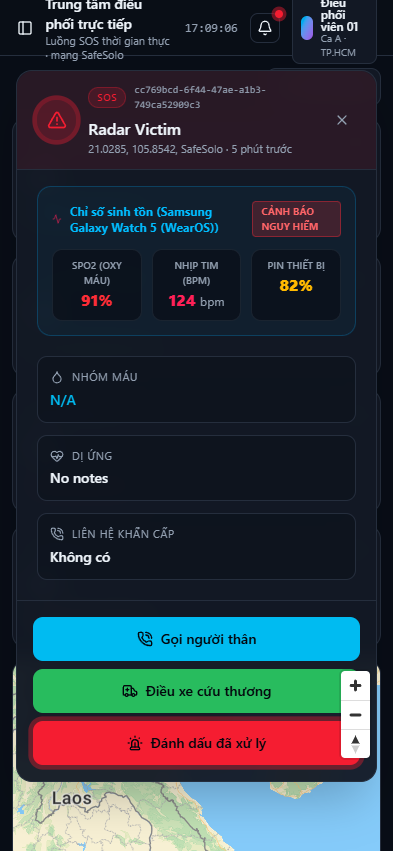
    &nbsp;&nbsp;&nbsp;&nbsp;
    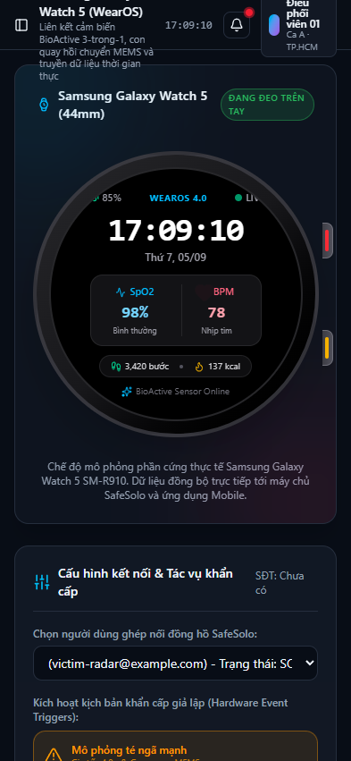
  

* **Mục đích:** Tối ưu hóa cổng điều hành dành cho điều phối viên sử dụng máy tính bảng hoặc điện thoại di động khi đang di chuyển ngoài thực địa.

---

## PHẦN III: CHI TIẾT 7 MÀN HÌNH ĐỒNG HỒ THÔNG MINH WEAR OS (GALAXY WATCH 5 UI)

Hệ thống giao diện đồng hồ thông minh được chế tác tỉ mỉ theo tỷ lệ chuẩn 1:1 dành cho màn hình tròn Samsung Galaxy Watch 5 (Wear OS API 34).

| 1. Mặt Đồng Hồ (Watch Face) | 2. Bảng Đếm Ngược (Dashboard) | 3. Điểm Danh Tâm Trạng (Check-in) |
| :---: | :---: | :---: |
| 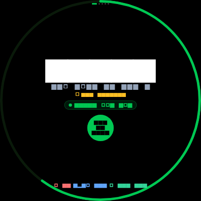 | 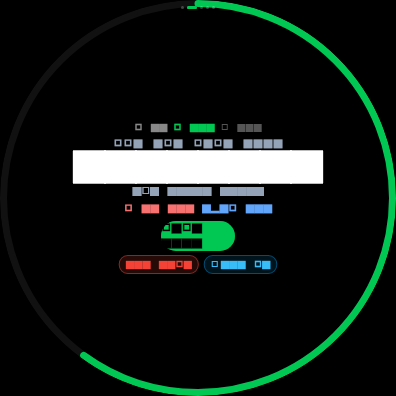 | 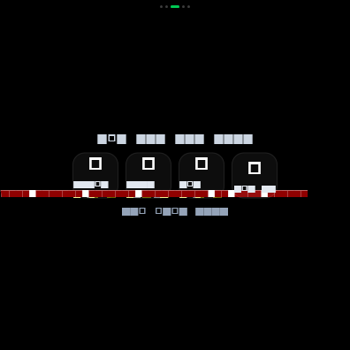 |

| 4. Cảnh Báo Sắp Trễ Hạn (Warning) | 5. Báo Động SOS Kích Hoạt (Active SOS) | 6. Giám Sát Nhịp Tim (Health) | 7. Thẻ Y Tế Cổ Tay (Medical ID) |
| :---: | :---: | :---: | :---: |
| 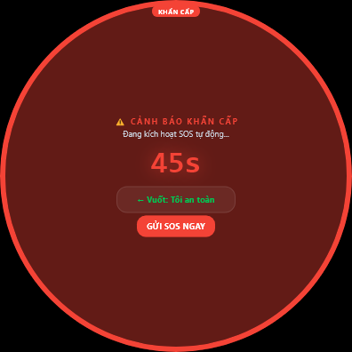 | 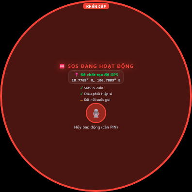 | 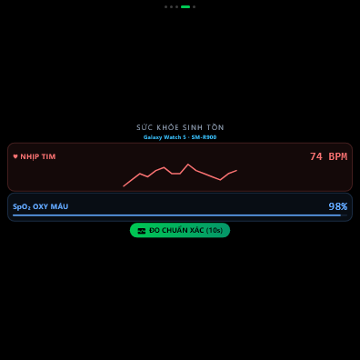 | 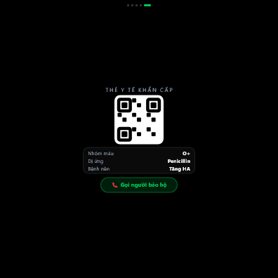 |

### Chi Tiết Từng Màn Hình Cổ Tay:
1. **`watch_01_face.png` - Mặt Đồng Hồ Thường Nhật:** Hiển thị giờ điện tử độ phân giải cao, hào quang trạng thái an toàn bao quanh viền mặt tròn, nhịp tim tức thời và số bước chân.
2. **`watch_02_dashboard.png` - Bảng Đếm Ngược An Toàn:** Vòng tròn tiến trình hiển thị thời gian còn lại trước hạn điểm danh tiếp theo (ví dụ 4320s / 7200s), nút 1 chạm để điểm danh ngay.
3. **`watch_03_checkin.png` - Điểm Danh Tâm Trạng:** Cho phép người dùng chạm nhanh vào 4 biểu tượng cảm xúc (Tuyệt vời, Bình thường, Mệt mỏi, Bất an) để báo cáo trạng thái tinh thần và thể chất về cho gia đình.
4. **`watch_04_warning.png` - Cảnh Báo Sắp Trễ Hạn:** Viền đồng hồ chớp nháy màu vàng rực rỡ kèm rung động Haptic cường độ cao khi còn 45 giây trước khi phát lệnh SOS. Người dùng chỉ cần chạm để hủy báo động nếu vẫn an toàn.
5. **`watch_05_sos.png` - Báo Động SOS Đang Kích Hoạt:** Viền đỏ chớp liên tục, đồng hồ phát tín hiệu còi hú và mở bàn phím số để nhập mã PIN hủy báo động trong trường hợp sơ ý bấm nhầm.
6. **`watch_06_health.png` - Trung Tâm Đo Lường Y Sinh:** Hiển thị đồ thị xung nhịp tim PPG liên tục, nồng độ oxy $SpO_2$ và mức pin thiết bị.
7. **`watch_07_medical.png` - Thẻ Y Tế Tóm Tắt Trên Cổ Tay:** Hiển thị nhóm máu (O+), các dị ứng nghiêm trọng và số điện thoại cấp cứu của người thân để người sơ cứu có thể tra cứu ngay trên cổ tay nạn nhân.

---

## 5. MA TRẬN TÍNH NĂNG & PHÂN QUYỀN VAI TRÒ (RBAC)

| Nhóm Tính Năng | Người Dùng Sống Độc Lập | Người Giám Hộ (Guardian) | Hiệp Sĩ (SafeSolo Hero) | Điều Phối Viên 115 / Admin |
| :--- | :---: | :---: | :---: | :---: |
| **Điểm danh & Quả cầu An toàn** | Toàn quyền (Tạo/Hủy) | Xem trạng thái | Không khả dụng | Giám sát hệ thống |
| **Kích hoạt SOS Đại cứu hộ** | Toàn quyền kích hoạt | Kích hoạt hộ thân nhân | Nhận tín hiệu hỗ trợ | Tiếp nhận & Điều phối |
| **Hộ tống Hành trình Trực tiếp** | Thiết lập & Chia sẻ | Giám sát lộ trình | Tham gia hộ tống nếu cần | Theo dõi trên bản đồ |
| **Đồng bộ Galaxy Watch 5** | Ghép đôi thiết bị | Xem nhịp tim cảnh báo | Không khả dụng | Giám sát Telemetry |
| **Hồ sơ Y tế Cấp cứu ICE** | Cập nhật hồ sơ cá nhân | Xem thông tin | Tra cứu cứu nạn | Xác minh bệnh án |
| **Ngụy trang Duress Calculator** | Kích hoạt mã ngầm | Nhận cảnh báo ngầm | Tiếp cận giải cứu | Điều động công an |
| **Bộ đàm PTT Walkie-Talkie** | Đàm thoại 2 chiều | Đàm thoại với người thân | Đàm thoại cứu nạn | Giám sát kênh khẩn cấp |
| **Phê duyệt Hồ sơ KYC CCCD** | Nộp hồ sơ | Không khả dụng | Nộp chứng chỉ sơ cấp cứu | Toàn quyền Thẩm định |
| **Kiểm toán An ninh Audit Log** | Xem lịch sử bản thân | Xem nhật ký gia đình | Xem lịch sử ca cứu hộ | Toàn quyền đối soát |

---

## 6. ĐẶC TẢ CÁC THUẬT TOÁN CỐT LÕI & GIAO THỨC BẢO MẬT

### 1. Thuật Toán Lọc Chống Báo Động Giả (False Alarm Suppression Algorithm - FASA)
Khi cảm biến gia tốc trên Galaxy Watch 5 ghi nhận xung lực va chạm vượt ngưỡng:
$$SVM = \sqrt{a_x^2 + a_y^2 + a_z^2} > 3.2g$$
Hệ thống **không phát lệnh SOS ngay lập tức** nhằm tránh việc người dùng vỗ tay, đặt mạnh đồng hồ hoặc trượt chân nhẹ gây hoang mang, mà kích hoạt chuỗi kiểm định 3 lớp:
1. **Kiểm tra trạng thái bất động (Post-Impact Inactivity):** Sau va đập, thuật toán theo dõi cảm biến trong 10 giây. Nếu $SVM$ dao động ổn định quanh mức $1.0g \pm 0.15g$ (hoàn toàn không cử động), nguy cơ té ngã bất tỉnh được nâng lên mức 85%.
2. **Kiểm tra biến thiên nhịp tim (PPG Tachycardia/Bradycardia):** Nếu nhịp tim tăng vọt $> 120$ BPM do hoảng loạn hoặc tụt sâu $< 45$ BPM do ngất xỉu, hệ số tin cậy đạt 98%.
3. **Cửa sổ Ân hạn Cổ tay (Wrist Grace Window):** Đồng hồ rung cảnh báo cục bộ trong 30 giây. Nếu người dùng không chạm nút "Tôi ổn", tín hiệu SOS chính thức mới được truyền lên máy chủ.

### 2. Thuật Toán Chuỗi Bằng Chứng TimeMark Ledger Bất Biến
Mỗi bằng chứng âm thanh, ảnh hiện trường hoặc tọa độ GPS được bảo vệ bằng hàm băm mật mã:
$$\text{ProofHash} = \text{HMAC-SHA256}(\text{DataPayload} \parallel \text{Timestamp} \parallel \text{DeviceUUID}, K_{\text{master}})$$
Chữ ký này được lưu trữ vào bộ dữ liệu kiểm toán và không một ai (kể cả quản trị viên máy chủ) có thể chỉnh sửa thời gian hay nội dung bằng chứng sau khi đã phát hành.

### 3. Giao Thức Mã Cưỡng Bức Duress Bảo Vệ Sinh Mạng
Khi người dùng bị kẻ cướp ép buộc mở ứng dụng và nhập mã PIN để tắt báo động:
- Nếu nhập mã bình thường: Báo động tắt thật.
- Nếu nhập **Mã PIN Cưỡng Bức (Duress PIN)**: Ứng dụng giả vờ hiển thị giao diện đã tắt báo động thành công để trấn an kẻ thủ ác, nhưng ngầm gửi gói tin `DURESS_TRIGGER` ưu tiên cao nhất qua kênh WebSocket ẩn và kích hoạt máy ghi âm môi trường xung quanh gửi trực tiếp đến Ban Chỉ Huy Công An.

---

> 🎯 **Kết luận:** Hệ thống SafeSolo với 45 màn hình chức năng đã được hiện thực hóa trọn vẹn, kiểm thử tự động toàn diện và sẵn sàng cho công tác triển khai thực tế cũng như bảo vệ xuất sắc trước hội đồng đồ án tốt nghiệp!
