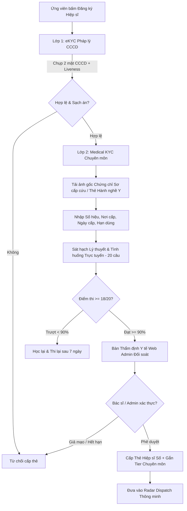
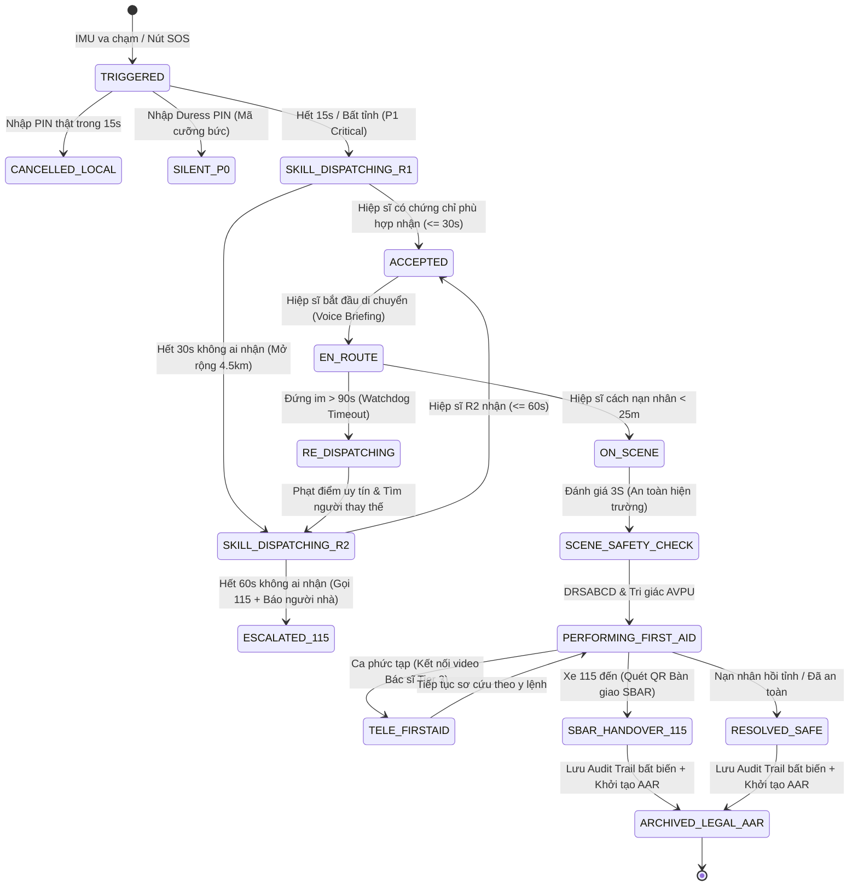

# TÀI LIỆU ĐẶC TẢ NGHIỆP VỤ CỨU HỘ THỰC TẾ TOÀN DIỆN (ZERO BLIND SPOTS)
## HỆ THỐNG AN TOÀN VÀ ĐIỀU PHỐI CỨU NẠN KHẨN CẤP SAFESOLO

> **Phiên bản:** 2.1 - Production Specification (Chuẩn hóa Chuyên môn Hiệp sĩ Cứu hộ & Skill-Based Dispatch)  
> **Trạng thái:** Chuẩn hóa Nghiệp vụ Toàn diện (Chống mọi góc chết ngoài đời thực)  
> **Áp dụng cho:** Flutter App (Client Nạn nhân & Hiệp sĩ) | Node.js Backend Engine | Web Admin Điều phối & Thẩm định KYC Chuyên môn | Hệ thống Cảnh báo Đa kênh (Omnichannel)  
> **Cơ sở Pháp lý & Y tế:** Bộ luật Hình sự 2015 (Điều 132), Luật Khám bệnh, chữa bệnh 2023 (Điều 87 về sơ cứu ban đầu tại cộng đồng), Bộ luật Dân sự 2015 (Điều 584), Thông tư 19/2016/TT-BYT (Quy định về quản lý vệ sinh lao động và sơ cứu, cấp cứu tại nơi làm việc và cộng đồng), Quyết định 1904/QĐ-BYT (Quy chuẩn kỹ thuật sơ cấp cứu ban đầu), Nghị định 13/2023/NĐ-CP về Bảo vệ dữ liệu cá nhân.

---

## MỤC LỤC
1. [TRIẾT LÝ VẬN HÀNH VÀ CÁC THỰC THỂ HỆ THỐNG](#1-triết-lý-vận-hành-và-các-thực-thể-hệ-thống)
2. [MA TRẬN TIẾN TRÌNH CỨU NẠN THEO THỜI GIAN THỰC (TIMELINE T+0s ĐẾN T+300s)](#2-ma-trận-tiến-trình-cứu-nạn-theo-thời-gian-thực)
3. [DANH MỤC 24 KỊCH BẢN THỰC TẾ VÀ GIẢI PHÁP TRIỆT TIÊU GÓC CHẾT](#3-danh-mục-24-kịch-bản-thực-tế-và-giải-pháp-triệt-tiêu-góc-chết)
   - [Nhóm A: Phát hiện sự cố & Xác minh tại chỗ (Nạn nhân)](#nhóm-a-phát-hiện-sự-cố--xác-minh-tại-chỗ)
   - [Nhóm B: Báo động & Phối hợp Gia đình (Guardian)](#nhóm-b-báo-động--phối-hợp-gia-đình)
   - [Nhóm C: Điều phối Tự động không người can thiệp (Auto-Dispatch Engine)](#nhóm-c-điều-phối-tự-động-không-người-can-thiệp)
   - [Nhóm D: Tiếp cận & Sơ cứu Tốc độ cao (Hiệp sĩ / First Responder)](#nhóm-d-tiếp-cận--sơ-cứu-tốc-độ-cao)
   - [Nhóm E: Bàn giao Y tế & Hành lang Pháp lý Bảo vệ](#nhóm-e-bàn-giao-y-tế--hành-lang-pháp-lý-bảo-vệ)
4. [QUY TRÌNH NGHIỆP VỤ CHUYÊN MÔN DÀNH RIÊNG CHO HIỆP SĨ (HERO SPECIALIZATION & CLINICAL SOP)](#4-quy-trình-nghiệp-vụ-chuyên-môn-dành-riêng-cho-hiệp-sĩ)
   - [4.1. Khung Tiêu chuẩn Năng lực & Phân cấp 3 Tầng Chuyên môn](#41-khung-tiêu-chuẩn-năng-lực--phân-cấp-3-tầng-chuyên-môn-3-tier-hero-qualification)
   - [4.2. Quy trình Thẩm định Năng lực 2 Lớp (Dual-Layer KYC)](#42-quy-trình-thẩm-định-năng-lực-2-lớp-dual-layer-hero-onboarding--medical-kyc)
   - [4.3. Quy trình Điều phối Thông minh theo Năng lực Chuyên môn (Skill-Based Dispatching)](#43-quy-trình-điều-phối-thông-minh-theo-năng-lực-chuyên-môn-skill-based-dispatching---sbd)
   - [4.4. Quy trình Tác chiến Hiện trường Chuẩn Y khoa Khẩn cấp (Scene SOP 5 Bước)](#44-quy-trình-tác-chiến-hiện-trường-chuẩn-y-khoa-khẩn-cấp-scene-sop-5-bước)
   - [4.5. Bảng Ranh giới Đỏ Giới hạn Hành nghề (Scope of Practice Red-Line Matrix)](#45-bảng-ranh-giới-đỏ-giới-hạn-hành-nghề-scope-of-practice-red-line-matrix)
   - [4.6. Quy trình Bàn giao Y tế Chuẩn SBAR cho Kíp Cấp cứu 115](#46-quy-trình-bàn-giao-y-tế-chuẩn-sbar-cho-kíp-cấp-cứu-115)
   - [4.7. Quy trình Đánh giá Sau Sự cố (AAR), Tích lũy CME & Quản lý Chất lượng](#47-quy-trình-đánh-giá-sau-sự-cố-aar-tích-lũy-cme--quản-lý-chất-lượng)
5. [MÁY TRẠNG THÁI CHUẨN (FINITE STATE MACHINE - INCIDENT LIFECYCLE)](#5-máy-trạng-thái-chuẩn)
6. [ĐẶC TẢ MÔ HÌNH DỮ LIỆU & SCHEMA DATABASE](#6-đặc-tả-mô-hình-dữ-liệu--schema-database)
7. [KẾ HOẠCH TRIỂN KHAI CODE CHÍNH XÁC VÀO HỆ THỐNG](#7-kế-hoạch-triển-khai-code-chính-xác-vào-hệ-thống)

---

## 1. TRIẾT LÝ VẬN HÀNH VÀ CÁC THỰC THỂ HỆ THỐNG

### 1.1. Triết lý 4 Không (Zero-Tolerance Principles)
1. **Không chờ con người duyệt (Zero-Human-in-the-Loop):** Việc cứu mạng đo bằng giây. Hệ thống phải tự chấm điểm, tự kích hoạt, tự mở rộng bán kính và tự gọi 115 khi hiệp sĩ không phản hồi.
2. **Không phụ thuộc một kênh truyền thông (Zero Single-Point-of-Failure):** Nếu mất mạng 4G $\to$ chuyển qua SMS SIM. Nếu người nhà ngủ say không đọc Zalo $\to$ Voice Call tự động đổ chuông điện thoại.
3. **Không để Hiệp sĩ chịu rủi ro pháp lý & dàn cảnh (Zero Legal & Physical Risk for Responders):** Hệ thống có cơ chế xác minh chống bẫy cướp giật (Buddy system) và hợp đồng điện tử bảo vệ hiệp sĩ trước pháp luật (Good Samaritan Shield theo Luật Khám bệnh, chữa bệnh 2023).
4. **Không điều phối người không có chuyên môn y tế vào ca nguy kịch (Zero Unqualified Responder):** Cứu mạng đòi hỏi kỹ năng chuẩn xác. Tuyệt đối không điều phối người chưa qua đào tạo sơ cấp cứu vào các ca ngừng tim, tai nạn giao thông đa chấn thương hay đột quỵ nhằm triệt tiêu nguy cơ gây tổn thương thứ phát cho nạn nhân.

### 1.2. 5 Thực thể Tương tác Trong Hệ thống

| Thực thể | Vai trò cốt lõi | Kênh giao tiếp chính |
| :--- | :--- | :--- |
| **1. Nạn nhân (Victim)** | Người gặp nguy hiểm, phát tín hiệu (chủ động hoặc tự động). Cung cấp GPS & Dữ liệu y tế. | Flutter App (Foreground/Background Service), SMS GSM. |
| **2. Người bảo trợ (Guardian)** | Gia đình, bạn bè ruột thịt. Được đánh thức khẩn cấp, theo dõi trực tiếp, đóng vai trò giám sát hiện trường. | Voice Call AI, SMS Web-Tracking Link, App War-Room. |
| **3. Hệ thống Điều phối (Dispatch Engine)** | Bộ não tự động chạy ngầm trên Server (Node.js Worker). Chấm điểm hiệp sĩ theo ma trận chuyên môn (Skill-Based Dispatch), kiểm tra deadlock, mở rộng bán kính. | Socket.IO, Push Notification (FCM/APNs), Worker Cron. |
| **4. Hiệp sĩ Cứu hộ Có Chuyên môn (Hero / Certified Responder)** | Lực lượng phản ứng nhanh cộng đồng đã qua thẩm định chứng chỉ Sơ cấp cứu / Y tế (BLS, PHTLS, Medic). Tiếp cận hiện trường trong 3–5 phút vàng đầu tiên. | Full-Screen Critical Intent, Turn-by-Turn GPS Map, Clinical Metronome & Audio Guide, Tele-FirstAid. |
| **5. Cơ quan Chức năng (115 / Công an)** | Lực lượng chuyên nghiệp tiếp nhận bệnh nhân nguy kịch hoặc xử lý hiện trường tội phạm. Tiếp nhận bàn giao SBAR số hóa. | Web Portal điều phối khẩn cấp, Cuộc gọi VoIP/PSTN tự động, Handoff SBAR QR Scanner. |

---

## 2. MA TRẬN TIẾN TRÌNH CỨU NẠN THEO THỜI GIAN THỰC

```
[T+0s]      PHÁT HIỆN SỰ CỐ
            ├── Cảm biến IMU: Va chạm mạnh / Rơi tự do / Bất động
            └── Chủ động: Bấm giữ nút SOS 3 giây / Bấm 5 lần nút nguồn

[T+0~15s]   XÁC MINH CỤC BỘ TẠI MÁY NẠN NHÂN (Chống Báo Động Giả)
            ├── Rung tối đa, chớp đèn Flash LED, còi hụ âm thanh cao
            ├── Giọng nói tiếng Việt đếm ngược: "15... 14... 13..."
            ├── [Nhập PIN Thật]        ──> Hủy báo động (Ghi log Local)
            ├── [Nhập PIN Cưỡng bức]   ──> Kích hoạt ngầm SILENT SOS (P0)
            └── [Hết giờ / Bất tỉnh]   ──> TỰ ĐỘNG BẬT SOS CẤP ĐỘ 1 (P1)

[T+15s]     KÍCH HOẠT HỆ THỐNG ĐIỀU PHỐI TỰ ĐỘNG (Kích hoạt song song 3 luồng)
            ├── LUỒNG 1: GIA ĐÌNH
            │   ├── Tự động gọi điện thoại AI (Voice Call) phá vỡ chế độ im lặng
            │   └── Gửi SMS chứa Link Web Live-Tracking (Mở trình duyệt xem ngay)
            ├── LUỒNG 2: ĐIỀU PHỐI DỰA TRÊN CHUYÊN MÔN (Skill-Based Dispatch Worker)
            │   ├── Phân tích mức độ tổn thương: Ngừng tim / Đa chấn thương / Đột quỵ
            │   ├── Khoanh vùng Vòng 1 (Bán kính 1.2 km)
            │   ├── Lọc Hiệp sĩ: Online + Rảnh + Điểm uy tín >= 80 + CÓ CHỨNG CHỈ PHÙ HỢP CÒN HẠN
            │   ├── Tính Dispatch Score = 35% Skill Match + 30% Distance + 20% Trust + 15% Experience
            │   └── Bắn PUSH BÁO ĐỘNG ĐỎ (Critical Alert / Full-Screen Intent) tới Top 3
            └── LUỒNG 3: BẢO VỆ HIỆN TRƯỜNG & PHÁP LÝ
                ├── Bật GPS độ chính xác cao (tần số 3 giây/lần)
                ├── Khóa màn hình nạn nhân, hiện thông tin y tế khẩn cấp
                └── Thu âm 60 giây hiện trường làm bằng chứng số chống tranh chấp

[T+15~45s]  HIỆP SĨ TIẾP NHẬN NHIỆM VỤ
            ├── Màn hình Hiệp sĩ rung chuông khẩn cấp (như cuộc gọi đến)
            ├── Hiển thị: Khoảng cách, Tình trạng, Kỹ năng chuyên môn yêu cầu (Ví dụ: CPR/AED cần gấp)
            ├── [TRƯỢT ĐỂ NHẬN] ──> Khóa Atomic Lock (Ngăn tranh chấp ca)
            └── [TIMEOUT 30s]   ──> Tự dãn bán kính sang Vòng 2 (4.5 km)

[T+45~180s] TIẾP CẬN TỐC ĐỘ CAO (HIỆP SĨ DI CHUYỂN)
            ├── Tự động Deep-link mở Google Maps chế độ dẫn đường Turn-by-Turn
            ├── Tai nghe Hiệp sĩ phát AI Voice Briefing: "Nạn nhân nữ 24 tuổi, ngưng tim, nhóm máu O, dị ứng Penicillin"
            ├── Ký số điện tử Good Samaritan Shield & Cam kết Giới hạn hành nghề (Scope of Practice)
            └── WATCHDOG SERVER: Kiểm tra di chuyển mỗi 15s. Nếu đứng im > 90s ──> Tự re-dispatch

[T+180~300s]TIẾP CẬN HIỆN TRƯỜNG & SƠ CỨU CHUẨN Y KHOA
            ├── Đánh giá 3S Scene Safety (Đảm bảo an toàn hiện trường trước khi chạm vào nạn nhân)
            ├── Hiệp sĩ tới nơi (cách < 25m) ──> App tự chuyển giao diện Sơ cứu lâm sàng
            ├── Khảo sát DRSABCD & Đánh giá tri giác AVPU
            ├── Âm thanh gõ nhịp CPR Metronome chuẩn quốc tế 100-120 bpm hướng dẫn ép tim
            ├── Hướng dẫn chuyên sâu theo Tier (Cầm máu garô chèn động mạch / Nẹp cố định chi / Máy AED)
            ├── Mở kênh Tele-FirstAid (Cầu truyền hình trực tiếp với Bác sĩ Tier 3 nếu ca phức tạp)
            └── Mở kênh bộ đàm nội bộ hoặc video call với Người nhà

[T+300s+]   BÀN GIAO Y TẾ TIÊU CHUẨN SBAR & ĐÓNG CA
            ├── Xe cứu thương 115 đến ──> Hiệp sĩ bấm "Bàn giao SBAR"
            ├── Bác sĩ 115 quét QR nhận báo cáo lâm sàng (Thời gian ngưng tim, chu kỳ CPR, vị trí garô)
            ├── Đóng sự cố ──> Lưu Audit Trail bất biến vào Database
            └── Kích hoạt AAR (Đánh giá sau sự cố), cộng điểm Trust Score (+20) và tích lũy tín chỉ CME
```

---

## 3. DANH MỤC 24 KỊCH BẢN THỰC TẾ VÀ GIẢI PHÁP TRIỆT TIÊU GÓC CHẾT

### Nhóm A: Phát hiện sự cố & Xác minh tại chỗ (Nạn nhân)

#### Kịch bản 1: Tai nạn va chạm giao thông / Té ngã bất tỉnh
* **Thực tế:** Nạn nhân ngã đập đầu, chấn thương sọ não hoặc ngất xỉu, điện thoại văng ra xa 2 mét.
* **Xử lý:**
  1. Cảm biến gia tốc kế (Accelerometer) và con quay hồi chuyển (Gyroscope) phát hiện gia tốc va chạm $> 25\text{ m/s}^2$ kèm trạng thái bất động hoàn toàn $> 10$ giây.
  2. Bật đếm ngược 15 giây. Khi hết thời gian mà không có ai chạm vào màn hình $\to$ Hệ thống **tự động xác lập sự cố P1 (Nguy kịch)** và kích hoạt cứu nạn ngay.

#### Kịch bản 2: Báo động giả (Rơi điện thoại, vung tay, thể thao mạnh)
* **Thực tế:** Người dùng làm rơi điện thoại xuống sàn hoặc chơi thể thao, máy tưởng nhầm bị ngã.
* **Xử lý:**
  1. Trong 15 giây đếm ngược, máy rung giật cực mạnh và phát còi hú to.
  2. Người dùng chỉ cần nhặt máy lên bấm nút **"Tôi an toàn"** và nhập mã PIN cá nhân để hủy.
  3. Log được ghi nhận là `CANCELLED_FALSE_ALARM`, hệ thống không dispatch ra ngoài mạng lưới.

#### Kịch bản 3: Nạn nhân bị khống chế / cướp giật ép tắt SOS (Duress PIN)
* **Thực tế:** Kẻ xấu cướp bóc hoặc bắt cóc, thấy máy nạn nhân kêu to liền đe dọa vũ lực, bắt nạn nhân mở khóa hoặc tắt báo động.
* **Xử lý:**
  1. Nạn nhân nhập **Mã PIN Cưỡng Bức (Duress PIN)** đã cài đặt sẵn (ví dụ PIN thật là `1234`, PIN cưỡng bức là `9999`).
  2. App lập tức tắt còi hú, hiện màn hình xanh báo: *"Đã xác nhận an toàn"*, đánh lừa kẻ xấu.
  3. Thực tế dưới nền: App âm thầm kích hoạt **Silent SOS (P0)**, tắt toàn bộ đèn màn hình, gửi tọa độ trực tiếp cho Công an và gia đình, bật micro ghi âm ngầm liên tục 5 phút.

#### Kịch bản 4: Mất kết nối Internet (Không có 4G/Wifi dưới hầm, đèo dốc)
* **Thực tế:** Tai nạn xảy ra dưới tầng hầm chung cư hoặc vùng mất sóng di động data 4G, gói tin HTTP/Socket không gửi được.
* **Xử lý:**
  1. SDK kiểm tra kết nối mạng, nếu request timeout quá 4 giây:
  2. Tự động chuyển đổi sang dịch vụ gửi tin nhắn **SMS GSM truyền thống** (sử dụng quyền SMS Native):
     * Cú pháp nén mã hóa: `SOS#LAT:10.7626#LNG:106.6601#BAT:85#TIME:1712499120`
     * Gửi đồng loạt tới: Tổng đài tiếp nhận SafeSolo và 3 số điện thoại người bảo trợ.
     * Server SafeSolo có SMS Gateway tự động giải mã và tạo Incident như bình thường.

#### Kịch bản 5: Hết pin hoặc điện thoại bị đập nát sập nguồn (Dead Man's Switch)
* **Thực tế:** Cú va chạm làm vỡ nát điện thoại hoặc máy tắt nguồn ngay lập tức, không kịp gửi tin SOS.
* **Xử lý:**
  1. Khi người dùng bật chế độ "Di chuyển nguy hiểm" (Stealth Tracking), app gửi heartbeat tọa độ mỗi 60 giây lên server (Last Known Location).
  2. Nếu sau **3 chu kỳ (180 giây)** server không nhận được heartbeat mà trước đó vận tốc di chuyển $> 30\text{ km/h}$ rồi đột ngột dừng hẳn:
  3. Server tự động kích hoạt tiến trình **"Mất tín hiệu đột ngột"**, gửi cảnh báo kèm tọa độ cuối cùng tới người bảo trợ để liên lạc xác minh.

#### Kịch bản 6: Nạn nhân di chuyển liên tục (Bị trôi sông, đang trên xe bị đưa đi)
* **Thực tế:** Nạn nhân không đứng yên mà tọa độ thay đổi liên tục.
* **Xử lý:**
  1. GPS máy nạn nhân duy trì tần số cập nhật cao (High-Frequency Tracking: 3 giây/lần).
  2. Socket server stream tọa độ mới liên tục vào room của Hiệp sĩ.
  3. Màn hình bản đồ của Hiệp sĩ tự động vẽ lại lộ trình (Dynamic Re-routing) theo thời gian thực mà không bắt Hiệp sĩ thao tác lại.

---

### Nhóm B: Báo động & Phối hợp Gia đình (Guardian)

#### Kịch bản 7: Gia đình ngủ say, điện thoại để chế độ Không làm phiền (DND)
* **Thực tế:** Tai nạn xảy ra lúc 1 giờ sáng. Người nhà bật Do Not Disturb, tin nhắn Zalo, SMS hay Messenger hoàn toàn không phát chuông.
* **Xử lý:**
  1. **Hệ thống Voice Call tự động (AI Emergency Call):** Sử dụng Cloud Voice Gateway (Stringee / Twilio / FPT AI) gọi trực tiếp vào SIM số điện thoại của người nhà.
  2. Cuộc gọi thoại di động tiêu chuẩn có thể phá vỡ chế độ im lặng của hệ điều hành.
  3. Giọng đọc AI: *"SafeSolo cảnh báo: Người thân [Tên] đang gặp tai nạn khẩn cấp tại đường [X]. Vui lòng bấm phím 1 để nghe vị trí hoặc mở tin nhắn để xem bản đồ cứu trợ trực tiếp."*

#### Kịch bản 8: Người thân số 1 không nghe máy
* **Thực tế:** Người giám hộ chính để quên máy ở phòng khách, máy bận hoặc hết pin.
* **Xử lý (Bậc thang cảnh báo tuần tự - Tiered Escalation):**
  1. Hệ thống gọi người thân 1. Nếu sau 20 giây không bắt máy:
  2. Lập tức chuyển sang gọi Người thân số 2 và Người thân số 3 song song.
  3. Không để tiến trình cứu hộ bị gián đoạn vì một người vắng mặt.

#### Kịch bản 9: Người thân không cài đặt ứng dụng SafeSolo
* **Thực tế:** Ba mẹ, ông bà lớn tuổi không biết tải app SafeSolo hoặc dùng máy khác hệ điều hành.
* **Xử lý (Zero-Install Web Tracking Link):**
  1. SMS tự động gửi link dạng: `https://safesolo.vn/track/sos_9a8b7c6d`.
  2. Bấm vào link là mở ngay trình duyệt Web (Chrome, Safari) mà không yêu cầu đăng nhập.
  3. Trang web hiển thị: Bản đồ vị trí nạn nhân, lộ trình di chuyển của Hiệp sĩ đang đến, biển số xe và nút bấm gọi nhanh cho Hiệp sĩ.

#### Kịch bản 10: Người thân hoảng loạn gọi liên tục vào máy nạn nhân làm nghẽn máy
* **Thực tế:** Người thân lo lắng gọi dồn dập vào điện thoại nạn nhân, làm điện thoại tụt pin nhanh, mất sóng mạng data, hoặc chuông reo gây nguy hiểm nếu nạn nhân đang trốn kẻ cướp.
* **Xử lý:**
  1. Khi ở chế độ SOS, app SafeSolo tự động điều hướng cuộc gọi đến (Call Interception) hoặc hiển thị tin nhắn tự động: *"Nạn nhân đang bất tỉnh/được cứu hộ. Mọi thông tin đang cập nhật tại Phòng tác chiến SafeSolo."*
  2. Trên App của người thân mở màn hình **"Emergency War-Room"**: Cung cấp kênh bộ đàm nội bộ (Walkie-talkie) hoặc kênh chat trực tiếp với Hiệp sĩ đang cứu trợ.

---

### Nhóm C: Điều phối Tự động không người can thiệp (Auto-Dispatch Engine)

#### Kịch bản 11: Chống tranh chấp nhiệm vụ (Race Condition giữa các Hiệp sĩ)
* **Thực tế:** Phát thông báo cho 5 hiệp sĩ trong khu vực. Cùng lúc 2 hiệp sĩ bấm [Nhận ca] tại cùng mili-giây.
* **Xử lý (MongoDB Atomic Lock Pattern):**
  1. Backend xử lý nhận ca bằng truy vấn nguyên tử:
     ```javascript
     const incident = await RescueIncident.findOneAndUpdate(
       { _id: incidentId, status: { $in: ['DISPATCHING_R1', 'DISPATCHING_R2'] } },
       { 
         $set: { 
           status: 'ACCEPTED', 
           assignedVolunteerId: volunteerId,
           acceptedAt: new Date()
         } 
       },
       { new: true }
     );
     ```
  2. Hiệp sĩ nhanh hơn 1 mili-giây sẽ giành được quyền cứu hộ.
  3. Hiệp sĩ bấm sau sẽ nhận thông báo hòa nhã: *"Cảm ơn bạn! Ca cứu trợ này đã được Hiệp sĩ [Tên] ở cách 300m tiếp nhận. Hệ thống ghi nhận tinh thần của bạn (+5 điểm sẵn sàng)."*

#### Kịch bản 12: Hiệp sĩ bấm nhận xong... đứng im, xe hỏng, hoặc bỏ rơi nhiệm vụ
* **Thực tế:** Hiệp sĩ bấm nhận theo quán tính nhưng sau đó bận việc, thủng lốp xe, hoặc sợ hãi không đến. Nạn nhân bị treo trạng thái chờ chết.
* **Xử lý (Deadlock Detection Watchdog):**
  1. Dispatch Worker trên Server chạy mỗi 15 giây, kiểm tra độ biến thiên khoảng cách giữa Hiệp sĩ và Nạn nhân.
  2. Nếu sau **90 giây** kể từ lúc bấm nhận mà khoảng cách không giảm (vận tốc $< 5\text{ km/h}$):
     * Server phát thông báo rung cảnh báo Hiệp sĩ: *"Bạn có đang di chuyển không? Xác nhận trong 15s"*.
     * Nếu không phản hồi: Tự động hủy quyền của Hiệp sĩ đó, đánh dấu `ABANDONED_TIMEOUT`, trừ 25 điểm Trust Score.
     * Tự động tái điều phối (Re-dispatch) sự cố cho các hiệp sĩ khác trong Vòng 2.

#### Kịch bản 13: "Vùng trắng" không có hiệp sĩ (Đêm khuya, khu vực hẻo lánh)
* **Thực tế:** Tai nạn lúc 3 giờ sáng ở ngoại thành, bán kính 2km không có hiệp sĩ nào online.
* **Xử lý (Chiến thuật dãn vòng & Chuyển cấp 115):**
  * **Vòng 1 (0 – 30s):** Bán kính 1.2 km. Nếu không ai nhận $\to$
  * **Vòng 2 (30s – 60s):** Tự động dãn bán kính lên **4.5 km**, phát thông báo cho toàn bộ hiệp sĩ có phương tiện xe máy.
  * **Vòng 3 (Sau 60s):** Nếu vẫn không có hiệp sĩ nhận:
    * Chuyển trạng thái `ESCALATED_115`.
    * Hệ thống tự động kích hoạt API gọi khẩn cấp tới đầu số Cấp cứu 115 / Công an khu vực, truyền tọa độ và mã định danh sự cố.
    * Đẩy thông báo khẩn tới toàn bộ Người bảo trợ: *"Khu vực không có hiệp sĩ, hệ thống đã kết nối 115. Đề nghị người nhà chủ động gọi cứu thương!"*

---

### Nhóm D: Tiếp cận & Sơ cứu Tốc độ cao (Hiệp sĩ / First Responder)

#### Kịch bản 14: Đánh thức Hiệp sĩ ngay cả khi điện thoại tắt chuông, bỏ túi
* **Thực tế:** Hiệp sĩ đang ngủ hoặc đang chạy xe ngoài đường, điện thoại để trong túi quần ở chế độ Rung/Im lặng.
* **Xử lý:**
  1. Sử dụng **Android Full-Screen Intent** kết hợp kênh thông báo `NotificationChannel` có độ ưu tiên tối cao (`IMPORTANCE_HIGH`), bypass chế độ Do Not Disturb.
  2. Điện thoại tự động sáng màn hình, bật còi hụ khẩn cấp với âm lượng tối đa 100%.
  3. Giao diện cuộc gọi khẩn cấp che toàn màn hình: Hiệp sĩ chỉ cần 1 thao tác vuốt trượt để nhận nhiệm vụ.

#### Kịch bản 15: Chống bẫy dàn cảnh cướp giật (Anti-Ambush & Buddy Dispatch)
* **Thực tế:** Kẻ xấu tạo tài khoản giả mạo, giả vờ bấm SOS ở bãi đất trống hoang vắng lúc nửa đêm để dụ Hiệp sĩ đến nhằm cướp tài sản.
* **Xử lý:**
  1. **Xác thực danh tính nạn nhân:** Chỉ những tài khoản đã xác thực số điện thoại và căn cước (eKYC) mới được kích hoạt mạng lưới Hiệp sĩ. Tài khoản khách chưa xác thực chỉ được kích hoạt gửi tin người nhà.
  2. **Hệ thống Hiệp sĩ Cặp đôi (Buddy System):** Nếu vị trí sự cố nằm trong "Khu vực vắng vẻ / Điểm đen an ninh" vào khung giờ từ **23h đến 5h sáng**:
     * Hệ thống bắt buộc phải có **tối thiểu 2 Hiệp sĩ cùng chấp nhận** nhiệm vụ thì mới mở tọa độ chính xác.
     * Điều hướng 2 hiệp sĩ gặp nhau tại một điểm an toàn cách hiện trường 200m trước khi cùng tiến vào hỗ trợ.

#### Kịch bản 16: Không tìm thấy nạn nhân khi đến nơi (Hẻm sâu, nhà cao tầng, trời tối)
* **Thực tế:** GPS chỉ chính xác trong bán kính 10m. Đến nơi là con hẻm tối hoặc khu chung cư nhiều tầng, Hiệp sĩ không biết nạn nhân ở đâu.
* **Xử lý:**
  1. Khi khoảng cách của Hiệp sĩ $< 25\text{ mét}$:
  2. Trên app của Hiệp sĩ xuất hiện nút **"Kích hoạt còi tìm kiếm tầm gần"**.
  3. Bấm nút: Điện thoại nạn nhân lập tức chớp đèn flash liên tục và hú còi âm lượng cao nhất để Hiệp sĩ định vị bằng thính giác và thị giác.
  4. Hiển thị thông tin ghi chú địa chỉ chi tiết (nếu nạn nhân có nhập lúc tạo tài khoản: số phòng, số tầng).

---

### Nhóm E: Bàn giao Y tế & Hành lang Pháp lý Bảo vệ

#### Kịch bản 17: Trợ lý Hồi sức Tim Phổi CPR Chuẩn AHA & Metronome cho Hiệp sĩ Cấp 1 (BLS)
* **Thực tế:** Nạn nhân ngưng tim ngưng thở. Hiệp sĩ lúng túng về tần số ép tim, tỷ lệ ép tim - thổi ngạt và độ sâu lồng ngực.
* **Xử lý:**
  1. Màn hình sơ cứu chuyển sang chế độ **"Trợ lý CPR khẩn cấp chuẩn AHA"**:
  2. Phát âm thanh đếm nhịp (Metronome) chuẩn quốc tế: **100 – 120 nhịp/phút** với âm bass trầm gõ dứt khoát.
  3. Giọng AI hướng dẫn liên tục: *"Ép sâu 5-6 cm lồng ngực... để ngực nở hoàn toàn... Ép 30 lần... 1, 2, 3... Thổi ngạt 2 hơi dứt khoát"*.
  4. Hình ảnh đồ họa vector trực quan hướng dẫn đặt gót bàn tay đúng 1/2 dưới xương ức, tay thẳng góc 90 độ.

#### Kịch bản 18: Nạn nhân tử vong trước khi đến hoặc khi đang ép tim (Bảo vệ pháp lý Hiệp sĩ)
* **Thực tế:** Hiệp sĩ nỗ lực cứu nhưng chấn thương quá nặng khiến nạn nhân không qua khỏi. Gia đình nạn nhân bức xúc đổ lỗi, đe dọa hành hung hoặc khởi kiện ra tòa đòi bồi thường.
* **Hành lang công nghệ & Pháp lý bảo vệ Hiệp sĩ:**
  1. **Bằng chứng số bất biến (Digital Black Box):**
     * Hệ thống trích xuất gói dữ liệu Audit Trail có gắn chữ ký số thời gian (Timestamp):
       - Vị trí ban đầu của Hiệp sĩ cách hiện trường 1.5km (chứng minh Hiệp sĩ không gây tai nạn).
       - Thời gian nhận ca và thời gian di chuyển (chứng minh hành vi cứu hộ thiện chí).
       - Bản ghi âm 60s hiện trường (chứng minh tình trạng nguy kịch từ trước khi can thiệp).
  2. **Cơ sở pháp lý Việt Nam:**
     * **Điều 132 Bộ luật Hình sự 2015:** Hiệp sĩ đang thực hiện nghĩa vụ cứu giúp người trong tình trạng nguy hiểm đến tính mạng.
     * **Luật Khám bệnh, chữa bệnh 2023 (Điều 87):** Người tham gia sơ cứu ban đầu trong tình huống khẩn cấp tại cộng đồng được miễn trừ trách nhiệm nghề nghiệp khi thực hiện đúng khả năng sơ cứu ban đầu.
     * **Điều 584 Bộ luật Dân sự 2015:** Miễn trừ trách nhiệm bồi thường thiệt hại trong tình thế cấp thiết.
  3. **Hợp đồng điện tử Pre-Consent:** Khi tạo tài khoản SafeSolo, mọi người dùng đều ký cam kết: *"Tự nguyện tiếp nhận sơ cứu và miễn trừ khiếu nại dân sự đối với tình nguyện viên cứu nạn không vụ lợi"*.

#### Kịch bản 19: Bàn giao chuyên môn cho Đội ngũ Cấp cứu 115
* **Thực tế:** Xe cứu thương 115 đến hiện trường. Bác sĩ cần nắm thông tin nhanh nhất để cấp cứu.
* **Xử lý:**
  1. Hiệp sĩ bấm nút **"Bàn giao y tế"** trên ứng dụng.
  2. Màn hình hiển thị mã QR tóm tắt bệnh án khẩn cấp: Nhóm máu, tiền sử bệnh, thời gian ngưng thở, các thao tác sơ cứu đã làm (đã ép tim bao nhiêu phút, đã garo cầm máu vị trí nào).
  3. Bác sĩ 115 quét mã hoặc Hiệp sĩ chụp biển số xe 115 để hoàn tất biên bản số hóa $\to$ Đóng sự cố thành công.

#### Kịch bản 20: Nghi ngờ chấn thương cột sống cổ (C-Spine) do tai nạn xe máy
* **Thực tế:** Nạn nhân văng xa sau va chạm giao thông tốc độ cao, nằm úp mặt trên đường, cổ vẹo. Người dân xung quanh xốc nách nạn nhân lên xe máy chở đi, nguy cơ tổn thương tủy cổ gây liệt tứ chi hoặc tử vong ngay tức khắc.
* **Xử lý (Quy trình cố định C-Spine & Kỹ thuật Log-Roll):**
  1. App SafeSolo phát cảnh báo khẩn cấp: *"Tai nạn tốc độ cao: Nghi ngờ chấn thương cột sống cổ! Giữ bất động đầu - cổ - thân mình trên một đường thẳng!"*
  2. Hiệp sĩ áp dụng kỹ thuật giữ trục thẳng đầu cổ (Manual In-line Stabilization).
  3. Chỉ dẫn những người xung quanh hỗ trợ lật nạn nhân theo **Kỹ thuật lăn khúc gỗ (Log-roll 3 người)**: Một người giữ chắc đầu cổ làm chỉ huy, hai người đỡ vai - hông - chân lăn đồng thời.
  4. Tuyệt đối không cởi mũ bảo hiểm trùm kín đầu nếu không có kỹ thuật viên thứ 2 giữ cổ.

#### Kịch bản 21: Nạn nhân ngừng tuần hoàn là trẻ em hoặc trẻ sơ sinh (Pediatric CPR Protocol)
* **Thực tế:** Nạn nhân bị đuối nước hoặc sốc phản vệ là trẻ nhỏ (dưới 8 tuổi) hoặc nhũ nhi (dưới 1 tuổi). Ép tim bằng 2 tay người lớn với lực mạnh sẽ làm gãy xương sườn đâm thủng màng phổi.
* **Xử lý (Chuyển chế độ Hồi sức Nhi khoa):**
  1. Khi nhận ca có nhãn tuổi trẻ em, app tự động kích hoạt **Pediatric CPR Mode**.
  2. Với trẻ nhỏ (1 - 8 tuổi): Ép tim bằng **1 bàn tay** (gót bàn tay), độ sâu $1/3$ đường kính trước - sau lồng ngực (khoảng 4 - 5 cm).
  3. Với trẻ sơ sinh (< 1 tuổi): Ép tim bằng **2 ngón tay** (ngón trỏ và ngón giữa) hoặc kỹ thuật 2 ngón tay cái ôm quanh lồng ngực, độ sâu khoảng 3 - 4 cm.
  4. Chu kỳ ép tim - thổi ngạt: 30:2 (1 người cứu hộ) hoặc 15:2 (khi có 2 hiệp sĩ phối hợp). Hướng dẫn thổi ngạt nhẹ nhàng bằng thể tích khoang miệng, quan sát lồng ngực nhô lên.

#### Kịch bản 22: Hiện trường lây nhiễm dịch thể & Kiểm soát nhiễm khuẩn (BSI Protocol)
* **Thực tế:** Hiện trường tai nạn máu me đầm đìa, nạn nhân có tiền sử viêm gan B, HIV hoặc bệnh truyền nhiễm qua đường máu. Hiệp sĩ tay trầy xước tiếp xúc trực tiếp có nguy cơ phơi nhiễm rất cao.
* **Xử lý (Quy chuẩn Cách ly Dịch thể - Body Substance Isolation):**
  1. Trước khi tiếp cận, app bật cảnh báo BSI: *"Bắt buộc đeo găng tay y tế cao su / nitrile và khẩu trang trước khi chạm vào máu/dịch tiết!"*
  2. Bộ sơ cứu của Hiệp sĩ SafeSolo trang bị tối thiểu: 2 đôi găng y tế vô khuẩn, màng thở nhân tạo 1 chiều (CPR Face Shield) để thổi ngạt chống trào ngược dịch dạ dày.
  3. Nếu không có găng tay: Hiệp sĩ hướng dẫn người nhà dùng túi ni-lông bọc tạm hoặc chỉ thực hiện ép tim liên tục (Hands-only CPR), không thổi ngạt trực tiếp tiếp xúc môi.

#### Kịch bản 23: Ca nguy kịch vượt cấp tại hiện trường & Kích hoạt Tele-FirstAid với Bác sĩ Tier 3
* **Thực tế:** Hiệp sĩ Tier 1 tiếp cận hiện trường thấy nạn nhân co giật sùi bọt mép, hôn mê sâu không rõ nguyên nhân (đột quỵ, ngộ độc hay hạ đường huyết), vượt quá năng lực xử trí độc lập.
* **Xử lý (Hội chẩn khẩn cấp Tele-FirstAid):**
  1. Hiệp sĩ bấm nút **"Yêu cầu Bác sĩ Cố vấn Khẩn cấp (Tele-FirstAid)"** trên màn hình sơ cứu.
  2. Hệ thống định tuyến WebRTC Video Stream độ trễ thấp tới Bác sĩ / Điều dưỡng (Hiệp sĩ Tier 3) đang trực chiến gần nhất.
  3. Bác sĩ xem video trực tiếp, kiểm tra đồng tử, nhịp thở và ra y lệnh hỗ trợ: *"Nghiêng đầu nạn nhân sang một bên, lau đờm dãi thông thoáng đường thở, tuyệt đối không nhét thìa/vật cứng vào miệng!"*
  4. Toàn bộ âm thanh và hình ảnh hội chẩn được ghi log bất biến vào hồ sơ `RescueIncident.auditTrail`.

#### Kịch bản 24: Gian lận chứng chỉ hoặc chứng chỉ hết hạn (Thu hồi quyền lập tức)
* **Thực tế:** Tài khoản sử dụng chứng chỉ photoshop hoặc chứng chỉ sơ cấp cứu đã hết hạn quá 2 năm cố tình vào mạng lưới nhận ca.
* **Xử lý (Hậu kiểm tự động & Khóa điều phối):**
  1. Cron Job định kỳ 24h quét toàn bộ `KYCDocument`: Nếu `expiryDate < Date.now()`, tài khoản tự động hạ cấp về `NONE`, chuyển trạng thái `EXPIRED`.
  2. Bắn thông báo cảnh báo trước 30 ngày, 15 ngày và 1 ngày yêu cầu nộp chứng chỉ tái đào tạo (Recertification).
  3. Nếu phát hiện hồ sơ giả mạo (báo cáo từ Web Admin đối soát với Hội Chữ thập đỏ / TT Cấp cứu 115): Khóa tài khoản vĩnh viễn, đưa vào danh sách đen (Blacklist eKYC), lập biên bản gửi cơ quan chức năng nếu có hành vi mạo danh chuyên môn y tế.

---

## 4. QUY TRÌNH NGHIỆP VỤ CHUYÊN MÔN DÀNH RIÊNG CHO HIỆP SĨ (HERO SPECIALIZATION & CLINICAL SOP)

> **Căn cứ pháp lý then chốt:** Theo **Điều 87 Luật Khám bệnh, chữa bệnh 2023**, người tham gia sơ cứu ban đầu tại cộng đồng phải có kiến thức, kỹ năng sơ cứu ban đầu và được đào tạo theo chương trình chuẩn của Bộ Y tế hoặc các tổ chức được cấp phép. Việc sơ cứu bừa bãi không chuyên môn có thể gây gãy xương sườn đâm rách màng phổi, liệt tủy vĩnh viễn hoặc tắc nghẽn đường thở, làm nạn nhân tử vong nhanh hơn.

### 4.1. Khung Tiêu chuẩn Năng lực & Phân cấp 3 Tầng Chuyên môn (3-Tier Hero Qualification)

```
┌────────────────────────────────────────────────────────────────────────┐
│             HỆ THỐNG PHÂN CẤP CHUYÊN MÔN HIỆP SĨ SAFESOLO              │
├───────────────────┬───────────────────────────┬────────────────────────┤
│   TIER 1 (BLS)    │      TIER 2 (PHTLS)       │     TIER 3 (MEDIC)     │
│   Sơ cứu Cơ bản   │    Chấn thương Ngoại viện │   Y tế Chuyên nghiệp   │
├───────────────────┼───────────────────────────┼────────────────────────┤
│ • CPR & Hà hơi    │ • Nẹp gãy xương chi       │ • Bác sĩ / Điều dưỡng  │
│ • Heimlich dị vật │ • Garô chèn động mạch đứt │ • Chỉ huy Triage hiện  │
│ • Băng bó phần mềm│ • Nẹp cổ C-spine          │   trường đa nạn nhân   │
│ • Nằm nghiêng an  │ • Khử rung tim tự động    │ • Tele-FirstAid cố vấn │
│   toàn Recovery   │   bằng máy ngoài AED      │   chuyên môn từ xa     │
└───────────────────┴───────────────────────────┴────────────────────────┘
```

| Tiêu chí | Cấp 1: Hiệp sĩ Cơ bản (Tier 1 - BLS) | Cấp 2: Hiệp sĩ Chấn thương (Tier 2 - PHTLS) | Cấp 3: Hiệp sĩ Y tế (Tier 3 - Medic) |
| :--- | :--- | :--- | :--- |
| **Đối tượng áp dụng** | Tình nguyện viên cộng đồng đã hoàn thành khóa sơ cấp cứu cơ bản. | Tình nguyện viên cứu hộ, cựu quân y, cứu hộ viên bãi biển/đèo dốc. | Bác sĩ, Y sĩ, Cử nhân Điều dưỡng, Nhân viên Cấp cứu 115 ngoại viện. |
| **Chứng chỉ bắt buộc** | Chứng chỉ Sơ cấp cứu Chữ Thập Đỏ VN / AHA Heartsaver / TT 115 (Còn hạn $\le 2$ năm). | Chứng chỉ PHTLS (Prehospital Trauma Life Support) / Cứu nạn cứu hộ nâng cao / Cứu hộ đuối nước. | **Chứng chỉ Hành nghề Y (CCHN)** do Sở Y tế / Bộ Y tế cấp + Thẻ nhân viên y tế. |
| **Phạm vi kỹ thuật can thiệp** | • Ép tim lồng ngực & thổi ngạt (CPR)<br>• Xử lý nghẹn dị vật (Heimlich thủ thuật)<br>• Băng ép cầm máu vết thương trầy xước/cắt đứt nông<br>• Xử trí say nắng, ngất xỉu, hạ đường huyết nhẹ<br>• Đặt tư thế hồi sức an toàn (Recovery position). | • Kỹ thuật toàn bộ của Tier 1<br>• Cố định gãy xương chi bằng nẹp chuyên dụng/vật liệu sẵn có<br>• Đặt garô chèn động mạch (CAT Tourniquet) trong vết thương đứt lìa/chảy máu phun tia<br>• Cố định cột sống cổ (C-spine in-line stabilization)<br>• Vận hành máy sốc điện ngoài lồng ngực tự động (AED)<br>• Băng ép kín tràn khí màng phổi hở. | • Toàn bộ kỹ năng của Tier 1 & 2<br>• Đánh giá phân loại hiện trường đa nạn nhân (START Triage Protocol)<br>• Kiểm soát đường thở nâng cao không xâm lấn<br>• Xử trí sốc phản vệ, cơn đau thắt ngực nhồi máu cơ tim<br>• Mở phiên Tele-FirstAid hướng dẫn lâm sàng cho các Hiệp sĩ Tier 1/2 từ xa. |
| **Hạng mục được điều phối** | P2 (Khẩn cấp), P3 (Hỗ trợ), ca ngất, đuối nước vừa vớt, ngừng tim đơn lẻ. | P1 (Nguy kịch), Tai nạn giao thông, té ngã từ trên cao, đa chấn thương gãy xương, vết thương động mạch. | P0, P1, P2; Ca nguy kịch đa tổn thương; Ca có chỉ định Tele-FirstAid; Ca thảm họa diện rộng. |

---

### 4.2. Quy trình Thẩm định Năng lực 2 Lớp (Dual-Layer Hero Onboarding & Medical KYC)



#### Chi tiết 5 Bước Thẩm định:
1. **Bước 1 (eKYC Pháp lý):** Đối soát ảnh chân dung và 2 mặt CCCD gắn chip qua OCR và Face Matching ($\ge 85\%$). Đảm bảo danh tính rõ ràng, ngăn chặn bẫy cướp giật và dàn cảnh.
2. **Bước 2 (Nộp Chứng chỉ Chuyên môn Y tế):**
   * Danh mục đơn vị cấp chứng chỉ được SafeSolo công nhận:
     - Hội Chữ thập đỏ Việt Nam (Trung ương & các Tỉnh/Thành phố).
     - Trung tâm Cấp cứu 115 (Hà Nội, TP.HCM, Đà Nẵng, Cần Thơ...).
     - Viện Tim Mạch Quốc Gia, Bệnh viện Chợ Rẫy, Bệnh viện Bạch Mai, Bệnh viện Đại học Y Dược.
     - Hiệp hội Tim mạch Hoa Kỳ (AHA - American Heart Association).
     - Hội Hồi sức Cấp cứu và Chống độc Việt Nam (VNACC).
   * Yêu cầu dữ liệu: Ảnh chụp bản gốc rõ nét, số hiệu chứng chỉ tra cứu được, thời hạn còn hiệu lực tối thiểu 3 tháng.
3. **Bước 3 (Sát hạch Tình huống Lâm sàng Trực tuyến - SafeSolo Clinical Exam):**
   * Ngân hàng đề thi chuẩn hóa 100 câu do Hội đồng Cố vấn Y khoa SafeSolo biên soạn.
   * Hệ thống rút ngẫu nhiên **20 câu hỏi trắc nghiệm tình huống** (Ví dụ: Nhận diện ngừng tuần hoàn trong bao nhiêu giây? Vị trí đặt garô cách vết thương bao nhiêu cm? Khi nào được phép cởi mũ bảo hiểm nạn nhân tai nạn?).
   * Điểm đạt: $\ge 18/20$ câu ($90\%$). Thời gian làm bài tối đa 15 phút.
4. **Bước 4 (Phê duyệt Bàn Tác chiến Web Admin):**
   * Bác sĩ / Điều phối viên đối chiếu tính hợp lệ của cơ quan cấp chứng chỉ.
   * Gán bậc Tier tương ứng (`TIER_1_BLS`, `TIER_2_PHTLS`, `TIER_3_MEDIC`) và danh mục kỹ năng (`skillsList`).
5. **Bước 5 (Quản lý Hạn dùng & Tái Thẩm định - Recertification):**
   * Thời hạn hiệu lực thẻ Hiệp sĩ: **24 tháng** kể từ ngày cấp chứng chỉ.
   * Trước 30 ngày hết hạn: App gửi Push Alert và SMS nhắc nhở cập nhật chứng chỉ bồi dưỡng mới.
   * Khi hết hạn: Tự động chuyển `specialtyTier = 'NONE'`, khóa quyền nhận ca SOS chuyên môn cho đến khi tải lên chứng chỉ gia hạn hợp lệ.

---

### 4.3. Quy trình Điều phối Thông minh theo Năng lực Chuyên môn (Skill-Based Dispatching - SBD)

Thay vì điều phối ngẫu nhiên mọi người trong bán kính, Bộ não Điều phối (Auto-Dispatch Engine) thực hiện **Ma trận Phù hợp Năng lực (Competence-Matching Matrix)**:

#### Ma trận ánh xạ Yêu cầu Chuyên môn:

| Loại Sự cố & Mức độ | Yêu cầu Kỹ năng Bắt buộc | Tier Tối thiểu | Thuật toán Điều phối |
| :--- | :--- | :--- | :--- |
| **Ngừng tim / Đột quỵ / Bất tỉnh ngưng thở (P1)** | `CPR_AED`, `AIRWAY_RECOVERY` | Tier 1 (BLS) | Ưu tiên quét Tier 2 hoặc Tier 1 có trang bị máy AED / kỹ năng CPR tốt nhất. |
| **Tai nạn giao thông / Đa chấn thương / Gãy xương hở (P1)** | `FRACTURE_SPLINTING`, `TOURNIQUET_HEMOSTASIS`, `SPINAL_CARE` | Tier 2 (PHTLS) | Bắt buộc quét Hiệp sĩ Tier 2. Không điều phối Tier 1 chưa qua đào tạo nẹp chấn thương. |
| **Vết thương động mạch chảy máu phun tia (P1)** | `TOURNIQUET_HEMOSTASIS` | Tier 1 hoặc 2 | Ưu tiên Hiệp sĩ có trang bị garô chuyên dụng CAT Tourniquet. |
| **Sản khoa khẩn cấp / Co giật / Ngộ độc cấp (P0, P1)** | `MEDICAL_ASSESSMENT`, `PEDIATRIC_CARE` | Tier 3 (Medic) | Quét Tier 3 + Điều phối Tier 1 gần nhất hỗ trợ giữ hiện trường dưới sự dẫn dắt qua video. |

#### Công thức Chấm điểm Điều phối Đa biến (Dynamic Dispatch Scoring Formula):

$$\text{Dispatch Score} = w_1 \cdot \text{SkillMatch} + w_2 \cdot \text{DistanceScore} + w_3 \cdot \text{TrustScore} + w_4 \cdot \text{ExperienceScore}$$

Trong đó:
* $w_1 = 0.35$ (Trọng số Phù hợp Chuyên môn - Skill Match, chiếm tỷ trọng cao nhất).
  - Nếu Hiệp sĩ sở hữu chính xác kỹ năng ca yêu cầu: $\text{SkillMatch} = 100$.
  - Nếu Hiệp sĩ ở bậc Tier cao hơn yêu cầu: $\text{SkillMatch} = 100$.
  - Nếu Hiệp sĩ thiếu kỹ năng thiết yếu (Ví dụ ca đa chấn thương nhưng chỉ có chứng chỉ sơ cấp cứu say nắng): $\text{SkillMatch} = 0$ (Loại khỏi danh sách Top 3).
* $w_2 = 0.30$ (Trọng số Khoảng cách: $\text{DistanceScore} = \max(0, 100 - \frac{d}{R} \times 50)$).
* $w_2 = 0.20$ (Trọng số Uy tín: $\text{TrustScore}$ từ 0 đến 100).
* $w_4 = 0.15$ (Trọng số Kinh nghiệm thực chiến: $\text{ExperienceScore} = \min(100, \text{rescuesCount} \times 10)$).

#### Xử lý "Vùng trắng chuyên môn" (Skill Gap Protocol):
Nếu trong bán kính 1.2km không có Hiệp sĩ Tier 2/3:
1. Hệ thống điều phối Hiệp sĩ Tier 1 gần nhất đến hiện trường để **đảm bảo an toàn cơ bản và trấn an**.
2. Đồng thời tự động kích hoạt **Cầu truyền hình Tele-FirstAid**, kết nối một Hiệp sĩ Bác sĩ Tier 3 ở xa hoặc Bác sĩ trực tổng đài 115 qua video call trực tiếp để "cầm tay chỉ việc" hướng dẫn Hiệp sĩ tại chỗ thực hiện thao tác.

---

### 4.4. Quy trình Tác chiến Hiện trường Chuẩn Y khoa Khẩn cấp (Scene SOP 5 Bước)

Mọi Hiệp sĩ khi tiếp cận hiện trường bắt buộc phải tuân thủ nghiêm ngặt **Quy trình 5 Bước chuẩn hóa Quốc tế**:

```
[BƯỚC 1] 3S SCENE SAFETY        ──> Hiện trường có an toàn không? Điện hở? Cháy nổ? Xe cộ?
     │
[BƯỚC 2] KHẢO SÁT DRSABCD & AVPU──> Danger -> Response -> Send for Help -> Airway -> Breathing -> CPR -> Defib
     │
[BƯỚC 3] CAN THIỆP SƠ CỨU       ──> Tuân thủ đúng Giới hạn Hành nghề (Scope of Practice)
     │
[BƯỚC 4] GHI NHẬT KÝ TELEMETRY   ──> Bấm log thời điểm bắt đầu CPR, đặt Garô, sốc AED
     │
[BƯỚC 5] BÀN GIAO SBAR CHO 115  ──> Situation -> Background -> Assessment -> Recommendation
```

#### Chi tiết 5 Bước:

* **Bước 1: 3S Scene Safety (Hiện trường An toàn):**
  - **S**cene (Hiện trường) - **S**afety (An toàn) - **S**ituation (Tình huống).
  - Quy tắc vàng: *“Không biến người cứu hộ thành nạn nhân thứ hai”*. Nếu hiện trường có rò rỉ khí độc, đường điện đứt nhiễm nước, đám cháy lớn $\to$ Hiệp sĩ đứng ở khoảng cách an toàn, gọi 114/115 và ngăn người dân lao vào, không tự ý liều mình khi không có thiết bị bảo hộ.
  - Trang bị BSI: Đeo găng tay y tế cao su trước khi chạm vào nạn nhân.

* **Bước 2: Khảo sát DRSABCD & Thang Tri giác AVPU:**
  - **D (Danger):** Đảm bảo an toàn tuyệt đối.
  - **R (Response - Thang AVPU):**
    + **A (Alert):** Tỉnh táo hoàn toàn, trả lời rành mạch.
    + **V (Verbal):** Chỉ đáp ứng khi gọi to.
    + **P (Pain):** Chỉ đáp ứng khi cấu véo / day xương ức.
    + **U (Unresponsive):** Bất tỉnh hoàn toàn, không phản xạ.
  - **S (Send for help):** Kích hoạt hệ thống hoặc bấm nút xác nhận trên app để server mở rộng bán kính điều phối.
  - **A (Airway - Đường thở):** Ngửa đầu nâng cằm (Head-tilt Chin-lift) hoặc Ấn giữ góc hàm (Jaw-thrust) nếu nghi ngờ chấn thương cột sống cổ.
  - **B (Breathing - Hô hấp):** Ghé tai nghe tiếng thở, quan sát lồng ngực di động trong 10 giây.
  - **C (CPR / Circulation - Tuần hoàn):** Nếu không thở hoặc thở ngáp cá $\to$ Ép tim ngay lập tức.
  - **D (Defibrillation - Sốc điện):** Bật máy khử rung tim AED dán miếng điện cực nếu có sẵn gần đó.

* **Bước 3: Can thiệp Sơ cấp cứu Chuẩn xác:**
  - Thực hiện kỹ thuật tương ứng với tổn thương đã được thẩm định trong chứng chỉ của mình.

* **Bước 4: Ghi nhận Nhật ký Sinh tồn Lâm sàng (Clinical Telemetry Logging):**
  - Màn hình app của Hiệp sĩ cung cấp các nút bấm 1 chạm (Quick Buttons):
    + `[Bắt đầu CPR]` $\to$ Bộ đếm nhịp Metronome kích hoạt, tự tính tổng thời gian ép tim.
    + `[Đặt Garô]` $\to$ Đồng hồ đếm ngược báo giờ nới garô (mỗi 60 phút cảnh báo 1 lần tránh hoại tử chi).
    + `[Sốc điện AED]` $\to$ Ghi nhận thời điểm sốc.
    + `[Mạch cảnh hồi phục]` $\to$ Đổi trạng thái sang tư thế nằm nghiêng an toàn.

* **Bước 5: Bàn giao SBAR Chuẩn Y tế cho Kíp 115:**
  - Trực tiếp báo cáo cho bác sĩ xe cấp cứu theo đúng cấu trúc chuẩn.

---

### 4.5. Bảng Ranh giới Đỏ Giới hạn Hành nghề (Scope of Practice Red-Line Matrix)

Để bảo vệ an toàn tính mạng cho nạn nhân và bảo vệ hiệp sĩ trước pháp luật hình sự, hệ thống quy định **BẢNG RANH GIỚI ĐỎ BẤT BIẾN**:

| Hạng mục can thiệp | ĐƯỢC PHÉP THỰC HIỆN (Permitted) | TUYỆT ĐỐI BỊ CẤM (Strictly Prohibited - Tước quyền lập tức) |
| :--- | :--- | :--- |
| **Đường thở & Hô hấp** | • Ngửa đầu nâng cằm, ấn góc hàm Jaw-thrust.<br>• Móc dị vật trong miệng **khi nhìn thấy rõ bằng mắt**.<br>• Thổi ngạt qua màng lọc 1 chiều (Pocket mask). | • Dùng dụng cụ chọc hút dị vật mù quáng.<br>• Mở khí quản, đặt ống nội khí quản (chỉ dành cho Bác sĩ).<br>• Nhét bất kỳ vật dụng gì (thìa, đũa) vào miệng nạn nhân đang co giật. |
| **Tuần hoàn & CPR** | • Ép tim lồng ngực tần số 100-120 bpm, sâu 5-6cm.<br>• Dán miếng dán và nhấn nút sốc điện theo hiệu lệnh máy AED tự động. | • Sử dụng thuốc cấp cứu tiêm mạch (Adrenaline, Atropine) trừ khi có sự hiện diện trực tiếp của Bác sĩ 115.<br>• Thôi ép tim khi chưa đủ 30 phút mà nạn nhân chưa hồi tỉnh hoặc chưa có bác sĩ 115 tiếp quản. |
| **Chảy máu & Vết thương** | • Băng ép cầm máu bằng gạc vô khuẩn.<br>• Đặt garô chèn động mạch khi chi bị đứt lìa hoặc máu phun tia thành vòi.<br>• Ghi rõ giờ:phút đặt garô lên trán/tay nạn nhân. | • Tự ý rút các dị vật cắm sâu trong cơ thể (dao, cọc sắt, cành cây) gây mất máu ồ ạt không thể kiểm soát.<br>• Rửa vết thương sâu bằng các hóa chất lạ hoặc đắp lá cây dân gian. |
| **Xương khớp & Chấn thương** | • Cố định chi gãy bằng nẹp gỗ/nẹp hơi ở nguyên tư thế gãy.<br>• Giữ trục thẳng đầu cổ (Manual in-line stabilization). | • Tự ý nắn chỉnh khớp trật, kéo thẳng xương gãy hở đâm lòi ra ngoài.<br>• Di chuyển nạn nhân nghi chấn thương cột sống bằng cách bế xốc nách, gập lưng. |
| **Dùng thuốc & Ăn uống** | • Hỗ trợ nạn nhân hen suyễn hít bình xịt của chính họ.<br>• Cho người tỉnh táo nghi hạ đường huyết uống nước đường. | • Tiêm truyền bất kỳ loại dung dịch hoặc thuốc nào.<br>• Cho nạn nhân bất tỉnh, lơ mơ uống nước, thuốc hạ sốt, paracetamol (nguy cơ sặc vào phổi gây tử vong do ngạt). |

---

### 4.6. Quy trình Bàn giao Y tế Chuẩn SBAR cho Kíp Cấp cứu 115

Khi xe cứu thương 115 đến, Hiệp sĩ không được rời đi ngay mà phải thực hiện thủ tục **Bàn giao SBAR (Situation - Background - Assessment - Recommendation)** đã được số hóa trên ứng dụng SafeSolo:

```
┌────────────────────────────────────────────────────────────────────────┐
│             BIÊN BẢN BÀN GIAO LÂM SÀNG SBAR NGOẠI VIỆN                 │
├────────────────────────────────────────────────────────────────────────┤
│ S - Situation (Tình huống):                                            │
│   "Nạn nhân nữ, khoảng 24 tuổi, tai nạn xe máy va chạm xe tải lúc 01h15,│
│   tiếp cận trong tình trạng bất tỉnh, ngưng thở lúc 01h19."            │
├────────────────────────────────────────────────────────────────────────┤
│ B - Background (Bệnh sử & Thông tin):                                  │
│   "Nhóm máu O (Trích xuất từ SafeSolo Medical Snapshot), tiền sử dị ứng │
│   Penicillin, không rõ bệnh nền tim mạch."                             │
├────────────────────────────────────────────────────────────────────────┤
│ A - Assessment (Đánh giá Lâm sàng tại chỗ):                            │
│   "Tri giác U (Unresponsive), đồng tử co nhẹ, biến dạng cẳng chân trái, │
│   không thấy máu chảy ở tai/mũi."                                      │
├────────────────────────────────────────────────────────────────────────┤
│ R - Recommendation & Interventions (Đã can thiệp & Đề xuất):           │
│   "Đã ép tim CPR liên tục 8 phút kèm bóng Ambu, đã nẹp cố định cẳng chân│
│   trái lúc 01h24, đã sốc điện AED 1 lần lúc 01h22. Hiện mạch cảnh bắt  │
│   lại được yếu, nhịp tim khoảng 50 bpm."                              │
└────────────────────────────────────────────────────────────────────────┘
```

* **Thao tác trên App:**
  1. Hiệp sĩ bấm nút **"Xuất Mã QR Bàn Giao"**.
  2. Bác sĩ kíp 115 dùng camera quét mã QR: Toàn bộ dữ liệu lâm sàng, đồ thị CPR, thời gian ngưng tim và âm thanh hộp đen hiện trường lập tức được nạp vào phần mềm quản lý bệnh viện tiếp nhận.
  3. Bác sĩ bấm **"Xác nhận tiếp nhận"** trên trang web điều phối $\to$ Ca cứu nạn chuyển trạng thái `HANDED_OVER_115`.
  4. Hiệp sĩ được hệ thống giải phóng ca, ghi nhận hoàn thành xuất sắc nhiệm vụ.

---

### 4.7. Quy trình Đánh giá Sau Sự cố (AAR), Tích lũy CME & Quản lý Chất lượng

Quy trình quản lý chất lượng khép kín đảm bảo mạng lưới Hiệp sĩ luôn duy trì năng lực chuyên môn cao nhất:

1. **Họp rút kinh nghiệm ca cứu hộ (After Action Review - AAR trong vòng 24h):**
   * Đối với tất cả các ca Nguy kịch (P1) hoặc ca nạn nhân không qua khỏi:
   * Hội đồng Cố vấn Y khoa của SafeSolo tự động nhận bản ghi Audio hiện trường, nhật ký CPR và đồ thị GPS di chuyển để phân tích.
   * Rút ra bài học: Hiệp sĩ tiếp cận có nhanh không? Thao tác CPR có đúng nhịp không? Có vi phạm ranh giới đỏ không?
2. **Khảo sát Đánh giá 3 Chiều (360-Degree Quality Audit):**
   * **Chiều 1 (Bác sĩ 115):** Đánh giá chất lượng sơ cứu ban đầu (1 đến 5 sao, nhận xét tính chuẩn xác của nẹp xương, băng bó, ép tim).
   * **Chiều 2 (Gia đình / Nạn nhân):** Đánh giá thái độ, sự nhiệt tình và tính kịp thời.
   * **Chiều 3 (Hệ thống AI Audit Trail):** Kiểm tra thời gian di chuyển, vận tốc và sự ổn định tín hiệu.
3. **Tích lũy Điểm Bồi dưỡng Chuyên môn (CME Credits - Continuing Medical Education):**
   * Mỗi ca cứu hộ thành công được Bác sĩ 115 xác nhận: Hiệp sĩ được cộng **+10 CME Credits** và **+20 Trust Score**.
   * Đạt 100 CME Credits: Đủ điều kiện đăng ký thi nâng bậc từ Tier 1 lên Tier 2 (tài trợ miễn phí khóa học PHTLS từ quỹ SafeSolo Foundation).
4. **Chăm sóc Sức khỏe Tinh thần & Hỗ trợ Giảm sốc Tâm lý (PTSD Care):**
   * Cứu người bị tai nạn thảm khốc hoặc chứng kiến tử vong có thể gây sang chấn tâm lý nặng nề cho Hiệp sĩ.
   * Hệ thống có chế độ: Tự động gắn nhãn ca nghiêm trọng $\to$ Chuyên gia tâm lý đối tác SafeSolo chủ động liên hệ hỗ trợ tư vấn tâm lý miễn phí trong 48h.
5. **Cơ chế Xử lý Sai phạm Chuyên môn (Disciplinary Actions):**
   * Vi phạm cấp độ 1 (Đến muộn do chủ quan, quên ghi log SBAR): Nhắc nhở, trừ 10 điểm Trust Score.
   * Vi phạm cấp độ 2 (Thực hiện sai kỹ thuật gây đau đớn không đáng có nhưng chưa nguy hiểm tính mạng): Tạm đình chỉ 14 ngày, yêu cầu thi lại bài sát hạch lâm sàng.
   * Vi phạm cấp độ 3 (Vi phạm ranh giới đỏ: Tự ý rút dị vật sâu, tiêm thuốc lạ, cho uống nước khi bất tỉnh gây sặc phổi, hoặc hành vi trục lợi tài sản nạn nhân): **Khóa tài khoản vĩnh viễn, tước thẻ Hiệp sĩ và chuyển hồ sơ sang Cơ quan Điều tra Công an**.

---

## 5. MÁY TRẠNG THÁI CHUẨN (FINITE STATE MACHINE - INCIDENT LIFECYCLE)



---

## 6. ĐẶC TẢ MÔ HÌNH DỮ LIỆU & SCHEMA DATABASE

Để hỗ trợ hoàn hảo hệ thống Hiệp sĩ có chuyên môn và thuật toán Skill-Based Dispatch, các Model MongoDB trong Backend được chuẩn hóa như sau:

### 6.1. Model `KYCDocument` (`backend/src/models/KYCDocument.js`)
```javascript
const crypto = require('crypto');
const mongoose = require('mongoose');

const KYCDocumentSchema = new mongoose.Schema(
  {
    _id: { type: String, default: () => crypto.randomUUID() },
    userId: { type: String, required: true, unique: true, index: true },
    
    // Lớp 1: eKYC Định danh Pháp lý CCCD
    frontImageUrl: { type: String, required: true },
    backImageUrl: { type: String, required: true },
    faceMatchPercentage: { type: Number, default: 0 },
    
    // Lớp 2: Medical KYC - Chứng chỉ Chuyên môn Sơ cấp cứu / Y tế
    certificateImageUrl: { type: String, default: null }, // Ảnh chụp chứng chỉ gốc
    certificateNumber: { type: String, default: null, trim: true }, // Số hiệu chứng chỉ
    issuingOrganization: { 
      type: String, 
      enum: [
        'RED_CROSS_VN',          // Hội Chữ Thập Đỏ Việt Nam
        'EMERGENCY_CENTER_115',  // Trung tâm Cấp cứu 115
        'AHA_HEARTSAVER',        // American Heart Association
        'HOSPITAL_TRAINING_CTR', // Bệnh viện Đa khoa / Viện Tim Mạch
        'MINISTRY_OF_HEALTH',    // Bộ Y tế / Sở Y tế (Chứng chỉ hành nghề)
        'OTHER_ACCREDITED'
      ],
      default: 'RED_CROSS_VN'
    },
    certificateType: {
      type: String,
      enum: ['FIRST_AID_STANDARD', 'BLS_CPR_AED', 'PHTLS_TRAUMA', 'MEDICAL_PRACTICE_LICENSE'],
      default: 'FIRST_AID_STANDARD'
    },
    specialtyTier: {
      type: String,
      enum: ['TIER_1_BLS', 'TIER_2_PHTLS', 'TIER_3_MEDIC'],
      default: 'TIER_1_BLS',
      index: true
    },
    skillsList: {
      type: [String],
      enum: [
        'CPR_AED',
        'TOURNIQUET_HEMOSTASIS',
        'FRACTURE_SPLINTING',
        'AIRWAY_CHOKING',
        'SPINAL_CARE',
        'ANAPHYLAXIS',
        'WATER_RESCUE',
        'PEDIATRIC_CARE'
      ],
      default: ['CPR_AED', 'AIRWAY_CHOKING']
    },
    issueDate: { type: Date, default: null },
    expiryDate: { type: Date, default: null, index: true }, // Quản lý thời hạn 24 tháng
    
    // Sát hạch Trắc nghiệm Lâm sàng
    theoryExamScore: { type: Number, default: 0 }, // Điểm thi (thang điểm 20, cần >= 18)
    theoryExamPassed: { type: Boolean, default: false },
    theoryExamTakenAt: { type: Date, default: null },
    
    // Cam kết Ranh giới đỏ & Miễn trừ trách nhiệm
    scopeOfPracticeAgreed: { type: Boolean, default: true },
    scopeOfPracticeAgreedAt: { type: Date, default: Date.now },
    
    // Trạng thái phê duyệt của Bàn Thẩm định Y tế Web Admin
    status: {
      type: String,
      enum: ['PENDING', 'APPROVED', 'REJECTED', 'EXPIRED'],
      default: 'PENDING',
      index: true
    },
    submittedAt: { type: Date, default: Date.now },
    reviewedAt: { type: Date, default: null },
    reviewedBy: { type: String, default: null }, // ID Bác sĩ / Admin thẩm định
    rejectionReason: { type: String, default: null }
  },
  {
    timestamps: true,
    versionKey: false
  }
);

module.exports = mongoose.models.KYCDocument || mongoose.model('KYCDocument', KYCDocumentSchema);
```

### 6.2. Model `User` (`backend/src/models/User.js`) - Bổ sung Trường Chuyên môn
```javascript
// Bổ sung vào UserSchema:
{
  isKycVerified: { type: Boolean, default: false }, // Đã duyệt cả CCCD & Chuyên môn
  heroTier: { 
    type: String, 
    enum: ['NONE', 'TIER_1_BLS', 'TIER_2_PHTLS', 'TIER_3_MEDIC'], 
    default: 'NONE',
    index: true 
  },
  heroSkills: { type: [String], default: [] },
  certificateExpiry: { type: Date, default: null },
  cmeCredits: { type: Number, default: 0 }, // Điểm đào tạo liên tục tích lũy
  trustScore: { type: Number, default: 80, min: 0, max: 100 },
  rescuesCount: { type: Number, default: 0 },
  isOnlineForRescue: { type: Boolean, default: false, index: true }
}
```

### 6.3. Model `RescueIncident` (`backend/src/models/RescueIncident.js`)
```javascript
const crypto = require('crypto');
const mongoose = require('mongoose');

const rescueIncidentSchema = new mongoose.Schema(
  {
    _id: { type: String, default: () => crypto.randomUUID() },
    victimId: { type: String, required: true, index: true },
    
    // Vòng đời sự cố cứu nạn
    status: {
      type: String,
      enum: [
        'ACTIVE',
        'TRIGGERED',
        'DISPATCHING_R1',
        'DISPATCHING_R2',
        'ACCEPTED',
        'EN_ROUTE',
        'ON_SCENE',
        'HANDED_OVER_115',
        'RESOLVED_SAFE',
        'ESCALATED_115',
        'CANCELLED_FALSE_ALARM'
      ],
      default: 'DISPATCHING_R1',
      index: true
    },
    incidentType: { type: String, required: true },
    severity: { type: Number, default: 2 },
    severityLevel: {
      type: String,
      enum: ['P0_SILENT', 'P1_CRITICAL', 'P2_URGENT', 'P3_ASSIST'],
      default: 'P1_CRITICAL'
    },
    
    // Yêu cầu Năng lực Chuyên môn để Điều phối (Skill-Based Dispatch Requirements)
    requiredSkillTier: {
      type: String,
      enum: ['TIER_1_BLS', 'TIER_2_PHTLS', 'TIER_3_MEDIC'],
      default: 'TIER_1_BLS'
    },
    requiredSkills: [{ type: String }], // Ví dụ: ['CPR_AED', 'FRACTURE_SPLINTING']
    
    // Tọa độ địa lý
    exactLat: { type: Number, required: true },
    exactLng: { type: Number, required: true },
    fuzzedLat: { type: Number, required: true },
    fuzzedLng: { type: Number, required: true },
    approxAddress: { type: String, default: null },
    dispatchRadiusKm: { type: Number, default: 1.2 },
    
    // Phân bổ Hiệp sĩ
    assignedVolunteerId: { type: String, default: null, index: true },
    backupVolunteerIds: [{ type: String }],
    
    // Dữ liệu y tế đóng băng tại thời điểm bị nạn (Medical Snapshot)
    medicalSnapshot: {
      bloodType: { type: String, default: 'UNKNOWN' },
      allergies: [String],
      chronicConditions: [String],
      emergencyNotes: String
    },
    
    // Giám sát hành trình di chuyển (Watchdog Telemetry)
    telemetry: {
      lastVictimUpdateAt: Date,
      lastHeroMovementAt: Date,
      heroSpeedKmh: Number,
      distanceRemainingMeters: Number
    },
    
    // Lịch sử kiểm toán bất biến (Immutable Audit Trail)
    auditTrail: [
      {
        action: String,
        actorId: String,
        timestamp: { type: Date, default: Date.now },
        metadata: mongoose.Schema.Types.Mixed
      }
    ],
    
    // Biên bản Bàn giao Y tế SBAR cho 115
    sbarHandoff: {
      situationText: String,
      backgroundText: String,
      assessmentText: String,
      recommendationText: String,
      cprDurationMinutes: Number,
      tourniquetAppliedAt: Date,
      aedShocksCount: Number,
      ambulancePlate: String,
      paramedicName: String,
      handedOverAt: Date,
      qrVerificationHash: String
    },
    
    createdAt: { type: Date, default: Date.now, index: true },
    resolvedAt: Date
  },
  {
    timestamps: true,
    versionKey: false
  }
);

module.exports = mongoose.models.RescueIncident || mongoose.model('RescueIncident', rescueIncidentSchema);
```

### 6.4. Model `VolunteerResponse` (`backend/src/models/VolunteerResponse.js`)
```javascript
const crypto = require('crypto');
const mongoose = require('mongoose');

const volunteerResponseSchema = new mongoose.Schema(
  {
    _id: { type: String, default: () => crypto.randomUUID() },
    incidentId: { type: String, required: true, index: true },
    volunteerId: { type: String, required: true, index: true },
    
    status: {
      type: String,
      enum: [
        'ALERTED',
        'ACCEPTED',
        'REJECTED',
        'TIMEOUT',
        'EN_ROUTE',
        'ARRIVED',
        'ON_SCENE',
        'ABANDONED_TIMEOUT',
        'COMPLETED'
      ],
      default: 'ALERTED',
      index: true
    },
    
    // Thông số Chuyên môn tại thời điểm điều phối
    heroTierAtDispatch: { type: String, default: 'TIER_1_BLS' },
    skillMatchScore: { type: Number, default: 100 },
    
    // Hành lang pháp lý Good Samaritan Shield
    goodSamaritanAgreementSigned: { type: Boolean, default: true },
    signedAt: { type: Date, default: Date.now },
    
    // Ghi nhận nhật ký sơ cấp cứu thực hiện tại hiện trường
    firstAidActionsPerformed: [
      {
        actionType: {
          type: String,
          enum: [
            'CPR',
            'TOURNIQUET_HEMOSTASIS',
            'AIRWAY_RECOVERY',
            'RECOVERY_POSITION',
            'AED_SHOCK',
            'FRACTURE_SPLINT',
            'C_SPINE_STABILIZE',
            'TELE_FIRSTAID_CALL',
            'OTHER'
          ]
        },
        startedAt: { type: Date, default: Date.now },
        durationSeconds: { type: Number, default: 0 },
        notes: { type: String, default: '' }
      }
    ],
    
    etaSeconds: Number,
    distanceMeters: Number,
    createdAt: { type: Date, default: Date.now }
  },
  {
    timestamps: true,
    versionKey: false
  }
);

module.exports = mongoose.models.VolunteerResponse || mongoose.model('VolunteerResponse', volunteerResponseSchema);
```

---

## 7. KẾ HOẠCH TRIỂN KHAI CODE CHÍNH XÁC VÀO HỆ THỐNG

### Thứ tự thực hiện (4 Giai đoạn):

1. **Giai đoạn 1: Nâng cấp Schemas Chuyên môn (Backend Models)**
   * Nâng cấp `KYCDocument.js`: Bổ sung ảnh chứng chỉ y tế, số chứng chỉ, `specialtyTier` (`TIER_1_BLS`, `TIER_2_PHTLS`, `TIER_3_MEDIC`), `skillsList`, `expiryDate`, `theoryExamScore`, `scopeOfPracticeAgreed`.
   * Cập nhật `User.js`: Bổ sung `heroTier`, `heroSkills`, `certificateExpiry`, `cmeCredits`.
   * Nâng cấp `RescueIncident.js` & `VolunteerResponse.js`: Bổ sung trường `requiredSkillTier`, `requiredSkills`, `sbarHandoff`, `skillMatchScore`.

2. **Giai đoạn 2: Tái cấu trúc Radar Service theo Ma trận Chuyên môn (Skill-Based Dispatch)**
   * Sửa `backend/src/services/radarService.js`:
     * Bổ sung bộ lọc điều phối `findNearbyVolunteers`: Bắt buộc `isKycVerified === true`, `heroTier !== 'NONE'`, chứng chỉ còn hạn (`certificateExpiry > Date.now()`).
     * Tính toán **Dispatch Score 4 Biến**: $35\% \text{ Skill Match} + 30\% \text{ Distance} + 20\% \text{ Trust} + 15\% \text{ Experience}$.
     * Áp dụng **Atomic Lock** nhận ca nguyên tử chống Race Condition.
     * Tích hợp sự kiện Socket.IO riêng biệt truyền tải Briefing lâm sàng (`medicalSnapshot`).

3. **Giai đoạn 3: Viết Module Sát hạch Trắc nghiệm & Quản lý Hạn dùng Chứng chỉ**
   * Xây dựng API Sát hạch Lâm sàng: `POST /api/v1/kyc/exam/submit` (chấm điểm 20 câu hỏi tình huống, cấp tích xanh khi $\ge 18/20$).
   * Tạo Cron Worker `backend/src/workers/certificationWatchdog.js`:
     * Chạy định kỳ lúc 00:00 hàng ngày.
     * Quét các chứng chỉ hết hạn 24 tháng $\to$ hạ bậc Tier về `NONE` và gửi thông báo nhắc nhở gia hạn.

4. **Giai đoạn 4: Cập nhật Giao diện Ứng dụng Client (Flutter & Web Admin)**
   * **Flutter App Hiệp sĩ:**
     * Nâng cấp màn hình Đăng ký KYC ([`heroes_page.dart`](file:///c:/Users/Admin/SafeSolo/lib/views/heroes/heroes_page.dart)): Thêm form tải ảnh chứng chỉ sơ cấp cứu, chọn chuyên ngành, nộp chứng chỉ và bài trắc nghiệm 20 câu trực quan.
     * Nâng cấp màn hình Tác chiến Hiện trường ([`hero_workspace_page.dart`](file:///c:/Users/Admin/SafeSolo/lib/views/heroes/hero_workspace_page.dart)): Giao diện CPR Metronome âm thanh nhịp chuẩn AHA 100-120 bpm, nút log thao tác lâm sàng nhanh (Đặt garô, Nẹp chi, Sốc AED), và màn hình xuất mã QR Bàn giao SBAR cho 115.
   * **Web Admin Điều phối:**
     * Bổ sung Bàn Thẩm định Y tế: Cho phép Bác sĩ quản trị đối chiếu chứng chỉ chuyên môn, xem điểm bài thi sát hạch, phê duyệt cấp Tier 1/2/3 và kiểm tra mã hiệu chứng chỉ.

---
*(Tài liệu này là căn cứ kỹ thuật và nghiệp vụ bất biến cho mọi chỉnh sửa code tiếp theo)*

