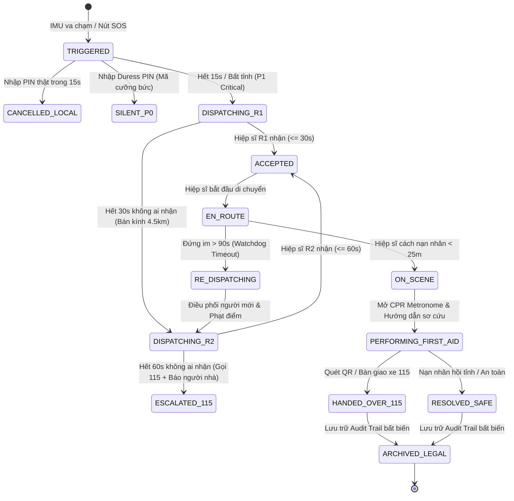

# TÀI LIỆU ĐẶC TẢ NGHIỆP VỤ CỨU HỘ THỰC TẾ TOÀN DIỆN (ZERO BLIND SPOTS)
## HỆ THỐNG AN TOÀN VÀ ĐIỀU PHỐI CỨU NẠN KHẨN CẤP SAFESOLO

> **Phiên bản:** 2.0 - Production Specification  
> **Trạng thái:** Chuẩn hóa Nghiệp vụ Toàn diện (Chống mọi góc chết ngoài đời thực)  
> **Áp dụng cho:** Flutter App (Client Nạn nhân & Hiệp sĩ) | Node.js Backend Engine | Hệ thống Cảnh báo Đa kênh (Omnichannel)  
> **Cơ sở Pháp lý:** Bộ luật Hình sự 2015 (Điều 132), Luật Khám bệnh, chữa bệnh 2023, Bộ luật Dân sự 2015 (Điều 584), Nghị định 13/2023/NĐ-CP về Bảo vệ dữ liệu cá nhân.

---

## MỤC LỤC
1. [TRIẾT LÝ VẬN HÀNH VÀ CÁC THỰC THỂ HỆ THỐNG](#1-triết-lý-vận-hành-và-các-thực-thể-hệ-thống)
2. [MA TRẬN TIẾN TRÌNH CỨU NẠN THEO THỜI GIAN THỰC (TIMELINE T+0s ĐẾN T+300s)](#2-ma-trận-tiến-trình-cứu-nạn-theo-thời-gian-thực)
3. [DANH MỤC 16 KỊCH BẢN THỰC TẾ VÀ GIẢI PHÁP TRIỆT TIÊU GÓC CHẾT](#3-danh-mục-16-kịch-bản-thực-tế-và-giải-pháp-triệt-tiêu-góc-chết)
   - [Nhóm A: Phát hiện sự cố & Xác minh tại chỗ (Nạn nhân)](#nhóm-a-phát-hiện-sự-cố--xác-minh-tại-chỗ)
   - [Nhóm B: Báo động & Phối hợp Gia đình (Guardian)](#nhóm-b-báo-động--phối-hợp-gia-đình)
   - [Nhóm C: Điều phối Tự động không người can thiệp (Auto-Dispatch Engine)](#nhóm-c-điều-phối-tự-động-không-người-can-thiệp)
   - [Nhóm D: Tiếp cận & Sơ cứu Tốc độ cao (Hiệp sĩ / First Responder)](#nhóm-d-tiếp-cận--sơ-cứu-tốc-độ-cao)
   - [Nhóm E: Bàn giao Y tế & Hành lang Pháp lý Bảo vệ](#nhóm-e-bàn-giao-y-tế--hành-lang-pháp-lý-bảo-vệ)
4. [MÁY TRẠNG THÁI CHUẨN (FINITE STATE MACHINE - INCIDENT LIFECYCLE)](#4-máy-trạng-thái-chuẩn)
5. [ĐẶC TẢ MÔ HÌNH DỮ LIỆU & SCHEMA DATABASE](#5-đặc-tả-mô-hình-dữ-liệu--schema-database)
6. [KẾ HOẠCH TRIỂN KHAI CODE CHÍNH XÁC VÀO HỆ THỐNG](#6-kế-hoạch-triển-khai-code-chính-xác-vào-hệ-thống)

---

## 1. TRIẾT LÝ VẬN HÀNH VÀ CÁC THỰC THỂ HỆ THỐNG

### 1.1. Triết lý 3 Không (Zero-Tolerance Principles)
1. **Không chờ con người duyệt (Zero-Human-in-the-Loop):** Việc cứu mạng đo bằng giây. Hệ thống phải tự chấm điểm, tự kích hoạt, tự mở rộng bán kính và tự gọi 115 khi hiệp sĩ không phản hồi.
2. **Không phụ thuộc một kênh truyền thông (Zero Single-Point-of-Failure):** Nếu mất mạng 4G $\to$ chuyển qua SMS SIM. Nếu người nhà ngủ say không đọc Zalo $\to$ Voice Call tự động đổ chuông điện thoại.
3. **Không để Hiệp sĩ chịu rủi ro pháp lý & dàn cảnh (Zero Legal & Physical Risk for Responders):** Hệ thống có cơ chế xác minh chống bẫy cướp giật (Buddy system) và hợp đồng điện tử bảo vệ hiệp sĩ trước pháp luật.

### 1.2. 5 Thực thể Tương tác Trong Hệ thống

| Thực thể | Vai trò cốt lõi | Kênh giao tiếp chính |
| :--- | :--- | :--- |
| **1. Nạn nhân (Victim)** | Người gặp nguy hiểm, phát tín hiệu (chủ động hoặc tự động). Cung cấp GPS & Dữ liệu y tế. | Flutter App (Foreground/Background Service), SMS GSM. |
| **2. Người bảo trợ (Guardian)** | Gia đình, bạn bè ruột thịt. Được đánh thức khẩn cấp, theo dõi trực tiếp, đóng vai trò giám sát hiện trường. | Voice Call AI, SMS Web-Tracking Link, App War-Room. |
| **3. Hệ thống Điều phối (Dispatch Engine)** | Bộ não tự động chạy ngầm trên Server (Node.js Worker). Chấm điểm hiệp sĩ, kiểm tra deadlock, mở rộng bán kính. | Socket.IO, Push Notification (FCM/APNs), Worker Cron. |
| **4. Hiệp sĩ cứu hộ (Hero / Volunteer)** | Tình nguyện viên sơ cấp cứu trong bán kính 1–3km. Tiếp cận hiện trường trong 3–5 phút đầu tiên. | Full-Screen Critical Intent, Turn-by-Turn GPS Map, Audio Guide. |
| **5. Cơ quan Chức năng (115 / Công an)** | Lực lượng chuyên nghiệp tiếp nhận bệnh nhân nguy kịch hoặc xử lý hiện trường tội phạm. | Web Portal điều phối khẩn cấp, Cuộc gọi VoIP/PSTN tự động. |

---

## 2. MA TRẬN TIẾN TRÌNH CỨU NẠN THEO THỜI GIAN THỰC

```
[T+0s]      PHÁT HIỆN SỰ CỐ
            ├── Cảm biến IMU: Va chạm mạnh / Rơi tự do / Bất động
            └── Chủ động: Bấm giữ nút SOS 3 giây / Bấm 5 lần nút nguồn

[T+0~15s]   XÁC MINH CỤC BỘ TẠI MÁY NẠN NHÂN (Chống Báo Động Giả)
            ├── Rung tối đa, chớp đèn Flash LED, còi hụ âm thanh cao
            ├── Giọng nói tiếng Việt đếm ngược: "15... 14... 13..."
            ├── [Nhập PIN Thật]        ──> Hủy báo động (Ghi log Local)
            ├── [Nhập PIN Cưỡng bức]   ──> Kích hoạt ngầm SILENT SOS (P0)
            └── [Hết giờ / Bất tỉnh]   ──> TỰ ĐỘNG BẬT SOS CẤP ĐỘ 1 (P1)

[T+15s]     KÍCH HOẠT HỆ THỐNG ĐIỀU PHỐI TỰ ĐỘNG (Kích hoạt song song 3 luồng)
            ├── LUỒNG 1: GIA ĐÌNH
            │   ├── Tự động gọi điện thoại AI (Voice Call) phá vỡ chế độ im lặng
            │   └── Gửi SMS chứa Link Web Live-Tracking (Mở trình duyệt xem ngay)
            ├── LUỒNG 2: THUẬT TOÁN ĐIỀU PHỐI (Auto-Dispatch Worker)
            │   ├── Khoanh vùng Vòng 1 (Bán kính 1.2 km)
            │   ├── Lọc Hiệp sĩ: Online + Rảnh + Điểm uy tín >= 80 + Có chứng chỉ sơ cứu
            │   └── Bắn PUSH BÁO ĐỘNG ĐỎ (Critical Alert / Full-Screen Intent) tới Top 3
            └── LUỒNG 3: BẢO VỆ HIỆN TRƯỜNG & PHÁP LÝ
                ├── Bật GPS độ chính xác cao (tần số 3 giây/lần)
                ├── Khóa màn hình nạn nhân, hiện thông tin y tế khẩn cấp
                └── Thu âm 60 giây hiện trường làm bằng chứng số chống tranh chấp

[T+15~45s]  HIỆP SĨ TIẾP NHẬN NHIỆM VỤ
            ├── Màn hình Hiệp sĩ rung chuông khẩn cấp (như cuộc gọi đến)
            ├── Hiển thị: Khoảng cách (ví dụ 600m), Tình trạng (Té ngã bất tỉnh)
            ├── [TRƯỢT ĐỂ NHẬN] ──> Khóa Atomic Lock (Ngăn tranh chấp ca)
            └── [TIMEOUT 30s]   ──> Tự dãn bán kính sang Vòng 2 (3.5 km)

[T+45~180s] TIẾP CẬN TỐC ĐỘ CAO (HIỆP SĨ DI CHUYỂN)
            ├── Tự động Deep-link mở Google Maps chế độ dẫn đường Turn-by-Turn
            ├── Tai nghe Hiệp sĩ phát AI Voice: "Nạn nhân nữ, 24 tuổi, nhóm máu O, dị ứng Penicillin"
            ├── Ký số điện tử Good Samaritan Shield (Miễn trừ trách nhiệm theo Luật KCB 2023)
            └── WATCHDOG SERVER: Kiểm tra di chuyển mỗi 15s. Nếu đứng im > 90s ──> Tự re-dispatch

[T+180~300s]TIẾP CẬN HIỆN TRƯỜNG & SƠ CỨU
            ├── Hiệp sĩ tới nơi (cách < 30m) ──> App tự chuyển giao diện Sơ cứu
            ├── Âm thanh gõ nhịp CPR Metronome chuẩn 100-120 bpm hướng dẫn ép tim
            ├── Hướng dẫn sơ cứu tương tác (Cầm máu / Đường thở / Nằm nghiêng an toàn)
            └── Mở kênh bộ đàm nội bộ hoặc video call với Người nhà

[T+300s+]   BÀN GIAO Y TẾ & KẾT THÚC
            ├── Xe cứu thương 115 đến ──> Hiệp sĩ quét QR / Chụp biển số xe bàn giao
            ├── Đóng sự cố ──> Lưu Audit Trail bất biến vào Database
            └── Cộng điểm Trust Score (+20) và Huy hiệu Hiệp sĩ
```

---

## 3. DANH MỤC 16 KỊCH BẢN THỰC TẾ VÀ GIẢI PHÁP TRIỆT TIÊU GÓC CHẾT

### Nhóm A: Phát hiện sự cố & Xác minh tại chỗ (Nạn nhân)

#### Kịch bản 1: Tai nạn va chạm giao thông / Té ngã bất tỉnh
* **Thực tế:** Nạn nhân ngã đập đầu, chấn thương sọ não hoặc ngất xỉu, điện thoại văng ra xa 2 mét.
* **Xử lý:**
  1. Cảm biến gia tốc kế (Accelerometer) và con quay hồi chuyển (Gyroscope) phát hiện gia tốc va chạm $> 25\text{ m/s}^2$ kèm trạng thái bất động hoàn toàn $> 10$ giây.
  2. Bật đếm ngược 15 giây. Khi hết thời gian mà không có ai chạm vào màn hình $\to$ Hệ thống **tự động xác lập sự cố P1 (Nguy kịch)** và kích hoạt cứu nạn ngay.

#### Kịch bản 2: Báo động giả (Rơi điện thoại, vung tay, thể thao mạnh)
* **Thực tế:** Người dùng làm rơi điện thoại xuống sàn hoặc chơi thể thao, máy tưởng nhầm bị ngã.
* **Xử lý:**
  1. Trong 15 giây đếm ngược, máy rung giật cực mạnh và phát còi hú to.
  2. Người dùng chỉ cần nhặt máy lên bấm nút **"Tôi an toàn"** và nhập mã PIN cá nhân để hủy.
  3. Log được ghi nhận là `CANCELLED_FALSE_ALARM`, hệ thống không dispatch ra ngoài mạng lưới.

#### Kịch bản 3: Nạn nhân bị khống chế / cướp giật ép tắt SOS (Duress PIN)
* **Thực tế:** Kẻ xấu cướp bóc hoặc bắt cóc, thấy máy nạn nhân kêu to liền đe dọa vũ lực, bắt nạn nhân mở khóa hoặc tắt báo động.
* **Xử lý:**
  1. Nạn nhân nhập **Mã PIN Cưỡng Bức (Duress PIN)** đã cài đặt sẵn (ví dụ PIN thật là `1234`, PIN cưỡng bức là `9999`).
  2. App lập tức tắt còi hú, hiện màn hình xanh báo: *"Đã xác nhận an toàn"*, đánh lừa kẻ xấu.
  3. Thực tế dưới nền: App âm thầm kích hoạt **Silent SOS (P0)**, tắt toàn bộ đèn màn hình, gửi tọa độ trực tiếp cho Công an và gia đình, bật micro ghi âm ngầm liên tục 5 phút.

#### Kịch bản 4: Mất kết nối Internet (Không có 4G/Wifi dưới hầm, đèo dốc)
* **Thực tế:** Tai nạn xảy ra dưới tầng hầm chung cư hoặc vùng mất sóng di động data 4G, gói tin HTTP/Socket không gửi được.
* **Xử lý:**
  1. SDK kiểm tra kết nối mạng, nếu request timeout quá 4 giây:
  2. Tự động chuyển đổi sang dịch vụ gửi tin nhắn **SMS GSM truyền thống** (sử dụng quyền SMS Native):
     * Cú pháp nén mã hóa: `SOS#LAT:10.7626#LNG:106.6601#BAT:85#TIME:1712499120`
     * Gửi đồng loạt tới: Tổng đài tiếp nhận SafeSolo và 3 số điện thoại người bảo trợ.
     * Server SafeSolo có SMS Gateway tự động giải mã và tạo Incident như bình thường.

#### Kịch bản 5: Hết pin hoặc điện thoại bị đập nát sập nguồn (Dead Man's Switch)
* **Thực tế:** Cú va chạm làm vỡ nát điện thoại hoặc máy tắt nguồn ngay lập tức, không kịp gửi tin SOS.
* **Xử lý:**
  1. Khi người dùng bật chế độ "Di chuyển nguy hiểm" (Stealth Tracking), app gửi heartbeat tọa độ mỗi 60 giây lên server (Last Known Location).
  2. Nếu sau **3 chu kỳ (180 giây)** server không nhận được heartbeat mà trước đó vận tốc di chuyển $> 30\text{ km/h}$ rồi đột ngột dừng hẳn:
  3. Server tự động kích hoạt tiến trình **"Mất tín hiệu đột ngột"**, gửi cảnh báo kèm tọa độ cuối cùng tới người bảo trợ để liên lạc xác minh.

#### Kịch bản 6: Nạn nhân di chuyển liên tục (Bị trôi sông, đang trên xe bị đưa đi)
* **Thực tế:** Nạn nhân không đứng yên mà tọa độ thay đổi liên tục.
* **Xử lý:**
  1. GPS máy nạn nhân duy trì tần số cập nhật cao (High-Frequency Tracking: 3 giây/lần).
  2. Socket server stream tọa độ mới liên tục vào room của Hiệp sĩ.
  3. Màn hình bản đồ của Hiệp sĩ tự động vẽ lại lộ trình (Dynamic Re-routing) theo thời gian thực mà không bắt Hiệp sĩ thao tác lại.

---

### Nhóm B: Báo động & Phối hợp Gia đình (Guardian)

#### Kịch bản 7: Gia đình ngủ say, điện thoại để chế độ Không làm phiền (DND)
* **Thực tế:** Tai nạn xảy ra lúc 1 giờ sáng. Người nhà bật Do Not Disturb, tin nhắn Zalo, SMS hay Messenger hoàn toàn không phát chuông.
* **Xử lý:**
  1. **Hệ thống Voice Call tự động (AI Emergency Call):** Sử dụng Cloud Voice Gateway (Stringee / Twilio / FPT AI) gọi trực tiếp vào SIM số điện thoại của người nhà.
  2. Cuộc gọi thoại di động tiêu chuẩn có thể phá vỡ chế độ im lặng của hệ điều hành.
  3. Giọng đọc AI: *"SafeSolo cảnh báo: Người thân [Tên] đang gặp tai nạn khẩn cấp tại đường [X]. Vui lòng bấm phím 1 để nghe vị trí hoặc mở tin nhắn để xem bản đồ cứu trợ trực tiếp."*

#### Kịch bản 8: Người thân số 1 không nghe máy
* **Thực tế:** Người giám hộ chính để quên máy ở phòng khách, máy bận hoặc hết pin.
* **Xử lý (Bậc thang cảnh báo tuần tự - Tiered Escalation):**
  1. Hệ thống gọi người thân 1. Nếu sau 20 giây không bắt máy:
  2. Lập tức chuyển sang gọi Người thân số 2 và Người thân số 3 song song.
  3. Không để tiến trình cứu hộ bị gián đoạn vì một người vắng mặt.

#### Kịch bản 9: Người thân không cài đặt ứng dụng SafeSolo
* **Thực tế:** Ba mẹ, ông bà lớn tuổi không biết tải app SafeSolo hoặc dùng máy khác hệ điều hành.
* **Xử lý (Zero-Install Web Tracking Link):**
  1. SMS tự động gửi link dạng: `https://safesolo.vn/track/sos_9a8b7c6d`.
  2. Bấm vào link là mở ngay trình duyệt Web (Chrome, Safari) mà không yêu cầu đăng nhập.
  3. Trang web hiển thị: Bản đồ vị trí nạn nhân, lộ trình di chuyển của Hiệp sĩ đang đến, biển số xe và nút bấm gọi nhanh cho Hiệp sĩ.

#### Kịch bản 10: Người thân hoảng loạn gọi liên tục vào máy nạn nhân làm nghẽn máy
* **Thực tế:** Người thân lo lắng gọi dồn dập vào điện thoại nạn nhân, làm điện thoại tụt pin nhanh, mất sóng mạng data, hoặc chuông reo gây nguy hiểm nếu nạn nhân đang trốn kẻ cướp.
* **Xử lý:**
  1. Khi ở chế độ SOS, app SafeSolo tự động điều hướng cuộc gọi đến (Call Interception) hoặc hiển thị tin nhắn tự động: *"Nạn nhân đang bất tỉnh/được cứu hộ. Mọi thông tin đang cập nhật tại Phòng tác chiến SafeSolo."*
  2. Trên App của người thân mở màn hình **"Emergency War-Room"**: Cung cấp kênh bộ đàm nội bộ (Walkie-talkie) hoặc kênh chat trực tiếp với Hiệp sĩ đang cứu trợ.

---

### Nhóm C: Điều phối Tự động không người can thiệp (Auto-Dispatch Engine)

#### Kịch bản 11: Chống tranh chấp nhiệm vụ (Race Condition giữa các Hiệp sĩ)
* **Thực tế:** Phát thông báo cho 5 hiệp sĩ trong khu vực. Cùng lúc 2 hiệp sĩ bấm [Nhận ca] tại cùng mili-giây.
* **Xử lý (MongoDB Atomic Lock Pattern):**
  1. Backend xử lý nhận ca bằng truy vấn nguyên tử:
     ```javascript
     const incident = await RescueIncident.findOneAndUpdate(
       { _id: incidentId, status: { $in: ['DISPATCHING_R1', 'DISPATCHING_R2'] } },
       { 
         $set: { 
           status: 'ACCEPTED', 
           assignedVolunteerId: volunteerId,
           acceptedAt: new Date()
         } 
       },
       { new: true }
     );
     ```
  2. Hiệp sĩ nhanh hơn 1 mili-giây sẽ giành được quyền cứu hộ.
  3. Hiệp sĩ bấm sau sẽ nhận thông báo hòa nhã: *"Cảm ơn bạn! Ca cứu trợ này đã được Hiệp sĩ [Tên] ở cách 300m tiếp nhận. Hệ thống ghi nhận tinh thần của bạn (+5 điểm sẵn sàng)."*

#### Kịch bản 12: Hiệp sĩ bấm nhận xong... đứng im, xe hỏng, hoặc bỏ rơi nhiệm vụ
* **Thực tế:** Hiệp sĩ bấm nhận theo quán tính nhưng sau đó bận việc, thủng lốp xe, hoặc sợ hãi không đến. Nạn nhân bị treo trạng thái chờ chết.
* **Xử lý (Deadlock Detection Watchdog):**
  1. Dispatch Worker trên Server chạy mỗi 15 giây, kiểm tra độ biến thiên khoảng cách giữa Hiệp sĩ và Nạn nhân.
  2. Nếu sau **90 giây** kể từ lúc bấm nhận mà khoảng cách không giảm (vận tốc $< 5\text{ km/h}$):
     * Server phát thông báo rung cảnh báo Hiệp sĩ: *"Bạn có đang di chuyển không? Xác nhận trong 15s"*.
     * Nếu không phản hồi: Tự động hủy quyền của Hiệp sĩ đó, đánh dấu `ABANDONED_TIMEOUT`, trừ 25 điểm Trust Score.
     * Tự động tái điều phối (Re-dispatch) sự cố cho các hiệp sĩ khác trong Vòng 2.

#### Kịch bản 13: "Vùng trắng" không có hiệp sĩ (Đêm khuya, khu vực hẻo lánh)
* **Thực tế:** Tai nạn lúc 3 giờ sáng ở ngoại thành, bán kính 2km không có hiệp sĩ nào online.
* **Xử lý (Chiến thuật dãn vòng & Chuyển cấp 115):**
  * **Vòng 1 (0 – 30s):** Bán kính 1.2 km. Nếu không ai nhận $\to$
  * **Vòng 2 (30s – 60s):** Tự động dãn bán kính lên **4.5 km**, phát thông báo cho toàn bộ hiệp sĩ có phương tiện xe máy.
  * **Vòng 3 (Sau 60s):** Nếu vẫn không có hiệp sĩ nhận:
    * Chuyển trạng thái `ESCALATED_115`.
    * Hệ thống tự động kích hoạt API gọi khẩn cấp tới đầu số Cấp cứu 115 / Công an khu vực, truyền tọa độ và mã định danh sự cố.
    * Đẩy thông báo khẩn tới toàn bộ Người bảo trợ: *"Khu vực không có hiệp sĩ, hệ thống đã kết nối 115. Đề nghị người nhà chủ động gọi cứu thương!"*

---

### Nhóm D: Tiếp cận & Sơ cứu Tốc độ cao (Hiệp sĩ / First Responder)

#### Kịch bản 14: Đánh thức Hiệp sĩ ngay cả khi điện thoại tắt chuông, bỏ túi
* **Thực tế:** Hiệp sĩ đang ngủ hoặc đang chạy xe ngoài đường, điện thoại để trong túi quần ở chế độ Rung/Im lặng.
* **Xử lý:**
  1. Sử dụng **Android Full-Screen Intent** kết hợp kênh thông báo `NotificationChannel` có độ ưu tiên tối cao (`IMPORTANCE_HIGH`), bypass chế độ Do Not Disturb.
  2. Điện thoại tự động sáng màn hình, bật còi hụ khẩn cấp với âm lượng tối đa 100%.
  3. Giao diện cuộc gọi khẩn cấp che toàn màn hình: Hiệp sĩ chỉ cần 1 thao tác vuốt trượt để nhận nhiệm vụ.

#### Kịch bản 15: Chống bẫy dàn cảnh cướp giật (Anti-Ambush & Buddy Dispatch)
* **Thực tế:** Kẻ xấu tạo tài khoản giả mạo, giả vờ bấm SOS ở bãi đất trống hoang vắng lúc nửa đêm để dụ Hiệp sĩ đến nhằm cướp tài sản.
* **Xử lý:**
  1. **Xác thực danh tính nạn nhân:** Chỉ những tài khoản đã xác thực số điện thoại và căn cước (eKYC) mới được kích hoạt mạng lưới Hiệp sĩ. Tài khoản khách chưa xác thực chỉ được kích hoạt gửi tin người nhà.
  2. **Hệ thống Hiệp sĩ Cặp đôi (Buddy System):** Nếu vị trí sự cố nằm trong "Khu vực vắng vẻ / Điểm đen an ninh" vào khung giờ từ **23h đến 5h sáng**:
     * Hệ thống bắt buộc phải có **tối thiểu 2 Hiệp sĩ cùng chấp nhận** nhiệm vụ thì mới mở tọa độ chính xác.
     * Điều hướng 2 hiệp sĩ gặp nhau tại một điểm an toàn cách hiện trường 200m trước khi cùng tiến vào hỗ trợ.

#### Kịch bản 16: Không tìm thấy nạn nhân khi đến nơi (Hẻm sâu, nhà cao tầng, trời tối)
* **Thực tế:** GPS chỉ chính xác trong bán kính 10m. Đến nơi là con hẻm tối hoặc khu chung cư nhiều tầng, Hiệp sĩ không biết nạn nhân ở đâu.
* **Xử lý:**
  1. Khi khoảng cách của Hiệp sĩ $< 25\text{ mét}$:
  2. Trên app của Hiệp sĩ xuất hiện nút **"Kích hoạt còi tìm kiếm tầm gần"**.
  3. Bấm nút: Điện thoại nạn nhân lập tức chớp đèn flash liên tục và hú còi âm lượng cao nhất để Hiệp sĩ định vị bằng thính giác và thị giác.
  4. Hiển thị thông tin ghi chú địa chỉ chi tiết (nếu nạn nhân có nhập lúc tạo tài khoản: số phòng, số tầng).

---

### Nhóm E: Bàn giao Y tế & Hành lang Pháp lý Bảo vệ

#### Kịch bản 17: Hướng dẫn sơ cứu tại chỗ cho Hiệp sĩ chưa có nhiều kinh nghiệm
* **Thực tế:** Nạn nhân ngưng tim ngưng thở. Hiệp sĩ lúng túng không nhớ tỷ lệ ép tim và thổi ngạt.
* **Xử lý:**
  1. Màn hình sơ cứu chuyển sang chế độ **"Trợ lý CPR khẩn cấp"**:
  2. Phát âm thanh đếm nhịp (Metronome) chuẩn quốc tế: **100 – 120 nhịp/phút**.
  3. Hướng dẫn bằng giọng nói: *"Ép tim 30 lần... 1, 2, 3... Thổi ngạt 2 lần"*.
  4. Hình ảnh đồ họa 3D/Vector hướng dẫn đặt tay đúng vị trí xương ức.

#### Kịch bản 18: Nạn nhân tử vong trước khi đến hoặc khi đang ép tim (Bảo vệ pháp lý Hiệp sĩ)
* **Thực tế:** Hiệp sĩ nỗ lực cứu nhưng chấn thương quá nặng khiến nạn nhân không qua khỏi. Gia đình nạn nhân bức xúc đổ lỗi, đe dọa hành hung hoặc khởi kiện ra tòa đòi bồi thường.
* **Hành lang công nghệ & Pháp lý bảo vệ Hiệp sĩ:**
  1. **Bằng chứng số bất biến (Digital Black Box):**
     * Hệ thống trích xuất gói dữ liệu Audit Trail có gắn chữ ký số thời gian (Timestamp):
       - Vị trí ban đầu của Hiệp sĩ cách hiện trường 1.5km (chứng minh Hiệp sĩ không gây tai nạn).
       - Thời gian nhận ca và thời gian di chuyển (chứng minh hành vi cứu hộ thiện chí).
       - Bản ghi âm 60s hiện trường (chứng minh tình trạng nguy kịch từ trước khi can thiệp).
  2. **Cơ sở pháp lý Việt Nam:**
     * **Điều 132 Bộ luật Hình sự 2015:** Hiệp sĩ đang thực hiện nghĩa vụ cứu giúp người trong tình trạng nguy hiểm đến tính mạng.
     * **Luật Khám bệnh, chữa bệnh 2023:** Người tham gia sơ cứu ban đầu trong tình huống khẩn cấp tại cộng đồng được miễn trừ trách nhiệm nghề nghiệp khi thực hiện đúng khả năng sơ cứu ban đầu.
     * **Điều 584 Bộ luật Dân sự 2015:** Miễn trừ trách nhiệm bồi thường thiệt hại trong tình thế cấp thiết.
  3. **Hợp đồng điện tử Pre-Consent:** Khi tạo tài khoản SafeSolo, mọi người dùng đều ký cam kết: *"Tự nguyện tiếp nhận sơ cứu và miễn trừ khiếu nại dân sự đối với tình nguyện viên cứu nạn không vụ lợi"*.

#### Kịch bản 19: Bàn giao chuyên môn cho Đội ngũ Cấp cứu 115
* **Thực tế:** Xe cứu thương 115 đến hiện trường. Bác sĩ cần nắm thông tin nhanh nhất để cấp cứu.
* **Xử lý:**
  1. Hiệp sĩ bấm nút **"Bàn giao y tế"** trên ứng dụng.
  2. Màn hình hiển thị mã QR tóm tắt bệnh án khẩn cấp: Nhóm máu, tiền sử bệnh, thời gian ngưng thở, các thao tác sơ cứu đã làm (đã ép tim bao nhiêu phút, đã garo cầm máu vị trí nào).
  3. Bác sĩ 115 quét mã hoặc Hiệp sĩ chụp biển số xe 115 để hoàn tất biên bản số hóa $\to$ Đóng sự cố thành công.

---

## 4. MÁY TRẠNG THÁI CHUẨN (FINITE STATE MACHINE - INCIDENT LIFECYCLE)



---

## 5. ĐẶC TẢ MÔ HÌNH DỮ LIỆU & SCHEMA DATABASE

Để đáp ứng đầy đủ nghiệp vụ không góc chết, hai Model trung tâm là `RescueIncident` và `VolunteerResponse` phải được nâng cấp toàn diện:

### 5.1. Model `RescueIncident` (`backend/src/models/RescueIncident.js`)
```javascript
const mongoose = require('mongoose');

const rescueIncidentSchema = new mongoose.Schema({
  // Nạn nhân
  victimId: { type: mongoose.Schema.Types.ObjectId, ref: 'User', required: true, index: true },
  
  // Tọa độ địa lý (GeoJSON 2dsphere)
  location: {
    type: { type: String, enum: ['Point'], default: 'Point' },
    coordinates: { type: [Number], required: true } // [longitude, latitude]
  },
  addressText: { type: String, default: '' },
  
  // Mức độ ưu tiên
  severity: { 
    type: String, 
    enum: ['P0_SILENT', 'P1_CRITICAL', 'P2_URGENT', 'P3_ASSIST'], 
    default: 'P1_CRITICAL' 
  },
  
  // Vòng đời sự cố
  status: {
    type: String,
    enum: [
      'TRIGGERED',          // Vừa phát hiện, đang đếm ngược 15s
      'DISPATCHING_R1',     // Đang quét hiệp sĩ Vòng 1 (1.2 km)
      'DISPATCHING_R2',     // Đang quét hiệp sĩ Vòng 2 (4.5 km)
      'ACCEPTED',           // Đã có hiệp sĩ bấm nhận (Atomic lock)
      'EN_ROUTE',           // Hiệp sĩ đang phóng xe tới
      'ON_SCENE',           // Hiệp sĩ đã có mặt hiện trường (< 25m)
      'HANDED_OVER_115',    // Đã bàn giao bác sĩ/công an
      'RESOLVED_SAFE',      // Nạn nhân an toàn, hoàn tất
      'ESCALATED_115',      // Không có hiệp sĩ, chuyển giao 115
      'CANCELLED_FALSE_ALARM' // Hủy do bấm nhầm
    ],
    default: 'DISPATCHING_R1',
    index: true
  },
  
  // Hiệp sĩ chính tiếp nhận
  assignedVolunteerId: { type: mongoose.Schema.Types.ObjectId, ref: 'User', default: null },
  backupVolunteerIds: [{ type: mongoose.Schema.Types.ObjectId, ref: 'User' }], // Buddy system
  
  // Dữ liệu y tế đóng băng tại thời điểm bị nạn (Medical Snapshot)
  medicalSnapshot: {
    bloodType: { type: String, default: 'UNKNOWN' },
    allergies: [String],
    chronicConditions: [String],
    emergencyNotes: String
  },
  
  // Giám sát hành trình di chuyển (Watchdog Telemetry)
  telemetry: {
    lastVictimUpdateAt: Date,
    lastHeroMovementAt: Date,
    heroSpeedKmh: Number,
    distanceRemainingMeters: Number
  },
  
  // Bằng chứng số & Hành lang pháp lý (Legal Audit Trail)
  auditTrail: [{
    action: String,          // 'SOS_TRIGGERED', 'DISPATCH_SENT', 'HERO_ACCEPTED', 'ARRIVED', etc.
    actorId: mongoose.Schema.Types.ObjectId,
    timestamp: { type: Date, default: Date.now },
    metadata: mongoose.Schema.Types.Mixed
  }],
  
  // Biên bản bàn giao 115
  handoffRecord: {
    ambulancePlate: String,
    paramedicName: String,
    handedOverAt: Date,
    qrVerificationHash: String
  },
  
  createdAt: { type: Date, default: Date.now, index: true },
  resolvedAt: Date
});

rescueIncidentSchema.index({ location: '2dsphere' });
module.exports = mongoose.model('RescueIncident', rescueIncidentSchema);
```

### 5.2. Model `VolunteerResponse` (`backend/src/models/VolunteerResponse.js`)
```javascript
const mongoose = require('mongoose');

const volunteerResponseSchema = new mongoose.Schema({
  incidentId: { type: mongoose.Schema.Types.ObjectId, ref: 'RescueIncident', required: true, index: true },
  volunteerId: { type: mongoose.Schema.Types.ObjectId, ref: 'User', required: true, index: true },
  
  status: {
    type: String,
    enum: [
      'ALERTED',            // Đã nhận được push báo động đỏ
      'ACCEPTED',           // Bấm nhận ca
      'REJECTED',           // Bấm từ chối
      'TIMEOUT',            // Hết 30s không phản hồi
      'EN_ROUTE',           // Đang di chuyển
      'ARRIVED',            // Đã đến nơi
      'ABANDONED_TIMEOUT',  // Bị hệ thống phạt và thu hồi vì đứng im > 90s
      'COMPLETED'           // Hoàn thành nhiệm vụ
    ],
    default: 'ALERTED'
  },
  
  // Bảo vệ pháp lý Good Samaritan
  goodSamaritanAgreementSigned: { type: Boolean, default: true },
  signedAt: { type: Date, default: Date.now },
  
  // Ghi nhận sơ cấp cứu thực hiện
  firstAidActionsPerformed: [{
    actionType: { type: String, enum: ['CPR', 'TOURNIQUET_HEMOSTASIS', 'AIRWAY_RECOVERY', 'RECOVERY_POSITION'] },
    startedAt: Date,
    durationSeconds: Number
  }],
  
  etaSeconds: Number,
  distanceMeters: Number,
  createdAt: { type: Date, default: Date.now }
});

module.exports = mongoose.model('VolunteerResponse', volunteerResponseSchema);
```

---

## 6. KẾ HOẠCH TRIỂN KHAI CODE CHÍNH XÁC VÀO HỆ THỐNG

### Thứ tự thực hiện (4 Giai đoạn):

1. **Giai đoạn 1: Nâng cấp Schemas (Backend Models)**
   * Cập nhật `RescueIncident.js` với đầy đủ trạng thái `DISPATCHING_R1`, `DISPATCHING_R2`, `ESCALATED_115`, `medicalSnapshot`, `auditTrail`, `handoffRecord`.
   * Cập nhật `VolunteerResponse.js` với `ABANDONED_TIMEOUT`, `firstAidActionsPerformed`.

2. **Giai đoạn 2: Tái cấu trúc Radar Service (Backend Dispatch Core)**
   * Sửa `backend/src/services/radarService.js`:
     * Lọc danh sách hiệp sĩ: Bắt buộc `isOnline === true` VÀ không có bản ghi `VolunteerResponse` ở trạng thái `EN_ROUTE` (chống phân bổ người đang bận).
     * Áp dụng **Atomic Lock** trong `acceptRescueIncident` bằng `findOneAndUpdate`.
     * Emit sự kiện Socket trực tiếp theo cá nhân (`HERO_DISPATCH_REQUEST`) thay vì phát tán room chung vô danh.

3. **Giai đoạn 3: Viết Worker Tự Động Hóa (Autonomous Dispatch Worker)**
   * Tạo mới `backend/src/workers/dispatchWorker.js`:
     * Chạy chu kỳ 15 giây/lần.
     * Quét các ca `DISPATCHING_R1` quá 30s $\to$ tự dãn sang `DISPATCHING_R2` (bán kính 4.5km).
     * Quét các ca `DISPATCHING_R2` quá 60s $\to$ tự kích hoạt `ESCALATED_115`.
     * Quét các ca `EN_ROUTE` mà Hiệp sĩ đứng im quá 90s $\to$ chuyển `ABANDONED_TIMEOUT` và tự re-dispatch.

4. **Giai đoạn 4: Sửa Client Flutter (Nạn nhân & Hiệp sĩ UI/Provider)**
   * Sửa `lib/views/emergency/false_alarm_verification_dialog.dart`:
     * Xóa sạch hàm giả lập `simulateEmergencyStatus()`.
     * Gọi API thực `POST /api/v1/sos/escalate-p1` khi đếm ngược về 0.
     * Thêm trường nhập **Duress PIN** kích hoạt Silent SOS P0.
   * Cập nhật `lib/core/providers/app_provider.dart` để đồng bộ state machine chuẩn.

---
*(Tài liệu này là căn cứ kỹ thuật và nghiệp vụ bất biến cho mọi chỉnh sửa code tiếp theo)*
