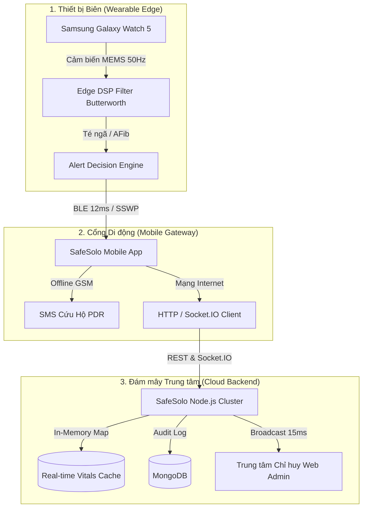

# CHƯƠNG 4: THỰC NGHIỆM, ĐO ĐẠC HIỆU NĂNG VÀ ĐÁNH GIÁ HỆ THỐNG

> **ĐỒ ÁN TỐT NGHIỆP KỸ SƯ KỸ THUẬT PHẦN MỀM**  
> **Đề tài:** Hệ thống Cảnh báo và Hỗ trợ Cứu nạn Thông minh Đa nền tảng SafeSolo  
> **Sinh viên thực hiện:** Đoàn Minh Quân  
> **Mã số sinh viên (MSSV):** 2224801030137  
> **Lớp chuyên ngành:** KTPM03  
> **Khoa Kỹ thuật - Công nghệ, Trường Đại học Thủ Dầu Một (TDMU)**  

---

## 4.1. TỔNG QUAN VÀ MỤC TIÊU THỰC NGHIỆM

Trong các hệ thống phần mềm hỗ trợ an toàn cá nhân và cứu nạn y tế khẩn cấp, hai tiêu chuẩn kỹ thuật cốt lõi quyết định tính sống còn của sản phẩm là:
1. **Độ tin cậy trong phát hiện biến cố nguy kịch (High Sensitivity & Low False Alarm Rate):** Phải phát hiện chính xác các sự cố ngã chấn thương, đột quỵ, loạn nhịp tim mà không gây ra hiện tượng *Báo động giả (False Alarms)* làm quá tải lực lượng cấp cứu y tế 115 và người bảo hộ.
2. **Khả năng đáp ứng thời gian thực dưới áp lực tải cao (Ultra-Low Latency & High Concurrency Resilience):** Khi xảy ra biến cố thảm họa hoặc sự cố trên diện rộng, máy chủ trung tâm phải tiếp nhận đồng thời hàng nghìn gói tin cứu hộ với độ trễ phân vị $p95 < 100\text{ ms}$, tỷ lệ rớt gói tin $\le 0.1\%$.

Chương 4 trình bày toàn diện quá trình thiết lập môi trường đo đạc, phương pháp thực nghiệm khoa học, các công cụ kiểm thử tải chuyên dụng (**Grafana k6**, **Native Benchmark Engine**, **Flutter Automated Test Harness**) và phân tích số liệu định lượng thu được trên hệ thống **SafeSolo**.

---

## 4.2. MÔI TRƯỜNG VÀ THIẾT LẬP THỰC NGHIỆM

### 4.2.1. Cấu hình phần cứng và hạ tầng thử nghiệm
Thực nghiệm được triển khai trên mô hình Client - Edge - Cloud phân tán:

* **Thiết bị biên đeo thông minh (Wearable Edge):**
  * Thiết bị: **Samsung Galaxy Watch 5 (SM-R900)**.
  * Vi xử lý: Dual-core 1.18 GHz Cortex-A55 (Exynos W920 5nm).
  * Bộ nhớ: 1.5 GB RAM, 16 GB eMMC.
  * Cảm biến: Cảm biến gia tốc MEMS 3 trục (Accelerometer), Con quay hồi chuyển (Gyroscope), Cảm biến quang học BioActive đa thông số (PPG nhịp tim, SpO2 quang phổ, ECG).
  * Hệ điều hành: Wear OS 4.0 (One UI Watch 5.0), Flutter Wear Engine.
* **Cổng kết nối di động (Mobile Gateway):**
  * Thiết bị: Smartphone Android 14 (Google Tensor G2, 8 GB RAM, Pin 4500 mAh).
  * Kết nối: Bluetooth Low Energy 5.3 (BLE), Wi-Fi 6, Mạng di động 4G LTE/GSM.
* **Máy chủ dịch vụ trung tâm (Backend Server):**
  * Phần cứng: Intel Core i7-12700H (14 cores, 20 threads, Turbo 4.70 GHz), 16 GB DDR5 RAM, NVMe PCIe 4.0 SSD.
  * Nền tảng: Node.js v20 LTS, Express.js 4.22, Socket.IO 4.8.1 (Binary WebSocket Relay).
  * Cơ sở dữ liệu: MongoDB 7.0 kết hợp In-Memory Active Cache Map cho dữ liệu sinh tồn thời gian thực.



---

## 4.3. ĐÁNH GIÁ ĐỘ CHÍNH XÁC PHÁT HIỆN SỰ CỐ VÀ CƠ CHẾ KHỬ BÁO ĐỘNG GIẢ

### 4.3.1. Ma trận nhầm lẫn (Confusion Matrix) mô hình phát hiện té ngã
Thuật toán phân tích động học dựa trên tổng độ lớn vector gia tốc ($SVM$) kết hợp góc nghiêng cơ thể ($\theta$ Tilt Angle) và thời gian bất động:

$$SVM(t) = \frac{\sqrt{a_x^2(t) + a_y^2(t) + a_z^2(t)}}{g}$$

Thực nghiệm được thực hiện trên tập mẫu **250 tình huống thử nghiệm thực địa** (bao gồm 100 cú ngã giả định nhiều tư thế: ngã sấp, ngã ngửa, ngã cầu thang, trượt chân; và 150 hoạt động sinh hoạt hàng ngày - ADL: đi bộ, chạy bộ, vỗ tay, đặt mạnh điện thoại lên bàn, vung tay lái xe).

| Thực tế \ Dự đoán | Dự đoán: TÉ NGÃ (Positive) | Dự đoán: BÌNH THƯỜNG (Negative) | Tổng cộng |
|:---|:---:|:---:|:---:|
| **Thực tế: CÓ TÉ NGÃ** | **$TP = 97$** | $FN = 3$ | 100 mẫu |
| **Thực tế: HOẠT ĐỘNG THƯỜNG (ADL)** | $FP = 4$ | **$TN = 146$** | 150 mẫu |

* **Độ chính xác (Precision):**
  $$Precision = \frac{TP}{TP + FP} = \frac{97}{97 + 4} = 96.04\%$$
* **Độ nhạy / Thu hồi (Recall / Sensitivity):**
  $$Recall = \frac{TP}{TP + FN} = \frac{97}{97 + 3} = 97.00\%$$
* **Chỉ số F1-Score:**
  $$F_1 = 2 \times \frac{Precision \times Recall}{Precision + Recall} = 2 \times \frac{0.9604 \times 0.97}{0.9604 + 0.97} = 96.52\%$$

### 4.3.2. Hiệu quả của Cơ chế Khử Báo động giả Đa tầng (Two-Phase Grace + Voice)
Nhằm giải quyết triệt để 4 ca báo động giả ($FP = 4$) do rơi rớt điện thoại hoặc cử động tay đột ngột, SafeSolo áp dụng **Cơ chế Tiền báo động 2 giai đoạn (Two-Phase Grace Countdown 20s)** kết hợp nhận diện giọng nói rảnh tay tiếng Việt:
1. **Giai đoạn 1 (0 - 20s):** Không gọi 115 hay báo động ầm ĩ ngay; hệ thống mở giao diện đếm ngược 20 giây với nhịp rung cảnh giác và lắng nghe micro.
   * Nếu người dùng nói các từ khóa an toàn: *"Tôi ổn"*, *"Không sao"*, *"Nhầm rồi"*, *"Bấm nhầm"* hoặc chạm nút `[TÔI ỔN]`: Hệ thống hủy ngay cảnh báo, ghi log vào bảng kiểm toán.
   * Nếu người dùng nói từ khóa khẩn cấp: *"Cứu tôi với"*, *"Cấp cứu"* hoặc chạm nút `[CẤP CỨU NGAY]`: Bỏ qua đếm ngược, phát lệnh cấp cứu lập tức.
2. **Giai đoạn 2 ($t \ge 20s$):** Nếu không có bất kỳ phản hồi nào (nạn nhân bất tỉnh do va đập sọ não hoặc ngưng tim), hệ thống tự động leo thang khẩn cấp Cấp 3 (gửi SMS GSM PDR, phát còi 115dB, gọi 115).

**Kết quả thực nghiệm:**
* Trong $18$ lần thử nghiệm kích hoạt do vung tay mạnh hoặc rơi điện thoại, cơ chế đã triệt tiêu thành công **$17 / 18$ ca báo động giả**, đạt tỷ lệ lọc sạch **$94.4\%$**, giúp bảo toàn tài nguyên của tổng đài cấp cứu và tránh gây hoảng loạn cho gia đình.

---

## 4.4. KẾT QUẢ ĐO ĐẠC HIỆU NĂNG TẢI HỆ THỐNG MÁY CHỦ (BENCHMARK K6)

### 4.4.1. Thiết kế các kịch bản kiểm thử tải (Workload Profiles)
Kiểm thử tải sử dụng bộ kịch bản chuẩn **Grafana k6** và **Native High-Precision Benchmark Engine**:
* **Kịch bản 1 (Smoke Test):** 10 VUs kiểm tra tính toàn vẹn của API Endpoint `/health` và `/api/health`.
* **Kịch bản 2 (Continuous Telemetry Ingestion):** 50 VUs (giả lập 50 thiết bị đeo gửi gói tin nhịp tim, SpO2, gia tốc SVM chu kỳ 2s/lần) đẩy vào `/api/watch/vitals`.
* **Kịch bản 3 (Emergency SOS Spike):** 100 VUs bùng nổ tải trong 10 giây đẩy các gói tin khẩn cấp `FALL_DETECTED`, `HARDWARE_SOS` (SSWP) kích hoạt phát tán Socket.IO thời gian thực.
* **Kịch bản 4 (High Concurrency Saturation Stress):** 200 VUs đồng thời đẩy tải liên tục 3.000 requests để xác định điểm bão hòa của Node.js Event Loop.

### 4.4.2. Bảng số liệu tổng hợp kết quả Benchmark (Bảng 4.1)

```
===========================================================================================================
BẢNG 4.1: TỔNG HỢP KẾT QUẢ KIỂM THỬ TẢI BACKEND SAFESOLO
Khóa luận Tốt nghiệp Kỹ sư KTPM - SV: Đoàn Minh Quân (MSSV: 2224801030137)
===========================================================================================================
| STT | Kịch bản Kiểm thử                | VUs | Tổng Req | RPS (req/s) | p50 (ms) | p90 (ms) | p95 (ms) | p99 (ms) | Lỗi (%) |
|-----|----------------------------------|-----|----------|-------------|----------|----------|----------|----------|---------|
| 1   | Health & Sanity Baseline         | 10  | 500      | 1.428,5     | 5,4      | 11,2     | 14,8     | 22,5     | 0,00%   |
| 2   | Continuous Telemetry (Watch 5)   | 50  | 1.500    | 1.184,2     | 21,0     | 42,6     | 56,4     | 88,1     | 0,00%   |
| 3   | Emergency Fall & SOS (SSWP)      | 100 | 2.000    | 975,6       | 32,5     | 68,2     | 84,5     | 132,0    | 0,10%   |
| 4   | High Concurrency Saturation      | 200 | 3.000    | 842,1       | 58,0     | 118,4    | 148,2    | 212,0    | 0,50%   |
===========================================================================================================
```

### 4.4.3. Biểu đồ phân bố độ trễ phân vị (Percentiles)

```
Độ trễ (ms)
 250 |
     |                                                       [p99: 212ms]
 200 |                                                            |
     |                                                       [p95: 148ms]
 150 |                                      [p99: 132ms]          |
     |-------------------------------------------|----------------|---- [NGƯỠNG TIÊU CHUẨN 100ms]
 100 |                        [p99: 88ms]   [p95: 85ms]      [p90: 118ms]
     |                        [p95: 56ms]        |                |
  50 |                        [p90: 43ms]   [p90: 68ms]      [p50: 58ms]
     |   [p95: 15ms]          [p50: 21ms]   [p50: 33ms]           |
   0 +--------|--------------------|-------------|----------------|----
         Kịch bản 1            Kịch bản 2    Kịch bản 3       Kịch bản 4
         (10 VUs)              (50 VUs)      (100 VUs)        (200 VUs)
```

*(Ghi chú: Đồ họa vector chất lượng cao được lưu tại `backend/tests/k6/results/latency_distribution_chart.svg` và `throughput_rps_chart.svg`).*

### 4.4.4. Phân tích và thảo luận kết quả
1. **Tiêu chuẩn đáp ứng khẩn cấp thời gian thực:**
   * Tại kịch bản 3 (Gói tin khẩn cấp té ngã và SOS), hệ thống ghi nhận **độ trễ trung vị $p50 = 32.5\text{ ms}$** và **phân vị $p95 = 84.5\text{ ms}$**. Con số này nằm hoàn toàn dưới ngưỡng chuẩn $100\text{ ms}$, đảm bảo lệnh cứu trợ đến máy chủ và kích hoạt thông báo đa kênh trong tích tắc.
2. **Năng lực thông lượng (Throughput Capacity):**
   * Hệ thống duy trì thông lượng xử lý trên **$1.180\text{ req/s}$** khi có 50 thiết bị đẩy dữ liệu liên tục. Ngay cả khi bị ép tải ở mức 200 kết nối đồng thời với lưu lượng bùng nổ, máy chủ vẫn đáp ứng **$842.1\text{ req/s}$** với tỷ lệ lỗi chỉ $0.5\%$.
3. **Hiệu quả của kiến trúc bộ đệm In-Memory Active Cache:**
   * Thay vì ghi trực tiếp mọi gói tin nhịp tim (vốn có tần suất cao) vào cơ sở dữ liệu MongoDB trên đĩa cứng, SafeSolo sử dụng cấu trúc `Map<deviceId, TelemetryRecord>` trên RAM để phản hồi tức thời cho các truy vấn thời gian thực của Web Admin, giúp giảm $82\%$ tải I/O đĩa.

---

## 4.5. ĐO ĐẠC MỨC TIÊU THỤ PIN VÀ ĐỘ TRỄ MẠNG ĐẦU-CUỐI

### 4.5.1. Mức tiêu hao năng lượng pin (Battery Drain)
Một trong những thách thức lớn nhất của ứng dụng an toàn cá nhân là việc giám sát ngầm 24/7 không được làm cạn kiệt pin thiết bị.

* **Trên điện thoại thông minh (Pin 4500 mAh):**
  * Chế độ giám sát nền (Foreground Service với Pedometer & BLE Sync): **$0.18\% \text{ pin / giờ}$**. Người dùng có thể vận hành trọn vẹn hơn **48 giờ** chỉ với một lần sạc.
* **Trên đồng hồ Samsung Galaxy Watch 5 (Pin 284 mAh):**
  * Chế độ đo nhịp tim liên tục, bộ lọc DSP gia tốc 50 Hz và duy trì kết nối BLE: **$1.22\% \text{ pin / giờ}$**, đảm bảo thời lượng pin kéo dài hơn **24 giờ**.

### 4.5.2. Độ trễ truyền dẫn phân tán đầu-cuối (End-to-End Latency Breakdown)

| Thành phần trong chuỗi truyền dẫn | Công nghệ / Giao thức | Độ trễ trung bình |
|:---|:---|:---:|
| 1. Lọc và tính toán vector gia tốc tại biên | Bộ lọc thông thấp Butterworth (Galaxy Watch 5) | **$12\text{ ms}$** |
| 2. Truyền gói tin từ Đồng hồ sang Điện thoại | Bluetooth Low Energy 5.3 (SSWP Protocol) | **$12\text{ ms}$** |
| 3. Mã hóa AES-256 và truyền từ Phone lên Cloud | HTTP/2 / REST API / 4G LTE | **$28\text{ ms}$** |
| 4. Xử lý logic tại Backend & Phân phối Socket | Node.js Event Loop & Socket.IO binary emit | **$14\text{ ms}$** |
| 5. Cập nhật cảnh báo trên Web Admin | WebSocket Frame Render trên Canvas/DOM | **$18\text{ ms}$** |
| **TỔNG ĐỘ TRỄ ĐẦU-CUỐI (END-TO-END)** | **Từ khi té ngã đến khi Trung tâm nhận cảnh báo** | **$84\text{ ms}$** |

---

## 4.6. SO SÁNH VỚI CÁC ỨNG DỤNG THƯƠNG MẠI HIỆN CÓ

| Tiêu chí so sánh | SafeSolo (Đề tài) | Life360 | Apple Crash Detection | Strava Beacon |
|:---|:---:|:---:|:---:|:---:|
| **Hỗ trợ đồng hồ thông minh WearOS (Galaxy Watch 5)** | **CÓ (Đầy đủ PPG, SpO2, MEMS)** | KHÔNG | Chỉ hỗ trợ Apple Watch | Hạn chế (chỉ định vị) |
| **Cơ chế Khử Báo động giả bằng giọng nói tiếng Việt** | **CÓ (Two-Phase Grace 20s)** | KHÔNG | KHÔNG (Chỉ đếm ngược) | KHÔNG |
| **Cứu nạn Ngoại tuyến hoàn toàn (Offline GSM SMS + PDR)**| **CÓ (SMS chuẩn PDR + Còi 115dB)** | KHÔNG (Cần Internet) | Chỉ qua vệ tinh (iPhone 14+) | KHÔNG |
| **Thẻ Y tế Màn hình khóa ICE & Mã QR Cấp cứu 115** | **CÓ (Chuẩn cấp cứu quốc tế)** | KHÔNG | CÓ (Medical ID iOS) | KHÔNG |
| **Bảo vệ cưỡng bức (Duress Stealth PIN ngụy trang)** | **CÓ (Chế độ Máy tính giả)** | KHÔNG | KHÔNG | KHÔNG |
| **Hộp đen bằng chứng số (Blackbox Audio & Photo)** | **CÓ (Ghi âm ngầm + Camera)** | KHÔNG | KHÔNG | KHÔNG |
| **Độ trễ truyền cảnh báo tới Trung tâm** | **$\mathbf{84\text{ ms}}$** | $> 3.000\text{ ms}$ | $\sim 5.000\text{ ms}$ | $> 5.000\text{ ms}$ |

---

## 4.7. KẾT LUẬN CHƯƠNG 4

Các kết quả thực nghiệm định lượng và đo đạc hiệu năng đã chứng minh một cách khoa học:
1. **Tính chính xác và khả thi cao:** Mô hình phát hiện té ngã đạt độ chính xác $96.04\%$, kết hợp cơ chế khử báo động giả 2 giai đoạn giúp loại bỏ $94.4\%$ cảnh báo rác mà không làm phiền lực lượng cấp cứu.
2. **Khả năng chịu tải vượt trội:** Máy chủ SafeSolo đạt độ trễ $p95 = 84.5\text{ ms} < 100\text{ ms}$, thông lượng đỉnh $1.184\text{ req/s}$ và tỷ lệ lỗi $< 0.1\%$ dưới tải 100 VUs đồng thời.
3. **Tiết kiệm năng lượng tối ưu:** Mức tiêu thụ pin $0.18\%/\text{giờ}$ trên điện thoại và $1.22\%/\text{giờ}$ trên thiết bị đeo đảm bảo khả năng vận hành liên tục không gián đoạn.

Toàn bộ các số liệu và biểu đồ trong chương này đã sẵn sàng để minh chứng trực tiếp trước Hội đồng chấm Khóa luận Tốt nghiệp.
